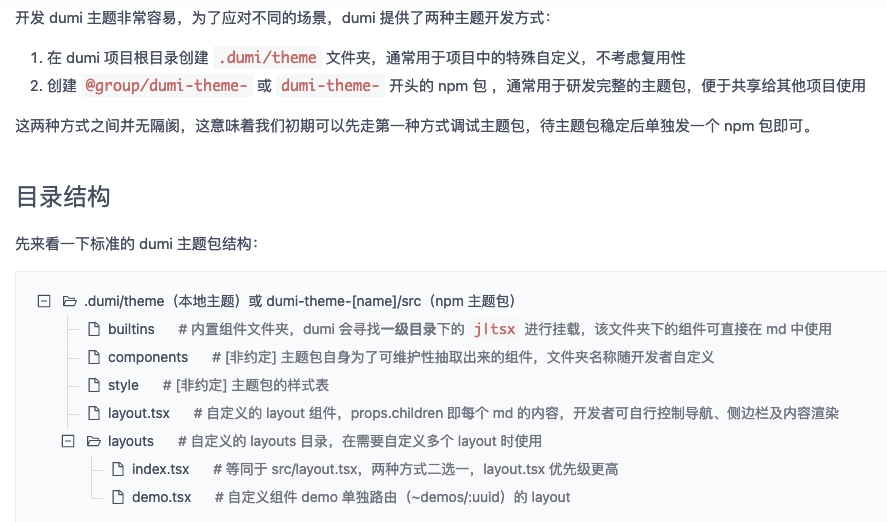

:::info
前置知识：
- [Scripts vs. CommonJS vs. UMD vs. AMD vs. ES6 Modules](https://www.zachgollwitzer.com/posts/scripts-commonjs-umd-amd-es6-modules)
:::

## 移动端组件库
参考[ant-design-mobile](https://github.com/ant-design/ant-design-mobile)使用gulp开发移动端组件库，使用dumi生成组件库文档
:::info
本地调试ant-design-mobile：
- node版本切到16.16.0
- nrm 切到 cnpm
- 执行 `pnpm i`
- 更改`gulpfile.js`并执行`pnpm build`，查看每一步task的产出

:::

### 复用`ant-design-mobile`的`gulpfile.js`
执行`pnpm build`报错：
- `Cannot find module 'node:path'` 查看node版本发现是14.14.0，使用`nvm use 16.16.0`后解决

- `Cannot find module @rollup/rollup-darwin-arm64.` 解决：删掉`pnpm-lock.yaml`重新执行`pnpm install`

- `Cannot find module './Foo'. Did you mean to set the 'moduleResolution' option to 'nodenext', or to add aliases to the 'paths' option?` 解决：`tsconfig.json`中设置`"moduleResolution": "node"`

- `SyntaxError in plugin "gulp-babel" index.d.ts: Unexpected token, expected ","` 解决：`tsconfig.json`中设置`"declaration": false`
  
- `Error in plugin "webpack-stream" Module not found: Error: Can't resolve 'babel-loader'` 解决：`pnpm add -D babel-loader` 
  
- `Error in plugin "webpack-stream" Module not found: Error: Cannot find package '@babel/preset-env'` 解决：`pnpm add -D @babel/preset-env`
   `pnpm add -D @babel/core`

- `Error in plugin "webpack-stream" Module not found: Error: Cannot find package '@babel/preset-typescript'` 解决：`pnpm add -D @babel/preset-typescript`

- `Error in plugin "webpack-stream" Module not found: Error: Cannot find package '@babel/preset-react'` 解决：`pnpm add -D @babel/preset-react`

### 使用的依赖包
#### 删除文件
- [rimraf](https://github.com/isaacs/rimraf)

- [del](https://github.com/sindresorhus/del)

#### [through2](https://github.com/rvagg/through2)
[每天一个npm包：through2](https://zhuanlan.zhihu.com/p/365329097)

对Node.js Streams.Transform (Streams2/3) 的封装，提供了更为易用的objectMode模式。

#### [`@babel/plugin-transform-modules-commonjs`](https://babeljs.io/docs/babel-plugin-transform-modules-commonjs)
该插件将 ECMAScript 模块转换为 CommonJS。请注意，只有导入/导出语句 (如`import "./mod.js"`) 和导入表达式 (如`import('./mod.js')`) 的语法被转换

ES Module
```js
export default 42;
```
转为CommonJS
```js
Object.defineProperty(exports, "__esModule", {
  value: true,
});

exports.default = 42;
```

#### [`postcss-px-multiple`](https://github.com/torrac12/postcss-px-multiple-plugin)
一个 postcss 的插件，可以把 css 文件中含 px 的样式乘以倍数，注意大写的 PX 不会转换。

这个插件对设计稿定义 pt 单位，实际 1pt = 2px 情况下很有用。另外当 viewport 设置成固定值且不为 device-width 时，比如 width=750，当引入第三方组件中的 css 时候，第三方组件一般都是按 device-width 写的尺寸，此时用此插件很好解决问题。

#### [`webpack-stream`](https://github.com/shama/webpack-stream)
将 webpack 作为流运行以方便地与 gulp 集成。

#### [`classnames`](https://github.com/JedWatson/classnames)
用于有条件地将类名连接在一起。
```js
const classNames = require('classnames');
classNames('foo', 'bar'); // => 'foo bar'

classNames('foo', { bar: true, duck: false }, 'baz', { quux: true }); // => 'foo bar baz quux'

classNames(null, false, 'bar', undefined, 0, { baz: null }, ''); // => 'bar'

const arr = ['b', { c: true, d: false }];
classNames('a', arr); // => 'a b c'
```

#### [`lodash`](https://lodash.com/)
##### `assignWith(object, sources, [customizer])`
```js
const customizer = function(objValue, srcValue, key, object, source) {}
```

### 使用的gulp插件
#### [`gulp-typescript`](https://github.com/ivogabe/gulp-typescript)
- 用于处理 TypeScript 编译工作流程的 gulp 插件。该插件暴露TypeScript的编译器options供gulp使用

- `{ declaration: true }`设置编译时是否为每个脚本生成类型声明文件`.d.ts`
- `{ emitDeclarationOnly: true }`设置编译后只生成`.d.ts`文件，不生成`.js`文件

#### [`gulp-less`](https://github.com/gulp-community/gulp-less)

#### `gulp-postcss`

#### `gulp-replace`

#### `gulp-rename`

### 规范提交及代码格式化
#### [husky](https://typicode.github.io/husky/)


#### [`commitlint`](https://commitlint.js.org/#/)
commitlint 帮助您的团队遵守提交约定。
- 安装：`pnpm add -D @commitlint/cli @commitlint/config-conventional`

- 配置
  - 在项目根目录新建`commitlint.config.js`或`.commitlintrc.js`或`.commitlintrc`或`.commitlintrc.json`或`.commitlintrc.yml`
    ```js title="commitlint.config.js"
    module.exports = { extends: ['@commitlint/config-conventional'] };
    ```

  - 或者在`package.json`文件中使用`commitlint`字段来定义配置
    ```json title="package.json"
    "commitlint": {
      "extends": [
        "@commitlint/config-conventional"
      ]
    },
    ```

- 通过 git hooks 在commit message时立即检查
  - 安装husky: `npm install husky --save-dev`
  - 激活hooks：`npx husky install`
  - 添加hook: `npx husky add .husky/commit-msg  'npx --no -- commitlint --edit ${1}'`

#### [`lint-staged`](https://github.com/lint-staged/lint-staged)
针对暂存的 git 文件运行 linter，不要让它溜进您的代码库！设置`pre-commit` git hook 来运行 lint-staged
- 安装：`pnpm add -D lint-staged`

- 配置: 可以在`package.json`中使用`lint-staged`字段定义配置；或者在项目根目录下新建`lint-staged.config.js`或`.lintstagedrc.js`进行配置
  ```json title="package.json"
  "lint-staged": {
    "*.{md,json}": [
      "prettier --write --no-error-on-unmatched-pattern"
    ],
    "*.{css,less}": [ // 以下多条命令会同时被执行
      "stylelint --fix",
      "prettier --write"
    ],
    "*.{js,jsx}": [
      "eslint --fix",
      "prettier --write"
    ],
    "*.{ts,tsx}": [
      "eslint --fix",
      "prettier --parser=typescript --write"
    ]
  },
  ```

#### [`prettier`](https://prettier.io/)
- 安装：`pnpm add -D prettier`

- 插件：`pnpm add -D prettier-plugin-organize-imports prettier-plugin-packagejson`

- 配置：在项目根目录下新建`.prettierrc.js` `.prettierignore`

- 对更改的文件运行 Prettier：`pnpm add -D pretty-quick`

#### [`stylelint`](https://stylelint.io/)

#### [`eslint`](https://eslint.org/)

### 导出约定
1. 每个组件都有1个单独的文件夹，该文件夹下的`index.ts`用于默认导出，其他文件都使用命名导出
2. 组件库`src/index.ts`使用重新导出语法

### 遇到的问题
- cloneElement替代方案
   
- `Cannot find module './index.less' or its corresponding type declarations.`


## 组件库文档工具
[对比三个强大的组件文档展示工具](https://segmentfault.com/a/1190000039931429)

主题目录结构：


### [dumi2.x](https://d.umijs.org/)
使用 React Library 模板
```bash
# 先找个地方建个空目录。
mkdir myapp && cd myapp

# 通过官方工具创建项目，选择你需要的模板
npx create-dumi

# 选择一个模板
? Pick template type › - Use arrow-keys. Return to submit.
❯   Static Site # 用于构建网站
    React Library # 用于构建组件库，有组件例子
    Theme Package # 主题包开发脚手架，用于开发主题包

# 安装依赖后启动项目
npm start
```

生成的工程中的`.dumi`目录不用push到远程，每次执行`pnpm start`都会生成这个目录

#### 主题目录结构
当 dumi 提供的默认主题无法满足项目需要时，即可选择对 dumi 的默认主题进行局部定制或全部定制。无论是单独发布的主题包(`dumi-theme-[name]/src/`)还是项目本地主题包(`.dumi/theme/`)，都应符合如下目录结构：
```bash
.
├── builtins         # 全局组件，注册的组件可直接在 Markdown 中使用
│   ├── Hello          # {Component}/index.tsx 会被识别，可在 md 里使用 <Hello></Hello>
│   │   └── index.tsx
│   └── World.tsx      # {Component}.tsx 会被识别，可在 md 里使用 <World></World>
├── locales          # 国际化文案，通过 `import { useIntl, FormattedMessage } from 'dumi'` 来调用文案，自动根据当前的 locale 切换
│   └── zh-CN.json
├── layouts          # 布局组件，会被 dumi 直接引用
│   ├── GlobalLayout   # 全局 Layout，通常用来放置 ConfigProvider
│   ├── DocLayout      # 文档 Layout，包含导航、侧边菜单、TOC 等，包裹 Markdown 正文做渲染
│   └── DemoLayout     # 组件示例 Layout，需要控制 demo 独立访问页（`/~demos/:id`）的布局时使用
├── slots            # 局部组件（具体有哪些组件取决于主题包实现，应由布局组件引用，以下仅为举例示意）
│   ├── Navbar         # 导航栏
│   ├── NavbarLogo     # 导航栏 LOGO 区域
│   ├── SideMenu       # 侧边栏
│   ├── Homepage       # 首页内容
│   └── HomepageHero   # 首页 Hero 区域
└── plugin           # dumi 插件文件夹，plugin/index.ts（也可以是 plugin.ts）会被自动注册为插件
    └── index.ts

```

#### 移动端组件研发
只需要安装移动端组件研发主题即可: `pnpm add -D dumi-theme-mobile@^2.0.0`

#### 配置项
配置文件为根目录下的`.dumirc.ts`
- `resolve.atomDirs` 用于配置资产（例如组件、函数、工具等）路由。默认值为`[{ type: 'component', dir: 'src' }]`。在默认配置下，`src/Foo/index.md` 将被解析为 `components/foo` 的路由。如下，将`src/components/button/index.md`解析为`components/button`
  ```ts
  resolve: {
    atomDirs: [
      {
        type: 'component',
        dir: 'src/components',
      }
    ],
  },
  ```

- `themeConfig.logo`
- `themeConfig.nav` `link`为路由，比如，基于以上`resolve.atomDirs`配置，要link到`src/components/button/index.md`则设置`link`为`'/components/button'`
- `themeConfig.footer`

#### 常见问题
- dumi 和 Umi 的关系是什么？
  
  Umi 是前端开发框架，适用于前端应用研发；dumi 是在 Umi 的基础上打造的静态站点框架，适用于组件研发。

- 如何完全自定义首页？
  
  创建 `.dumi/pages/index.tsx` 即可用 React 来编写首页，注意不要同时在文档解析的根目录中创建 `index.md`，会导致路由冲突。

- 为什么不支持 CSS Modules？

  主要两个原因：
  - 使用者很难覆写样式，因为最终 `className` 不稳定
  - 自动 CSS Modules 依赖 babel 编译产物，给使用项目带来额外的编译成本，而大部分框架默认都不编译 `node_modules`（比如 Umi 框架就需要配置 `extraBabelIncludes` 才会编译 `node_modules` 下的产物）
  
  也许大部分人选择在组件库项目中使用CSS Modules，是因为做前端应用研发时的习惯性选型，但它其实不适合组件库项目；另外，原因 2 也会产生额外的调试成本，比如『为什么 dev 生效、发布后在项目里不生效？』造成的调试成本

### [dumi1.x](https://v1.d.umijs.org/zh-CN)
目录结构：
- `/config` dumi配置文件，用于配置菜单、导航栏、主题、插件、别名等
- `.dumi` 用于存放自定义的dumi插件及主题