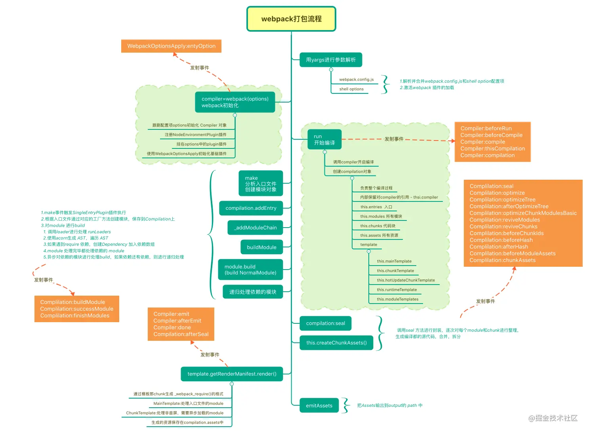
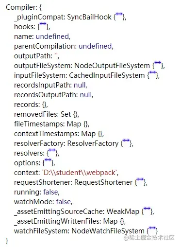

## loader
```js
module:{
  rules:[{
    test:/\.jpg$/,
    use:{
      loader:'file-loader'
    }
  }]
}
```
上面`file-loader`的底层，帮我们做了什么事情呢？

当我们打包 jpg 文件时， webpack 会把 jpg 文件移动到 dist 文件下，并且对 jpg 文件赋予一个新的名称。然后，它会把这个名称作为一个返回值，返回给我们引入模块的变量之中。


`file-loader` 不仅仅可以处理 jpg 这样的文件图片。理论上，它还可以处理很多种类型的静态资源。

### loader的作用
webpack 只能理解 JavaScript 和 JSON 文件，这是 webpack 开箱可用的自带能力。loader 让 webpack 能够去处理其他类型的文件，并将它们转换为有效模块，以供应用程序使用，以及被添加到依赖图中。

loader是运行在打包之前的。

### loader是什么
本质上，loader 是导出为函数的 JavaScript 模块。

### `file-loader` 和 `url-loader`的区别
`url-loader` 可以达到几近 `file-loader` 的效果。

当打包一个图片文件时，与 `file-loader` 不一样的是， `url-loader` 会将图片转换成一个 base64 的字符串，然后直接放到dist 目录下的 bundle.js(配置的打包输出文件) 里面，而不是单独生成一个图片文件。
- 好处就是，直接访问，而不用去文件夹下访问，节省了一次 http 请求。
- 坏处是，如果这个图片很大的话，会使得 `bundle.js` 文件变得很大，使得加载时间变得很长。
- 可以使用`limit`属性进行限制，当图片大小 小于 该限制时，使用`url-loader`

Webpack5 之前我们处理静态资源比如PNG 图片、SVG 图标等等，需要用到`url-loader`，`file-loader`，`raw-loader`。Webpack5 提供了内置的静态资源构建能力，我们不需要安装额外的 loader，仅需要简单的配置就能实现静态资源的打包和分目录存放。这三个loader在github上也停止了更新。webpack5使用四种新增的资源模块（[Asset Modules](https://webpack.js.org/guides/asset-modules/)）替代了这些loader的功能。
- `asset/resource` 将资源分割为单独的文件，并导出url，就是之前的 `file-loader` 的功能.
- `asset/inline` 将资源导出为`dataURL（url(data:)）`的形式，之前的 `url-loader` 的功能.
- `asset/source` 将资源导出为源码（source code）. 之前的 `raw-loader` 功能.
- `asset` 自动选择导出为单独文件或者 dataURL形式（默认为8KB）. 之前有`url-loader`设置asset size limit 限制实现。


### 样式loader
- 将 sass-loader 、css-loader 与 style-loader 进行链式调用，可以将样式以 style 标签的形式插入 DOM 中，或者使用 mini-css-extract-plugin 将样式输出到独立的文件中。

- 使用loader的顺序为：
[“style-loader”, “css-loader”, “sass-loader”]，先使用sass-loader将.less或.scss文件转换成css，再使用css-loader加载css文件，最后使用style-loader将css-loader处理的样式注入到HTML页面中。
>- style-loader：把js中import导入的样式文件打包到js文件中，运行js文件时，将样式自动插入到`<style>`标签中。如图：


- MiniCssExtractPlugin 提取 JS 中引入的 CSS 打包到单独文件中，然后通过标签 `<link>`添加到头部。mini-css-extract-plugin：把js中import导入的样式文件，单独打包成一个css文件，结合html-webpack-plugin，以link的形式插入到html文件中。如图：


- css-loader启用CSS Modules

- postcss-loader
> postcss是一个 支持插件的 用于转换样式的 库（https://github.com/postcss/postcss/blob/main/docs/README-cn.md），使用插件可以实现很多功能，比如：编译尚未被浏览器广泛支持的先进的 CSS 语法、autoprefixer插件添加了浏览器前缀、使用插件检查你编写的css等。([搜索postcss插件](https://www.postcss.parts/)；[postcss插件列表](https://github.com/postcss/postcss/blob/main/docs/plugins.md))
> - PostCSS 接收一个 CSS 文件并提供了一个 API 来分析、修改它的规则（通过把 CSS 规则转换成一个抽象语法树的方式）。在这之后，这个 API 便可被许多插件利用来做有用的事情，比如寻错或自动添加 CSS vendor 前缀。
> - 在webpack里使用postcss的方式：1）在 webpack.config.js 里使用 postcss-loader；然后在根目录创建 postcss.config.js来配置postcss的插件。 或者2）在 webpack.config.js 里使用 postcss-loader，并且在options中配置postcss的插件。
```js
// webpack.config.js
module.exports = {
  module: {
    rules: [
      {
        test: /\.css$/,
        exclude: /node_modules/,
        use: [
          {
            loader: 'style-loader',
          },
          {
            loader: 'css-loader',
            options: {
              importLoaders: 1,
            }
          },
          {
            loader: 'postcss-loader'
          }
        ]
      }
    ]
  }
}

// postcss.config.js
module.exports = {
  plugins: [
    require('precss'),
    require('autoprefixer')
  ]
}

// 或者
// webpack.config.js
module.exports = {
  module: {
    rules: [
      {
        test: /\.css$/i,
        use: [
          'style-loader',
          {
            loader: 'css-loader',
            options: { importLoaders: 1 },
          },
          {
            loader: 'postcss-loader',
            options: {
              postcssOptions: {
                plugins: [
                  [
                    'autoprefixer',
                    {
                      // 选项
                    },
                  ],
                ],
              },
            },
          },
        ],
      },
    ],
  },
};
```
> - postcss-loader报错：TypeError: this.getOptions is not a function，这个报错的原因是版本太高了，可以使用npm install postcss-loader@4.2.0 -D

### babel-loader
- babel-loader只会将 ES6/7/8语法转换为ES5语法，但是对新api并不会转换。可以通过 babel-polyfill 对一些不支持新语法的客户端提供新语法的实现。安装npm install @babel/polyfill 或者使用 @babel/runtime-corejs2按需引入 polyfill

- 使用@babel/preset-env配置useBuiltIns:'usage'后提示core-js警告，解决：指定corejs的版本
```js
module.exports = {
  presets: [
    ["@babel/preset-env", {
      "corejs": "3", // 声明corejs版本
      "useBuiltIns": "usage" // 用到es6以上的函数，babel会自动导入相关的polyfill
    }]
  ]
}
```

### [vue-loader](https://vue-loader.vuejs.org/zh/guide/#vue-cli)

### [react hot loader](http://gaearon.github.io/react-hot-loader/)

### [ts-loader](https://www.webpackjs.com/guides/typescript/)

## [plugin](https://www.webpackjs.com/plugins/)
> plugin可以运行在打包之前，也可以运行在打包的过程中，也可以运行在打包完成之后。
### `html-webpack-plugin`
- 作用：直接为项目生成一个或多个HTML文件(HTML文件个数由插件实例的个数决定，即new HtmlWebpackPlugin()的个数)，并将webpack打包后输出的所有脚本文件自动添加到插件生成的HTML文件中。通过配置，可以将根目录下用户自定义的HTML文件作为插件生成HTML文件的模板。另外，还可以通过向插件传递参数来控制HTML文件的输出。
- 参数有inject等（https://juejin.cn/post/6844903853708541959）
- new HtmlWebpackPlugin() 若不传入任何参数，那么插件将生成默认的html文件，注意使用webpack-dev-server启动的话，生成的该html文件是放在内存中而不在项目目录下。默认生成的html文件如下：
  ```html
  <!DOCTYPE html>
  <html>
    <head>
      <meta charset="utf-8">
      <title>Webpack App</title>
    <meta name="viewport" content="width=device-width, initial-scale=1"><script defer src="vue.bundle.js"></script></head>
    <body>
    </body>
  </html>
  ```
- 注意上面的defer。defer和async的区别如图：
  
  如图，一般情况下，即script没有额外属性时，HTML先解析，当遇到script时则加载js脚本(fetch)，加载完后解析并执行(execution)，执行完后继续解析HTML。由此可见，js脚本的加载、解析并执行会阻塞DOM的渲染。
  如图，defer和async的相同点是异步加载；不同点是，async加载完后立即解析并执行，而defer加载完后延迟到DOM解析完成后，DOMContentLoaded 事件触发之前 执行。
- script放在head和body的区别
> [js的script标签到底是放在head还是body中？](https://www.jianshu.com/p/2e6f9b732a91)
> - head内的js会阻塞页面的传输和页面的渲染。
> - head 内的 JavaScript 需要执行结束才开始渲染 body，所以尽量不要将 JS 文件放在 head 内。
> - 内部的js一般放到body内。不阻塞页面的加载(事实上js会被缓存)。可以直接在js里操作dom，这时候dom是准备好的，即保证js运行时dom是存在的。
- 使用模板new HtmlWebpackPlugin({template:'./watcher/htmlwebpack.html'})，原htmlwebpack.html文件：
  ```html
  <!DOCTYPE html>
  <html lang="en">
  <head>
    <meta charset="UTF-8">
    <title>webpack</title>
  </head>
  <body>
    <div id="root"></div>
  </body>
  </html>
  ```
  webpack-dev-server打包后的文件：
  ```html
  <!DOCTYPE html>
  <html lang="en">
  <head>
    <meta charset="UTF-8">
    <title>webpack</title>
  <script defer src="vue.bundle.js"></script></head>
  <body>
    <div id="root"></div>
  </body>
  </html>
  ```

- 使用报错：TypeError: Cannot read property 'tap' of undefined，原因：与webpack版本不兼容，webpack是4+则html-webpack-plugin也应为4+；webpack是5+则html-webpack-plugin也应为5+

- html-webpack-plugin@3.2.0使用webpack-dev-server启动后或者使用webpack打包后控制台会显示Entrypoint undefined = index.html；升级到html-webpack-plugin@4.5.2后则显示正常Entrypoint HtmlWebpackPlugin_0 = __child-HtmlWebpackPlugin_0

- `<meta http-equiv="X-UA-Compatible" content="IE=edge">` X-UA-Compatible 是针对 IE8 版本的一个特殊文件头标记，用于为 IE8 指定不同的页面渲染模式。IE=edge 模式通知 Windows Internet Explorer 以最高级别的可用模式显示内容。

- `<meta name="viewport" content="width=device-width, initial-scale=1.0">` 该meta标签的作用是让当前viewport的宽度等于设备的宽度，初始缩放比例为1。([viewport](https://www.cnblogs.com/yelongsan/p/7975580.html))

### mini-css-extract-plugin

### [copy-webpack-plugin](https://runebook.dev/zh-CN/docs/webpack/plugins/copy-webpack-plugin)
- [webpack复制静态文件](https://www.imqianduan.com/webpack/100.html)
> from路径是相对项目的根目录；to路径相对webpack配置的output路径

- 使用该插件遇到的问题：
>- 注意："copy-webpack-plugin": "^9.0.1", 配置项globOptions中的gitignore设置为true，编译时会报错：in Path ... is not in cwd ... 解决方案：gitignore设置为false
>- 编译报错：`unable to locate '.../public/**/*' glob`，配置如下: 
```js
new copyWebpackPlugin({
	patterns: [{
		from: path.resolve(__dirname, "../public"),
		to: 'static',
		globOptions: {
			dot: true,
			gitignore: false,
			ignore: ["**/index.html*"],
		}
	}]
})

// 报错的原因：For SPA, this problem occurs If public folder only contains index.html or public folder is empty

// 解决方案：public下不要只放index.html
```

### [DefinePlugin](https://www.webpackjs.com/plugins/define-plugin/)

## 手写一个webpack loader
### 遇到的问题
- 如果test一个项目中没有使用到的文件，则不会进入use里的loader
```js
// webpack.config.js
module: {
  rules: [
    {
      test: /\.vue$/,
      loader: 'vue-loader'
    },
    {
      test: /demo\_routes\.js/,
      include: [
        path.resolve(__dirname, 'src/tests')
      ],
      use: [
        {
          loader: './handleFileLoader.js' // 自定义的loader
        }
      ]
    }
  ]
},

// main.js
import { demoVar } from './tests/demo'

// 如上，如果项目中没有使用src/tests/index.js，则webpack编译时不会进入handleFileLoader.js。如果main.js中使用的demo换成demo_routes，则编译时就会进入handleFileLoader.js
```

- loader需要处理的是ts文件，不需要先用babel转换为js文件，不会报错，拿到的是ts文件的原样

- 链式调用：同一个文件使用多个loader

- loader可以传option，然后可以使用this.query来接收，也可以使用loader-utils来接收(需要先install)

- Loader can't be Function. 配置文件中的loader不能写成函数，也不能写成对象。A loader is a node module that exports a function.

- [loader引入的几种方式](https://www.cnblogs.com/wuxianqiang/p/11332544.html)

- webpack5 如果启用缓存，即配置了cache，则自定义的loader只会在第一次编译(build)时执行（serve不受cache影响），或许是我cache配置的有问题？我的配置如下
```
cache: {
  type: 'filesystem',
  buildDependencies: {
    config: [__filename]
  }
},
```

- 自定义loader中一定要return，调试时自定义loader的test是项目的主入口js文件，因为没return，结果编译都不报错，不过页面啥都没有

## 手写一个webpack插件
- [手把手带你入门 Webpack Plugin](https://www.zoo.team/article/webpack-plugin)

- webpack执行流程



### 1. webpack构建流程
webpack的基本构建流程如下：
- 校验配置文件
- 生成Compiler对象
- 初始化默认插件
- run/watch：如果运行在watch模式则执行watch方法，否则执行run方法
- compilation：创建Compilation对象回调compilation相关钩子
- emit：文件内容准备完成，准备生成文件，这是最后一次修改最终文件的机会
- afterEmit：文件已经写入磁盘完成
- done：完成编译

### 2. Tapable([tapable](https://github.com/webpack/tapable)
[梳理tapable的九大钩子函数的使用及原理](https://blog.csdn.net/qq_17175013/article/details/119547711))
- Tapable是 webpack 的一个核心工具，在 webpack 中的许多对象都扩展自 Tapable 类。 它对外暴露了 tap，tapAsync 和 tapPromise 等方法， 插件可以使用这些方法向 webpack 中注入自定义构建的步骤，这些步骤将在构建过程中触发。

hooks can be synchronous or asynchronous. To reflect this, there’re “Sync”, “AsyncSeries”, and “AsyncParallel” hook classes:
- Sync. A sync hook can only be tapped with synchronous functions (using myHook.tap()).

- AsyncSeries. An async-series hook can be tapped with synchronous, callback-based and promise-based functions (using myHook.tap(), myHook.tapAsync() and myHook.tapPromise()). They call each async method in a row.

- AsyncParallel. An async-parallel hook can also be tapped with synchronous, callback-based and promise-based functions (using myHook.tap(), myHook.tapAsync() and myHook.tapPromise()). However, they run each async method in parallel.

- tap。可用于同步钩子函数和异步钩子函数的调用。
```js
// 在compile阶段插入同步钩子的示例
compiler.hooks.compile.tap('MyWebpackPlugin', params => {
  console.log('我是同步钩子')
});
```
- tapAsync。用于异步钩子函数的调用，通过callback回调告诉Webpack异步执行完毕。
```js
class HelloAsyncPlugin {
  apply(compiler) {
    compiler.hooks.emit.tapAsync(
      'HelloAsyncPlugin',
      (compilation, callback) => {
        // 执行某些异步操作...
        setTimeout(function () {
          console.log('异步任务完成...');
          callback();
        }, 1000);
      }
    );
  }
}

module.exports = HelloAsyncPlugin;
```
- tapPromise。用于异步钩子函数的调用，返回一个Promise告诉Webpack异步执行完毕。
```js
class HelloAsyncPlugin {
  apply(compiler) {
    compiler.hooks.emit.tapPromise('HelloAsyncPlugin', (compilation) => {
      // 返回一个 pormise ，异步任务完成后 resolve
      return new Promise((resolve, reject) => {
        setTimeout(function () {
          console.log('异步任务完成...');
          resolve();
        }, 1000);
      });
    });
  }
}

module.exports = HelloAsyncPlugin;
```
### 3. 常用的生命周期钩子函数([compiler-hooks](https://www.webpackjs.com/api/compiler-hooks/)；[compilation-hooks](https://www.webpackjs.com/api/compilation-hooks/))
| 钩子      | 说明 | 参数     | 类型 |
|    :----:   |    :----:   |    :----:   |    :----:   |
| afterPlugins | 启动一次新的编译 | compiler | 同步 |
| compile | 创建compilation对象之前 | compilationParams | 同步 |
| compilation | compilation对象创建完成 | compilation | 同步 |
| emit | 资源生成完成，输出之前 | compilation | 异步 |
| afterEmit | 资源输出到目录完成 | compilation | 异步 |
| done | 完成编译 | stats | 同步 |

### 4. 插件是由「具有 apply 方法的 prototype 对象」所实例化出来的
- 这个 apply 方法在安装插件时，会被 webpack compiler 调用一次。
- Webpack在启动时会实例化插件对象，在初始化compiler对象之后会调用插件实例的apply方法，传入compiler对象，插件实例在apply方法中会注册相应的钩子，Webpack在执行过程中会根据构建阶段回调相应的钩子。
- **apply方法中插入钩子的一般形式如下**：compiler.hooks.生命周期钩子函数.Tapable暴露的函数('插件名称', (阶段回调参数) => { ... });
```js
class MyExampleWebpackPlugin {
  // 在插件函数的 prototype 上定义一个 `apply` 方法，以 compiler 为参数。
  apply(compiler) {
    // 指定一个挂载到 webpack 自身的事件钩子。
    compiler.hooks.emit.tapAsync(
      'MyExampleWebpackPlugin',
      (compilation, callback) => {
        console.log('这是一个示例插件！');
        console.log(
          '这里表示了资源的单次构建的 `compilation` 对象：',
          compilation
        );

        // 用 webpack 提供的插件 API 处理构建过程
        compilation.addModule(/* ... */);

        callback();
      }
    );
  }
}
module.exports = MyExampleWebpackPlugin;
```
```js
class HelloWorldPlugin {
  apply(compiler) {
    compiler.hooks.done.tap(
      'Hello World Plugin',
      (
        stats /* 绑定 done 钩子后，stats 会作为参数传入。 */
      ) => {
        console.log('Hello World!');
      }
    );
  }
}

module.exports = HelloWorldPlugin;
```
### 5. [Compiler](https://github.com/webpack/webpack/blob/main/lib/Compiler.js)
- Compiler对象包含了当前运行Webpack的配置，包括entry、output、loaders等配置，这个对象在启动Webpack时被实例化，而且是全局唯一的。Plugin可以通过该对象获取到Webpack的配置信息进行处理。


### 6. [Compilation](https://github.com/webpack/webpack/blob/main/lib/Compilation.js)
- Compilation对象，包含了模块、依赖、文件等信息。在开发模式下运行Webpack时，每修改一次文件都会产生一个新的Compilation对象，Plugin可以访问到本次编译过程中的模块、依赖、文件内容等信息。
- compilation实例 能够访问所有的模块和它们的依赖（大部分是循环依赖）。
- [compilation 对象方法](https://www.webpackjs.com/api/compilation-object/#compilation-object-methods)


### 7. ContextModuleFactory
> Compiler 使用 ContextModuleFactory 模块从 webpack 独特的 require.context API 生成依赖关系。它会解析请求的目录，为每个文件生成请求，并依据传递来的 regExp 进行过滤。最后匹配成功的依赖关系将被传入 NormalModuleFactory。

### 8. NormalModuleFactory

### 9. parser
- 参考 [webpack进阶之Parser](https://juejin.cn/post/6844904095728271374)
> webpack Parser是对模块ast进行遍历，所以可以获取到更细粒度的模块内容信息，例如模块是否调用了未定义的变量标识符，模块依赖了哪些第三方js模块、是否有指定成员的调用等等，基于此，我们可以利用webpack Parser提供的钩子做一些特殊的事情，最典型的应用：分析模块的依赖或者根据不同的情况为模块添加依赖。
```js
normalModuleFactory.hooks.parser.for('javascript/auto').tap('MyPlugin', (parse, options) => {

})
```

### 10. [Resolvers 解析器](https://webpack.docschina.org/api/resolvers/#root)
- 在 compiler 类中，提供了三种类型的内置解析器：
> - normal: 通过绝对或相对路径解析模块。
> - context: 在给定的上下文中解析模块。
> - loader: 解析 webpack loader。
- [enhanced-resolve](https://github.com/webpack/enhanced-resolve)


### 11. webpack执行流程及触发的钩子函数
- 钩子函数触发顺序
```js
// 例子：
// tool.test.js
import { route } from './util.test'

console.log('route', route)

function square(n) {
  return n * n;
}
let ace = 'test-tool';
console.log('ace', ace)

// util.test.js
import { dateForm } from './date.test.js'

export const route = {
  path: '/',
  children: [ ]
}
const fn = () => {
  console.log('fn')
}
console.log('dateForm', dateForm)

/*
normalModuleFactory---beforeResolve  tool.test.js
compiler---resolverFactory---resolver  tool.test.js
normalModuleFactory---createModule  tool.test.js
thisCompilation---buildModule  tool.test.js

compiler---resolverFactory---resolver  
thisCompilation---optimizeDependencies
*/
```
- [webpack编译流程分析](https://pcaaron.github.io/pages/fe/webpack/flow.html#%E5%87%86%E5%A4%87%E9%98%B6%E6%AE%B5)
- [Webpack 内部插件与钩子关系](https://alienzhou.com/projects/webpack-internal-plugin-relation/)

### 12. 编译时报错：Missing semicolon
- 原因是解析不了ts文件。
- 使用babel的preset

```js
const babel = require('@babel/core');
let transformFileResult = babel.transformFileSync(filePath,{
    presets: ["@babel/preset-typescript"],
});
let fileAst = babel.parseSync(transformFileResult.code);
```