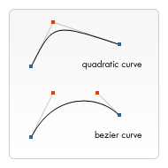

:::tip
`<canvas>` 只支持两种形式的图形绘制：矩形和路径（由一系列点连成的线段）。所有其他类型的图形都是通过一条或者多条路径组合而成的。
:::

## 画布栅格(canvas grid)

- canvas 元素默认被网格所覆盖，通常来说网格中的一个单元相当于 canvas 元素中的一像素。
- 栅格的起点为左上角（坐标为（0,0）），所有元素的位置都相对于原点定位，所以图中蓝色方形左上角的坐标为距离左边（X 轴）x 像素，距离上边（Y 轴）y 像素（坐标为（x,y））。

## 绘制矩形
canvas 提供了三种方法绘制矩形，这三个函数绘制之后会马上显现在 canvas 上，即时生效。
> 方法参数：x 与 y 指定了在 canvas 画布上所绘制的矩形的左上角（相对于原点）的坐标；width 和 height 设置矩形的尺寸。
- `fillRect(x, y, width, height)`  绘制一个填充的矩形
- `strokeRect(x, y, width, height)`  绘制一个矩形的边框
- `clearRect(x, y, width, height)`  清除指定矩形区域，让清除部分完全透明

:::info
[示例：绘制矩形](https://code.juejin.cn/pen/7265210574571913272)

示例中，`fillRect()` 函数绘制了一个边长为 `100px` 的黑色正方形，`clearRect()` 函数从正方形的中心开始擦除了一个 `60*60px` 的正方形，接着`strokeRect()` 在清除区域内生成一个 `50*50` 的正方形边框。
:::

## 绘制路径
:::tip
一个路径，甚至一个子路径，都是闭合的。使用路径绘制图形的步骤如下：
1. 首先，需要创建路径起始点
2. 然后，使用[相应API](https://developer.mozilla.org/zh-CN/docs/Web/API/CanvasRenderingContext2D#paths)去画出路径
3. 之后，把路径封闭
4. 一旦路径生成，就能通过描边或填充路径区域来渲染图形
:::
绘制路径会用到以下函数：
- `beginPath()`  新建一条路径，生成之后，图形绘制命令被指向到路径上生成路径
- `closePath()`  闭合路径之后图形绘制命令又重新指向到上下文中
- `stroke()`  通过线条来绘制图形轮廓
- `fill()`  通过填充路径的内容区域生成实心的图形
- `moveTo(x, y)`  将笔触移动到指定的坐标 x 以及 y 上

:::info
- 本质上，路径是由很多子路径构成，这些子路径都是在一个列表中，所有的子路径（线、弧形、等等）构成图形。
- 每次调用`beginPath()`之后，列表清空重置，就可以重新绘制新的图形。
- 调用 `beginPath()` 之后，或者 canvas 刚建的时候，第一条路径构造命令通常被视为是 `moveTo()`，无论实际上是什么。出于这个原因，几乎总是要在设置路径之后专门指定起始位置。
- 当调用 `fill()` 函数时，所有没有闭合的形状都会自动闭合，所以不需要调用 `closePath()` 函数。但是调用 `stroke()` 时不会自动闭合。
:::

### 绘制直线
- `lineTo(x, y)`  绘制一条从当前位置到指定 x 以及 y 位置的直线

:::info
[示例：绘制线](https://code.juejin.cn/pen/7265260863789989945)
```js
function draw() {
  var canvas = document.getElementById("canvas");
  if (canvas.getContext) {
    var ctx = canvas.getContext("2d");

    // 填充三角形
    ctx.beginPath();
    ctx.moveTo(25, 25);
    ctx.lineTo(105, 25);
    ctx.lineTo(25, 105);
    ctx.fill();

    // 描边三角形
    ctx.beginPath();
    ctx.moveTo(125, 125);
    ctx.lineTo(125, 45);
    ctx.lineTo(45, 125);
    ctx.closePath(); // 如果没有添加闭合路径closePath()，则只绘制了两条线段，并不是一个完整的三角形
    ctx.stroke();
  }
}
```
:::

### 绘制圆弧或者圆
- `arc(x, y, radius, startAngle, endAngle, anticlockwise)` 画一个以（x,y）为圆心的以 radius 为半径的圆弧（圆），从 startAngle 开始到 endAngle 结束，按照 anticlockwise 给定的方向（默认为顺时针）来生成。
  - x,y为绘制圆弧所在圆上的圆心坐标
  - radius为半径
  - startAngle以及endAngle参数用弧度定义了开始以及结束的弧度。这些都是以 x 轴为基准
  - anticlockwise为一个布尔值。为 true 时，是逆时针方向，否则顺时针方向

:::tip
`arc()` 函数中表示角的单位是弧度，不是角度。角度与弧度的 js 表达式：`弧度=(Math.PI/180)*角度`
:::
:::info
[示例：绘制圆弧/圆](https://code.juejin.cn/pen/7265585093019140152)
```js
function draw() {
  var canvas = document.getElementById("canvas");
  if (canvas.getContext) {
    var ctx = canvas.getContext("2d");

    for (var i = 0; i < 4; i++) {
      for (var j = 0; j < 3; j++) {
        ctx.beginPath();
        var x = 25 + j * 50; // x 坐标值
        var y = 25 + i * 50; // y 坐标值
        var radius = 20; // 圆弧半径
        var startAngle = 0; // 开始点
        var endAngle = Math.PI + (Math.PI * j) / 2; // 结束点
        var anticlockwise = i % 2 == 0 ? false : true; // 顺时针或逆时针

        ctx.arc(x, y, radius, startAngle, endAngle, anticlockwise);

        if (i > 1) {
          ctx.fill();
        } else {
          ctx.stroke();
        }
      }
    }
  }
}
```
:::

### 绘制贝塞尔曲线
:::info


如图，二次贝塞尔曲线有一个开始点（蓝色）、一个结束点（蓝色）以及一个控制点（红色），而三次贝塞尔曲线有两个控制点。
:::
- 绘制二次贝塞尔曲线：`quadraticCurveTo(cp1x, cp1y, x, y)`  cp1x,cp1y 为一个控制点，x,y 为结束点

[示例：绘制二次贝塞尔曲线](https://code.juejin.cn/pen/7265603050109632572)
```js
function draw() {
  var canvas = document.getElementById("canvas");
  if (canvas.getContext) {
    var ctx = canvas.getContext("2d");

    // 二次贝塞尔曲线
    ctx.beginPath();
    ctx.moveTo(75, 25);
    ctx.quadraticCurveTo(25, 25, 25, 62.5);
    ctx.quadraticCurveTo(25, 100, 50, 100);
    ctx.quadraticCurveTo(50, 120, 30, 125);
    ctx.quadraticCurveTo(60, 120, 65, 100);
    ctx.quadraticCurveTo(125, 100, 125, 62.5);
    ctx.quadraticCurveTo(125, 25, 75, 25);
    ctx.stroke();
  }
}
```

- 绘制三次贝塞尔曲线：`bezierCurveTo(cp1x, cp1y, cp2x, cp2y, x, y)`  cp1x,cp1y为控制点一，cp2x,cp2y为控制点二，x,y为结束点

[示例：绘制三次贝塞尔曲线](https://code.juejin.cn/pen/7265604211193643064)
```js
function draw() {
  var canvas = document.getElementById("canvas");
  if (canvas.getContext) {
    var ctx = canvas.getContext("2d");

    //三次贝塞尔曲线
    ctx.beginPath();
    ctx.moveTo(75, 40);
    ctx.bezierCurveTo(75, 37, 70, 25, 50, 25);
    ctx.bezierCurveTo(20, 25, 20, 62.5, 20, 62.5);
    ctx.bezierCurveTo(20, 80, 40, 102, 75, 120);
    ctx.bezierCurveTo(110, 102, 130, 80, 130, 62.5);
    ctx.bezierCurveTo(130, 62.5, 130, 25, 100, 25);
    ctx.bezierCurveTo(85, 25, 75, 37, 75, 40);
    ctx.fill();
  }
}
```

[示例：组合使用绘制路径](https://code.juejin.cn/pen/7265606468014243877)

### Path2D
- 所有的路径方法比如moveTo, rect, arc或quadraticCurveTo等，都可以在 Path2D 中使用。
```js
new Path2D(); // 空的 Path 对象
new Path2D(path); // 克隆 Path 对象
new Path2D(d); // 从 SVG 建立 Path 对象
```

- `Path2D.addPath(path [, transform])`  添加了一条路径到当前路径（可能添加了一个变换矩阵）

[示例：使用Path2D绘制矩形和圆](https://code.juejin.cn/pen/7265618673585356859)
```js
function draw() {
  var canvas = document.getElementById("canvas");
  if (canvas.getContext) {
    var ctx = canvas.getContext("2d");

    var rectangle = new Path2D();
    rectangle.rect(10, 10, 50, 50);

    var circle = new Path2D();
    circle.moveTo(125, 35);
    circle.arc(100, 35, 25, 0, 2 * Math.PI);

    ctx.stroke(rectangle);
    ctx.fill(circle);
  }
}
```

- 使用SVG path
```js
function draw() {
  var canvas = document.getElementById("canvas");
  if (canvas.getContext) {
    var ctx = canvas.getContext("2d");

    // 先移动到点 (M30 70) 然后再水平移动 80 个单位(h 80)，然后下移 80 个单位 (v 80)
    // 接着左移 80 个单位 (h -80)，再回到起点处 (z)。
    let p = new Path2D("M30 70 h 80 v 80 h -80 Z");
    ctx.fill(p);
  }
}
```