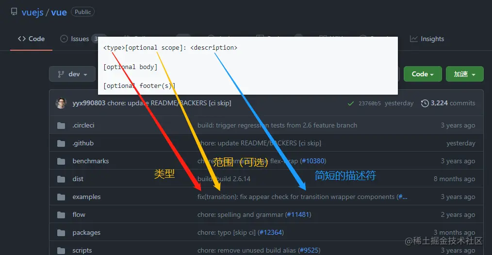

## husky
[husky](https://typicode.github.io/husky/)自动检查您的提交消息、代码，并在提交或推送时运行测试。

安装：`pnpm add --save-dev husky`

初始化：`pnpm exec husky init`。`init` 命令简化了项目中 husky 的设置。它在 `.husky/` 中创建预提交脚本，并更新 `package.json` 中的准备脚本。可以进行修改以适合您的工作流程。

大多数 Git 命令都包含一个 `-n`或`--no-verify` 选项来跳过hooks，对于没有此选项的命令，请使用 `HUSKY=0` 暂时禁用hooks:
```bash
git commit -m "..." -n # Skips Git hooks

HUSKY=0 git ... # Temporarily disables all Git hooks
git ... # Hooks will run again
```

要测试一个hook，可以在hook脚本中使用 `exit 1` 以中止 Git 命令:
```bash title=".husky/pre-commit"
# .husky/pre-commit

# Your WIP script
# ...

exit 1
```
```bash
git commit -m "testing pre-commit code"
# A commit will not be created
```

## conventional commits（约定式提交）
Conventional Commits是一个提交格式规范，这个规范主要是当你在commit的时候，对我们的提交信息做一个格式规范约束，它提供了一组简单规则来创建清晰的提交历史，通过在提交信息中描述功能、修复、破坏性变更。

message格式如下：
```bash
<type>[optional scope]: <description>

[optional body]

[optional footer(s)]
```


### 使用
- 安装`commitlint`和`husky`，`commitlint`用于对commit message进行格式校验，`husky`则易用git hook。`pnpm add -D @commitlint/cli @commitlint/config-conventional husky`

- 配置：在项目根目录中新建一个`commitlint.config.js`文件，配置commitlint。

- git hooks: 执行`pnpm exec husky install`命令之后，项目根目录会创建一个`.husky`文件夹（husky hook文件夹）。在这个文件夹中创建一个`commit-msg`文件，在`git commit`时，会触发到`commit-msg`这个hooks，执行commitlint进行commit message校验。当检验不通过时，则不能完成本次commit操作。
  ```bash
  # commit-msg
  #!/bin/sh
  . "$(dirname "$0")/_/husky.sh"

  pnpm exec commitlint --edit $1
  ```