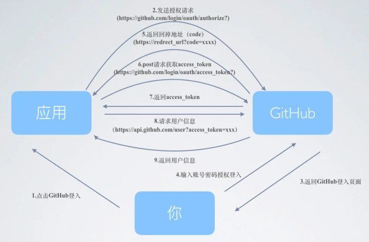
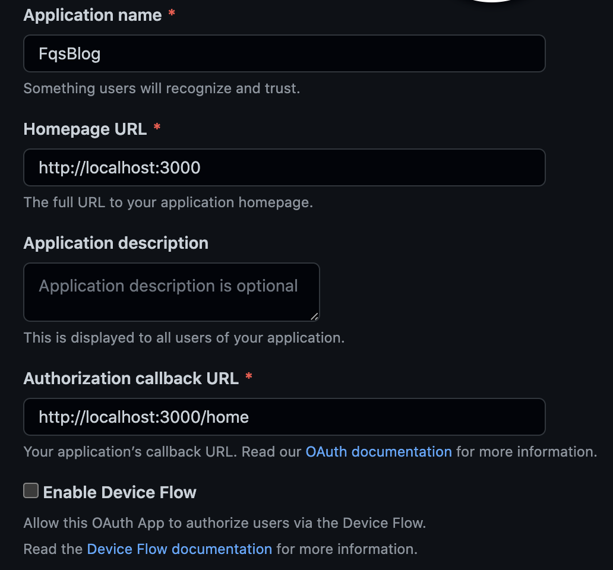
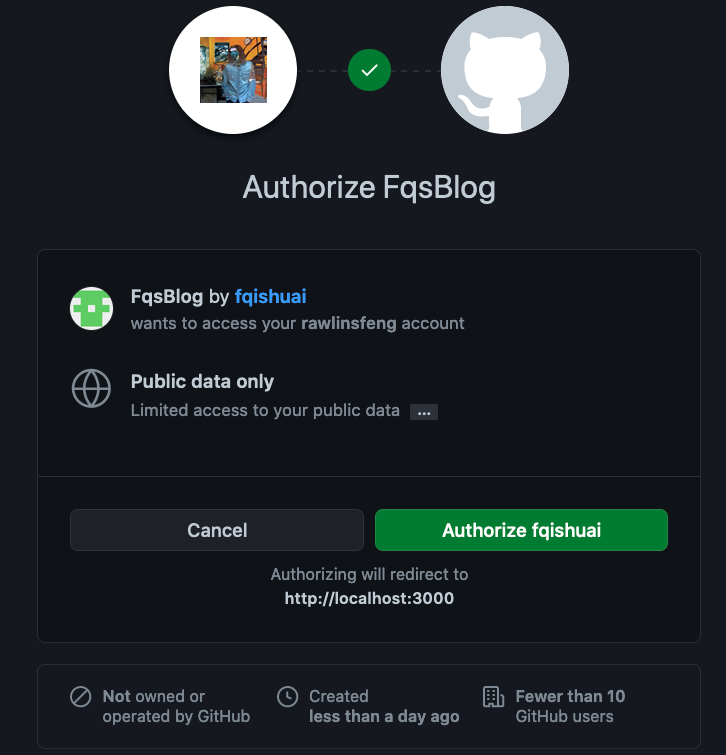
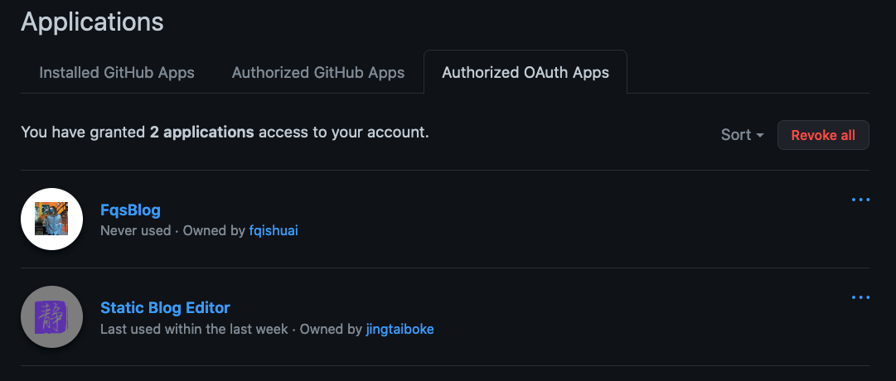

- [1. 使用git rebase合并分支(e.g.master合并dev)：git rebase dev](#1-使用git-rebase合并分支egmaster合并devgit-rebase-dev)
- [2. 使用git rebase合并commits：git rebase -i [start-commitid]  [end-commitid]](#2-使用git-rebase合并commitsgit-rebase--i-start-commitid--end-commitid)
- [3. git pull 报错：fatal: Exiting because of unfinished merge.](#3-git-pull-报错fatal-exiting-because-of-unfinished-merge)
- [4. 不要使用git rebase修改已经push到远端的commit](#4-不要使用git-rebase修改已经push到远端的commit)
- [5. 强制推送到远端分支(e.g. feature分支)](#5-强制推送到远端分支eg-feature分支)
- [6. 查看git graph](#6-查看git-graph)
- [7. git commit message规范](#7-git-commit-message规范)
- [8. 如何切换git本地账号](#8-如何切换git本地账号)
- [9. 创建一个新的存储库](#9-创建一个新的存储库)
- [10. 推送现有空的存储库](#10-推送现有空的存储库)
- [11. 推送已有存储库](#11-推送已有存储库)
- [12. git大文件push](#12-git大文件push)
- [13. git branch --set-upstream-to=origin/remote_branch local_branch](#13-git-branch---set-upstream-tooriginremote_branch-local_branch)
- [14. 查看某个stash改动的文件](#14-查看某个stash改动的文件)
- [15. 查看某个stash具体内容](#15-查看某个stash具体内容)
- [16. git subtree](#16-git-subtree)
- [17. 取出指定的stash](#17-取出指定的stash)
- [18. git cherry-pick](#18-git-cherry-pick)
- [19. 如何在 GitHub 提交第一个 pull request](#19-如何在-github-提交第一个-pull-request)
- [20. git fetch](#20-git-fetch)
- [21. git凭据](#21-git凭据)
- [22. github使用文档](#22-github使用文档)
- [23. git撤销，放弃本地修改](#23-git撤销放弃本地修改)
  - [(1) 未使用git add缓存代码时](#1-未使用git-add缓存代码时)
  - [(2) 已经使用了git add](#2-已经使用了git-add)
  - [(3) 已经使用了git commit提交了代码](#3-已经使用了git-commit提交了代码)
- [24. 修改commit message](#24-修改commit-message)
- [25. Git 拉取项目中指定文件或文件夹: 所用知识点为稀疏检出](#25-git-拉取项目中指定文件或文件夹-所用知识点为稀疏检出)
- [26. 稀疏检出和浅克隆](#26-稀疏检出和浅克隆)
- [27. 查看远程分支的git log： git log 远程分支名](#27-查看远程分支的git-log-git-log-远程分支名)
- [28. git rebase有冲突时](#28-git-rebase有冲突时)
- [29. 修改本地分支：git branch -m oldname newname  或者 git branch -M newname](#29-修改本地分支git-branch--m-oldname-newname--或者-git-branch--m-newname)
- [30. git push时报错：remote: Permission to rawlinsfeng/ignore-but-use-plugin.git denied to VimPy.](#30-git-push时报错remote-permission-to-rawlinsfengignore-but-use-plugingit-denied-to-vimpy)
- [31. git clone时报错：https://xxx.git not found.](#31-git-clone时报错httpsxxxgit-not-found)
- [32. 仓库只有一个git commit，怎么撤掉该git commit？](#32-仓库只有一个git-commit怎么撤掉该git-commit)
- [33. git tag](#33-git-tag)
- [34. 当用自己的网访问不了github时，可以使用dev-sidecar，亲测可用。](#34-当用自己的网访问不了github时可以使用dev-sidecar亲测可用)
- [35. gitbook的用法](#35-gitbook的用法)
- [36. github pages](#36-github-pages)
  - [(1) github.io](#1-githubio)
  - [(2) Jekyll](#2-jekyll)
  - [(3) gh-pages](#3-gh-pages)
  - [(4) deployments](#4-deployments)
  - [(5) Liquid语法](#5-liquid语法)
  - [(6) 分页插件jekyll-paginate](#6-分页插件jekyll-paginate)
- [37. git 修改远程分支名称](#37-git-修改远程分支名称)
- [38. 设置git识别文件名大小写变化](#38-设置git识别文件名大小写变化)
- [39. github查看安装的github应用（Installed GitHub Apps）、授权的github应用（Authorized Github Apps）、授权的OAuth应用（Authorized OAuth Apps）](#39-github查看安装的github应用installed-github-apps授权的github应用authorized-github-apps授权的oauth应用authorized-oauth-apps)
- [40. github授权登录](#40-github授权登录)
  - [(1) 授权流程](#1-授权流程)
  - [(2) 操作步骤](#2-操作步骤)
  - [(3) 代码参考](#3-代码参考)
- [41. github api](#41-github-api)
- [42. 本地新建分支后push到远程](#42-本地新建分支后push到远程)


## 1. 使用git rebase合并分支(e.g.master合并dev)：git rebase dev
## 2. 使用git rebase合并commits：git rebase -i [start-commitid]  [end-commitid]
> 注意：不包含start-commitid，包含end-commitid
>- pick：保留该commit（缩写:p）
>- reword：保留该commit，但我需要修改该commit的注释（缩写:r）
>- edit：保留该commit, 但我要停下来修改该提交(不仅仅修改注释)（缩写:e）
>- squash：将该commit和前一个commit合并（缩写:s）
>- fixup：将该commit和前一个commit合并，但我不要保留该提交的注释信息（缩写:f）
>- exec：执行shell命令（缩写:x）
>- drop：我要丢弃该commit（缩写:d）
## 3. git pull 报错：fatal: Exiting because of unfinished merge.
> 解决方法（放弃本地修改）：git reset --hard origin/master
## 4. 不要使用git rebase修改已经push到远端的commit
> 否则rebase后push的时候会报错（因为git的push操作默认是假设远端的分支和你本地的分支可以进行fast-forward操作，换句话说就是这个push命令假设你的本地分支和远端分支的唯一区别是你本地有几个新的commit，而远端没有）让先pull，而pull后会有一堆冲突。
## 5. 强制推送到远端分支(e.g. feature分支)
> 使用  git push --force-with-lease origin feature  来保证分支安全
## 6. 查看git graph
> git log --graph --decorate --oneline --simplify-by-decoration --all
>- --decorate 标记会让git log显示每个commit的引用(如:分支、tag等)
>- --oneline 一行显示
>- --simplify-by-decoration 只显示被branch或tag引用的commit
>- --all 表示显示所有的branch，如果想显示分支ABC的关系，则将--all替换为branchA branchB branchC
## 7. git commit message规范
>- feat：新功能（feature）
>- fix：修补bug
>- docs：文档（documentation）
>- style： 格式（不影响代码运行的变动）
>- refactor：重构（即不是新增功能，也不是修改bug的代码变动）
>- test：增加测试
>- chore：构建过程或辅助工具的变动

## 8. [如何切换git本地账号](https://www.jianshu.com/p/dca5e36d404e)
- 1）查看配置：git config --list
- 2）切换账号
   >- git config --global user.name "xxx"
   >- git config --global user.email "xxx"
## 9. 创建一个新的存储库
>- git clone https://xxx
>- git add README.md
>- git commit -m "add README"
>- git push -u origin main
## 10. 推送现有空的存储库
>- cd existing_folder
>- git init
>- git remote add origin https://xxx
>- git add .
>- git commit -m "Initial commit"
>- git push -u origin main
## 11. 推送已有存储库
>- cd existing_repo
>- git remote set-url origin https://xxx
>- git push --all https://xxx
## 12. git大文件push 
> You may want to try Git Large File Storage - https://git-lfs.github.com.
## 13. git branch --set-upstream-to=origin/remote_branch local_branch
## 14. 查看某个stash改动的文件
> git stash show stash@{0}
## 15. 查看某个stash具体内容
> git stash show -p stash@{0}
## 16. git subtree
## 17. 取出指定的stash
> git stash apply --index stash的索引
## 18. [git cherry-pick](https://www.ruanyifeng.com/blog/2020/04/git-cherry-pick.html)
- 转移一个提交：`git cherry-pick <Hash>`
- cherry-pick 支持一次转移多个提交
> - `git cherry-pick <HashA> <HashB>`
> - 上面的命令将 A 和 B 两个提交应用到当前分支。这会在当前分支生成两个对应的新提交。
> - 如果想要转移一系列的连续提交，可以使用下面的简便语法。
> - `git cherry-pick A..B`
> - 上面的命令可以转移从 A 到 B 的所有提交。它们必须按照正确的顺序放置：提交 A 必须早于提交 B，否则命令将失败，但不会报错。
> - 注意，使用上面的命令，提交 A 将不会包含在 Cherry pick 中。如果要包含提交 A，可以使用下面的语法。
> - `git cherry-pick A^..B`

## 19. [如何在 GitHub 提交第一个 pull request](https://chinese.freecodecamp.org/news/how-to-make-your-first-pull-request-on-github/)
- 1) fork仓库A
- 2) 将你账户中的仓库A克隆到本地
- 3）本地打开仓库A并新建一个分支用来修改
- 4）修改并提交
- 5）把变更推送到github
  - 推送前先确认远程库的名称，使用**git remote**查看
  - 确认后推送：git push origin [Branch Name]。注意：这里的origin是git remote查看的结果
- 6）GitHub上在你fork的仓库中可以看到一个“Compare & pull request”按钮，点击它。
- 7）write这次pr的内容，然后点击Create pull request
- 8）pr被接受的话，你将会收到邮件通知（不被接受也会收到邮件通知，本人第一个pr被拒了，哎~）

## 20. git fetch
- git pull 和 git fetch 的区别
> - [使用 git pull 、git fetch 获取最新版本](https://blog.csdn.net/weixin_44653603/article/details/87874110)
> - [git fetch & pull详解](https://juejin.cn/post/6844903921794859021)

## 21. [git凭据](https://www.codenong.com/15381198/)
- github从2021.08.13开始，访问仓库时不再支持用户名-密码的形式进行身份验证
- Settings/Developer settings/Personal access tokens 设置token，使用用户名-token的形式访问
- 更换密码或token
  - windows可以在控制面板/用户帐户/凭据管理器/Windows凭据中将git的凭据删除  或者  使用git config --global --unset credential.helper禁用对Git凭据缓存的使用
  - macos：启动台中打开钥匙串--->系统根证书--->搜索git，删掉github.com的密码

## 22. [github使用文档](https://docs.github.com/cn/github)

## 23. git撤销，放弃本地修改
### (1) 未使用git add缓存代码时
```js
/*
可以使用git checkout -- filename，比如git checkout -- readme.md
不要忘记"--"，不然就成了检出分支了。
放弃所有的文件修改(包括内容修改和文件删除)，使用git checkout .
*/
```
### (2) 已经使用了git add
```js
/*
可以使用git reset HEAD filename，比如git reset HEAD readme.md，来放弃指定文件的缓存
放弃所有的缓存可以使用，git reset HEAD .
此命令相当于撤销了git add的工作，使用该命令后，本地的修改并不会消失，继续使用
git checkout -- filename，就可以放弃本地的修改
*/
```
### (3) 已经使用了git commit提交了代码
```js
/*
可以使用git reset --hard HEAD^ 回退到上一次commit的状态
此命令可以用来回退到任意版本：git reset --hard commitId
可以使用git log来查看提交历史，commit后面的一串儿就是commitId
*/
```

## 24. 修改commit message
- [amend](https://docs.github.com/cn/github/committing-changes-to-your-project/creating-and-editing-commits/changing-a-commit-message)

## 25. [Git 拉取项目中指定文件或文件夹](https://www.jianshu.com/p/b1da4b0fea6e): 所用知识点为稀疏检出
```js
cd 一个空文件夹
git init    //git初始化
git remote add -f origin http://githhub/projectName.git   //添加远程仓库地址
git config core.sparsecheckout true    //开启sparse checkout功能
echo "fileName" >> .git/info/sparse-checkout   //fileName需要拉去的文件夹名称--->注意：windows上fileName加引号无效！！！
cat .git/info/sparse-checkout   //查看配置文件信息
git pull origin master    //拉取远程哪个分支的文件目录，这里是master上的分支
```
> **注意：** 可以 echo 某个目录名 >> .git/info/sparse-checkout；也可以 echo 某个文件名 >> .git/info/sparse-checkout；多个文件或目录的话可以遍历执行 echo 某个目录名或某个文件名 >> .git/info/sparse-checkout
> **注意：** 一旦设置拉取的文件后，后续就不能再添加或者减少拉取或者提交的代码范围，修改sparse-checkout无效。除非按照步骤再来一遍：echo 某个目录名或某个文件名 >> .git/info/sparse-checkout，然后拉取
> **注意：** 添加文件进行稀疏检出时，该文件需要有后缀

## 26. [稀疏检出和浅克隆](https://www.worldhello.net/gotgit/08-git-misc/090-sparse-checkout-and-shallow-clone.html)

## 27. 查看远程分支的git log： git log 远程分支名

## 28. git rebase有冲突时
- 先解决冲突，然后git add，然后git rebase --continue
- 也可以git rebase --skip跳过该commit
- 也可以git rebase --abort放弃本次rebase
> 工作时的操作：从master拉一个release分支并push到远程，用release分支rebase开发分支，解决冲突--->git add--->git rebase --continue，反复该过程直到本次rebase successfully，然后git status，根据status执行不同的命令，比如git fetch，然后rebase origin/release，然后push
> 注意：避免用rebase过开发分支的分支再去rebase新的开发分支

## 29. 修改本地分支：git branch -m oldname newname  或者 git branch -M newname

## 30. git push时报错：remote: Permission to rawlinsfeng/ignore-but-use-plugin.git denied to VimPy.
## 31. git clone时报错：https://xxx.git not found.
> 30和31这两种报错都是git 凭据导致的，如果你有两个github账号，使用不同账号的代码仓库时需要先删掉本机存的github凭据，或者设置本机不保存github凭据。

## 32. 仓库只有一个git commit，怎么撤掉该git commit？

## 33. [git tag](https://git-scm.com/book/zh/v2/Git-%E5%9F%BA%E7%A1%80-%E6%89%93%E6%A0%87%E7%AD%BE)
- 列出标签：git tag
- push本地所有标签：git push origin --tags
- tag内容：git tag -a v1.4 -m "my version 1.4"
- 给某次commit追加tag：git tag -a tag名 commit的hash，例如：git tag -a v1.2 9fceb02

## 34. 当用自己的网访问不了github时，可以使用[dev-sidecar](https://gitee.com/docmirror/dev-sidecar)，亲测可用。

## 35. gitbook的用法
- npm install -g gitbook-cli
- 在一个文件夹下执行gitbook init，生成两个文件：
>- readme.md---书籍的介绍文件
>- summary.md---书籍的目录结构的配置文件

## 36. github pages
### (1) github.io
- 创建一个public的仓库，命名为username.github.io（比如：fqishuai.github.io）
- 新建一个index.html，随便写点啥内容，然后push
- 访问https://fqishuai.github.io

### (2) [Jekyll](http://jekyllcn.com/)
> Jekyll 是一个静态站点生成器，内置 GitHub Pages 支持和简化的构建过程。Jekyll 的核心其实是一个文本转换引擎。它的概念其实就是：你用你最喜欢的标记语言来写文章，可以是 Markdown, 也可以是 Textile, 或者就是简单的 HTML, 然后 Jekyll 就会帮你套入一个或一系列的布局中。
- 可以通过编辑 [_config.yml](http://jekyllcn.com/docs/configuration/) 文件来配置大多数 Jekyll 设置

- 默认情况下，Jekyll 不会构建以下文件或文件夹：
>- 位于文件夹 /node_modules 或 /vendor 中
>- 开头为 _ 或 . 或 #
>- 结尾为 ~
>- 被配置文件中的 exclude 设置排除

- [安装jekyll的前提条件](https://jekyllrb.com/docs/installation/#requirements)
> macos环境直接执行：gem install --user-install bundler jekyll
> - 安装成功后可以使用jekyll -v 查看版本
> - 使用 `jekyll new [site-name]` 创建一个本地的静态站点
> - cd到刚才创建的文件夹下，执行`bundle exec jekyll serve`
> - 浏览器访问127.0.0.1:4000就可以看到这个静态站点页面
> - 如果你希望把 jekyll 安装到当前目录，你可以运行 jekyll new . 来代替。如果当前目录非空，你还需要增添 --force 参数，所以命令应为 jekyll new . --force。
> - 生成的目录结构：_config.yml--->保存配置数据。很多配置选项都可以直接在命令行中进行设置，但是如果你把那些配置写在这儿，你就不用非要去记住那些命令了；_posts--->这里放的就是你的文章了。文件格式很重要，必须要符合: YEAR-MONTH-DAY-title.MARKUP。 永久链接 可以在文章中自己定制，但是数据和标记语言都是根据文件名来确定的；_site--->一旦 Jekyll 完成转换（本地执行bundle exec jekyll serve后就会生成该目录），就会将生成的页面放在这里（默认）,最好将这个目录放进你的 .gitignore 文件中
> - 把生成的目录直接push到fqishuai.github.io这个仓库，访问 https://fqishuai.github.io 就可以看到和本地启动bundle exec jekyll serve访问127.0.0.1:4000时一样的页面

- jekyll生成的目录详解
>- 如果根目录下有index.html，则该html文件的内容就是fqishuai.github.io的首页，在该html中可以使用如下形式来加载其他html内容
```html
---
layout: default
---

<!-- 以上写法，就会把项目_layouts目录下的default.html的内容加载进来-->
```
>- 在html文件中还可以使用``来加载_includes目录下的文件
```html
<div>
  
</div>
```

- 使用[Jekyll 主题](http://jekyllthemes.org)
> 其实一个主题就是一个使用Jekyll生成的项目，可以下载到本地或者clone到本地，然后在此基础上按自己的想法再修改修改就可以成为自己的Jekyll博客模版
> 也可以[安装主题](http://jekyllcn.com/docs/themes/)

> 注意：使用安装主题这种方式的时候，本地需要有该主题对应的**gemspec文件**！

### (3) gh-pages
- react项目(my-app)部到GitHub page
>- yarn create react-app my-app --template typescript
>- yarn add gh-pages --dev
>- 修改package.json: (1)scripts增加"predeploy": "yarn build", "deploy": "gh-pages -d build" (2)增加"homepage": "./",

### (4) deployments
> 注意： If your GitHub Pages site is built from a public repository, it is built and deployed with a GitHub Actions workflow run unless you've configured your GitHub Pages site to use a different CI tool. 
- Environments--->github-pages的状态如果是Failure则说明没有部署成功，可以点进去查看原因，比如：github-pages 223 | Error:  The jekyll-theme-chirpy theme could not be found.

### (5) [Liquid语法](https://liquid.bootcss.com/)

### (6) 分页插件[jekyll-paginate](https://blog.csdn.net/henryhu712/article/details/84800410)

## 37. git 修改远程分支名称
- 首先 git branch -m 旧分支名 新分支名
- 其次 git push --delete origin 旧分支名
- 将新分支名推上去 git push origin 新分支名
- 将新本地分支和远程相连 git branch --set-upstream-to origin/新分支名

> 注意：如果修改远程master分支的名字，则：在Settings--->Branches中进行修改，然后：
> - git branch -m master main
> - git fetch origin
> - git branch -u origin/main main
> - git remote set-head origin -a

## 38. 设置git识别文件名大小写变化
> git config core.ignorecase false

## 39. github查看安装的github应用（Installed GitHub Apps）、授权的github应用（Authorized Github Apps）、授权的OAuth应用（Authorized OAuth Apps）
- github--->settings--->applications

## 40. github授权登录
> 第三方登录的实质就是 OAuth 授权

### (1) 授权流程
> 整个流程如图所示


- 授权的总体流程：
> - 用户进入到我的网站,我想要获取到用户的 GitHub 信息
> - 跳转到 GitHub 授权页面,然后问用户是否允许我获得他的信息,授予权限
> - 同意,我的网站会获得 GitHub 发回的一个授权码,使用该授权码向 GitHub 申请一个令牌
> - GitHub 授权码进行验证,没问题就会返回一个令牌(这个令牌只在短时间内有效)
> - 我的网站获得令牌,然后向 GitHub 的 user 发起请求
> - GitHub 验证令牌,没问题用户信息就返回过来了
> - 我们通过返回的用户信息然后创建一个用户,并生成 token 返回给 client
> - 然后根据 token 进行登录验证,来保持登录

### (2) 操作步骤
- 首先新建一个GitHub App或者一个OAuth App（github--->settings--->Developer settings--->GitHub Apps/OAuth Apps）

> 其中，Authorization callback URL对应的页面用来接收github返回的code，将code传给服务端，服务端用该code以及client ID 和 client secret调用GitHub API来鉴权获取GitHub账户信息

- 会生成一个Client ID，并且可以生成一个Client secret


- 可以访问`https://github.com/login/oauth/authorize?client_id=[你申请之后的client_id]&redirect_uri=[你的回调地址（也就是callback URL）]`看下此时的页面效果，有GitHub登录态和没有GitHub登录态的效果不一样，如果所示


> - 注意：有登录态的这个页面只会在未授权前出现，授权后有登录态的情况下不会再出现
> - 此时可以去授权该oauth app的GitHub账户查看Authorized OAuth App，发现多了一个刚才授权的应用，如图所示

> - 当然也可以撤销授权，点击Revoke，撤销授权后该应用就不能访问你的GitHub账户了

### (3) 代码参考
- [vue+node实现第三方登录——github](https://blog.csdn.net/YY_WYG/article/details/109027872)

## 41. github api
- [github-api](https://www.npmjs.com/package/github-js)

## 42. 本地新建分支后push到远程
> git push --set-upstream origin 分支名

## 43. 报错：HTTP/2 stream 1 was not closed cleanly before end of the underlying stream
是git默认使用的通信协议出现了问题，可以通过将默认通信协议修改为 http/1.1 来解决该问题：
```bash
git config --global http.version HTTP/1.1
```