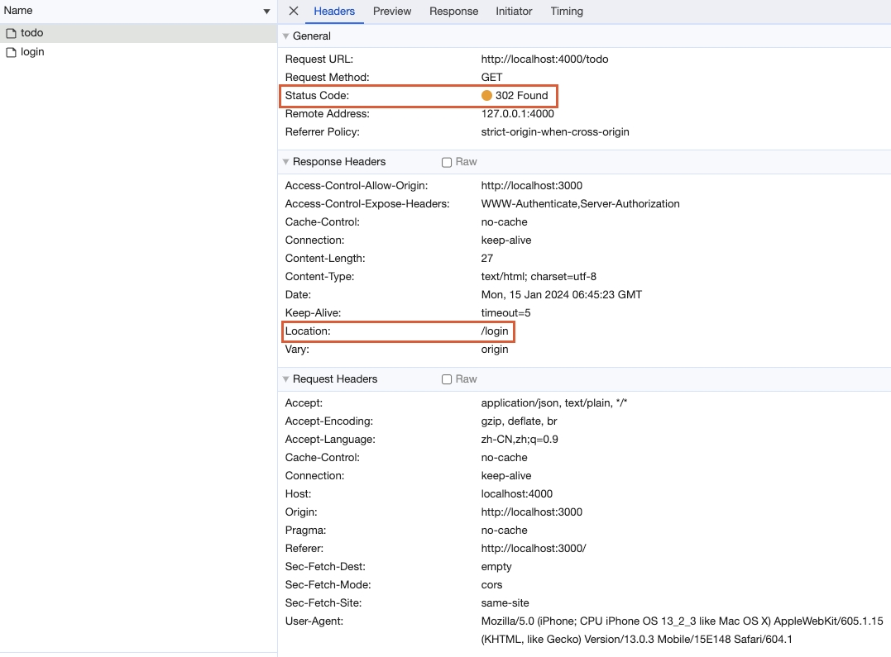
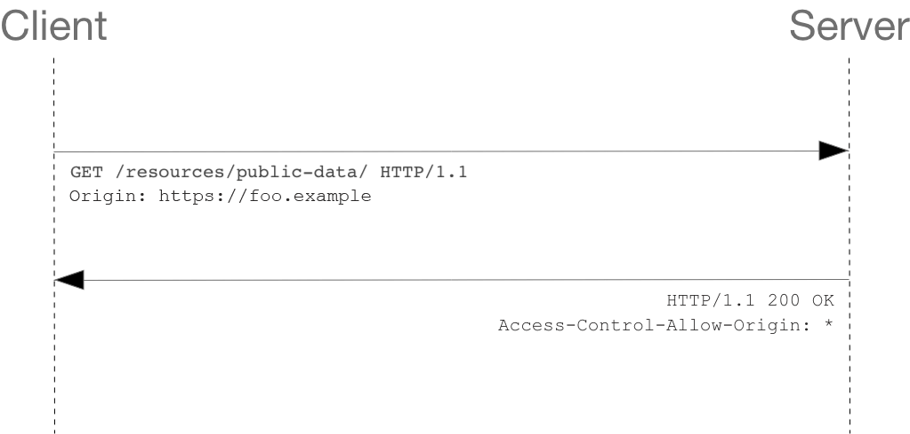

[HTTP](https://developer.mozilla.org/zh-CN/docs/Web/HTTP) 是一个用于传输超媒体文档（例如 HTML）的应用层协议。它是为 Web 浏览器与 Web 服务器之间的通信而设计的，但也可以用于其他目的。HTTP 遵循经典的客户端—服务端模型，客户端打开一个连接以发出请求，然后等待直到收到服务器端响应。HTTP 是无状态协议，这意味着服务器不会在两个请求之间保留任何数据（状态）。


## [HTTP 响应状态码](https://developer.mozilla.org/zh-CN/docs/Web/HTTP/Status)
HTTP 响应状态码用来表明特定 HTTP 请求是否成功完成。 响应被归为以下五大类：
- 信息响应 (100–199)
- 成功响应 (200–299)
- 重定向消息 (300–399)
- 客户端错误响应 (400–499)
- 服务端错误响应 (500–599)

### 302 Found
HTTP 302 Found 重定向状态码表明请求的资源被暂时的移动到了由该 HTTP 响应的响应头 `Location` 指定的 URL 上。浏览器会重定向到这个 URL。比如浏览器访问`http://localhost:4000/todo`，Node.js服务端会校验cookie及其有效性，校验不通过会重定向到`/login`



## [跨源资源共享（CORS）](https://developer.mozilla.org/zh-CN/docs/Web/HTTP/CORS)
:::tip
其他资料：[跨域资源共享 CORS 详解](https://www.ruanyifeng.com/blog/2016/04/cors.html)
:::

- 浏览器的同源策略：协议、域名、端口都相同就是同源。不同源的影响：
  - cookie、local storage、indexdb等存储性内容无法读取
  - dom节点无法访问
  - ajax请求发出去了，但是响应被浏览器拦截了。`XXX has been blocked by CORS policy: No 'Access-Control-Allow-Origin' header is present on the requested resource`.

- 跨源资源共享（CORS，或通俗地译为跨域资源共享）是一种基于 HTTP 头的机制，该机制通过允许服务器标示除了它自己以外的其他源（域、协议或端口），使得浏览器允许这些源访问加载自己的资源。跨源资源共享还通过一种机制来检查服务器是否会允许要发送的真实请求，该机制通过浏览器发起一个到服务器托管的跨源资源的“预检”("preflight")请求。在预检中，浏览器发送的头中标示有 HTTP 方法和真实请求中会用到的头。

- 出于安全性，浏览器限制脚本内发起的跨源 HTTP 请求。例如，XMLHttpRequest 和 Fetch API 遵循同源策略。这意味着使用这些 API 的 Web 应用程序只能从加载应用程序的同一个域请求 HTTP 资源，除非响应报文包含了正确 CORS 响应头。


- 跨源资源共享标准新增了一组 HTTP 标头字段，允许服务器声明哪些源站通过浏览器有权限访问哪些资源。另外，规范要求，对那些可能对服务器数据产生副作用的 HTTP 请求方法（特别是 GET 以外的 HTTP 请求，或者搭配某些 MIME 类型的 POST 请求），浏览器必须首先使用 OPTIONS 方法发起一个预检请求（preflight request），从而获知服务端是否允许该跨源请求。服务器确认允许之后，才发起实际的 HTTP 请求。在预检请求的返回中，服务器端也可以通知客户端，是否需要携带身份凭证（例如 Cookie 和 HTTP 认证相关数据）。


请求标头字段 `Origin` 表明该请求来源于 `http://foo.example`。服务端返回的 `Access-Control-Allow-Origin` 标头的`Access-Control-Allow-Origin: *` 表明，该资源可以被任意外源访问。

- [用最简单的方式讲清楚常见的几种跨域解决方案](https://mp.weixin.qq.com/s/BUROGy6x-o37TPWHfLpwpQ)

### Nginx 反向代理
- 同源策略限制的是浏览器向服务器发送跨域请求需要遵循的标准。那如果是服务器向服务器发送跨域请求呢？答案当然是，不受浏览器的同源策略限制。
- 利用这个思路，我们就可以搭建一个代理服务器，接受客户端请求，然后将请求转发给服务器，拿到响应后，再将响应转发给客户端。

```xml
# nginx.config
# ...
server {
  listen       80;
  server_name  www.domain1.com;
  location / {
    proxy_pass   http://www.domain2.com:8080;  #反向代理
    proxy_cookie_domain www.domain2.com www.domain1.com; #修改cookie里域名
    index  index.html index.htm;

    # 当用 webpack-dev-server 等中间件代理接口访问 nignx 时，此时无浏览器参与，故没有同源限制，下面的跨域配置可不启用
    add_header Access-Control-Allow-Origin *;
    add_header Access-Control-Allow-Credentials true;
    # ...
  }
}
```

### Node 中间件代理
- 实现的原理和nginx代理服务器的原理一样。需要注意的是，浏览器向代理服务器请求时仍然遵循同源策略，别忘了在 Node 层通过 CORS 做跨域处理。
```js
const https = require('https')
// 接受客户端请求
const sever = https.createServer((req, res) => {
  ...
  const { method, headers } = req
  // 设置 CORS 允许跨域
  res.writeHead(200, {
    'Access-Control-Allow-Origin': '*',
    'Access-Control-Allow-Methods': '*',
    'Access-Control-Allow-Headers': 'Content-Type',
    ...
  })
  // 请求服务器
  const proxy = https.request({ host: 'xxx', method, headers, ...}, response => {
    let body = ''
    response.on('data', chunk => { body = body + chunk })
    response.on('end', () => {
      // 响应结果转发给客户端
      res.end(body)
    })
  })
  // 结束请求
  proxy.end()
})
```

## 浏览器缓存

### [webpack 缓存指南](https://webpack.docschina.org/guides/caching/)
### 清除缓存
- [vue打包优化3：hash解决浏览器缓存](https://www.jianshu.com/p/822af1648831)
- 清除浏览器缓存的几种方法：
> - 修改html入口文件
```html
<meta http-equiv="pragram" content="no-cache">
<meta http-equiv="cache-control" content="no-cache, no-store, must-revalidate">
<meta http-equiv="expires" content="0">
```
> - 修改nginx
```xml
## 如果是部署在nginx上，在nginx的配置文件 nginx.config添加：
location = /index.html {
  add_header Cache-Control "no-cache, no-store";
}
## 或者设置expires为0

## 如果是用nginx做反向代理的：
location = /xx（xx为你的代理的项目名） {
  add_header Cache-Control "no-cache, no-store";
}

## 如果nginx上有 proxy_cache 的配置，也考虑删掉，这是nginx的服务器缓存
```
> - 修改构建配置文件：output的filename和chunkFilename加上时间戳

## XMLHttpRequest(XHR)
### `withCredentials`属性
CORS请求默认不发送Cookie和HTTP认证信息。如果要把Cookie发到服务器，一方面要服务器同意，指定`Access-Control-Allow-Credentials`字段: `Access-Control-Allow-Credentials: true`；另一方面，开发者必须在AJAX请求中打开`withCredentials`属性:
```js
var xhr = new XMLHttpRequest();
xhr.withCredentials = true;
```
否则，即使服务器同意发送Cookie，浏览器也不会发送。或者，服务器要求设置Cookie，浏览器也不会处理。但是，如果省略`withCredentials`设置，有的浏览器还是会一起发送Cookie。这时，可以显式关闭`withCredentials`: `xhr.withCredentials = false;`

:::warning
需要注意的是，如果要发送Cookie，`Access-Control-Allow-Origin`就不能设为星号，必须指定明确的、与请求网页一致的域名。同时，Cookie依然遵循同源政策，只有用服务器域名设置的Cookie才会上传，其他域名的Cookie并不会上传，且（跨源）原网页代码中的`document.cookie`也无法读取服务器域名下的Cookie。
:::

## cookie
### HttpOnly
### Domain
### SameSite
### Expires / Max-Age
### js获取cookie
```js
const getCookie = (cookieName: string) => {
  const cookies = document.cookie;
  const name = cookieName + "=";
  var cookieArray = cookies.split(';');
  for (let i=0; i<cookieArray.length; i++) {
    let cookie = cookieArray[i].trim();
    if (cookie.indexOf(name) == 0) return cookie.substring(name.length,cookie.length);
  }
  return "";
}
```

## 优化相关
### 1. [Web 性能优化：控制关键请求的优先级](https://mp.weixin.qq.com/s/P63LEMaXLMyWGYVdLiWxZw)

## 安全
### 1. [Content-Security-Policy](https://developer.mozilla.org/zh-CN/docs/Web/HTTP/Headers/Content-Security-Policy)
> 示例: 禁用不安全的内联/动态执行, 只允许通过 https加载这些资源 (images, fonts, scripts, etc.)
```markdown
// header
Content-Security-Policy: default-src https:
// meta tag
<meta http-equiv="Content-Security-Policy" content="default-src https:">
```