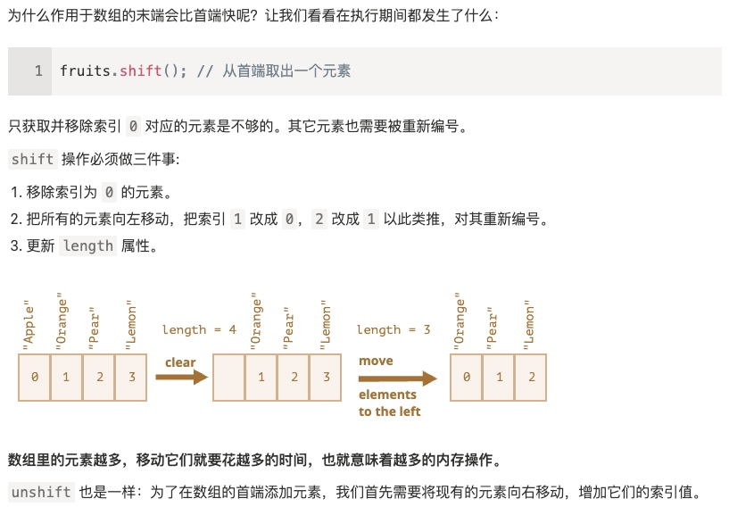
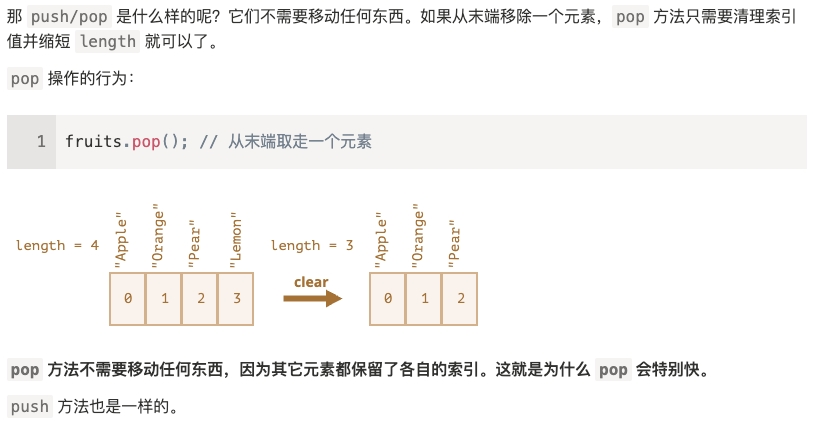
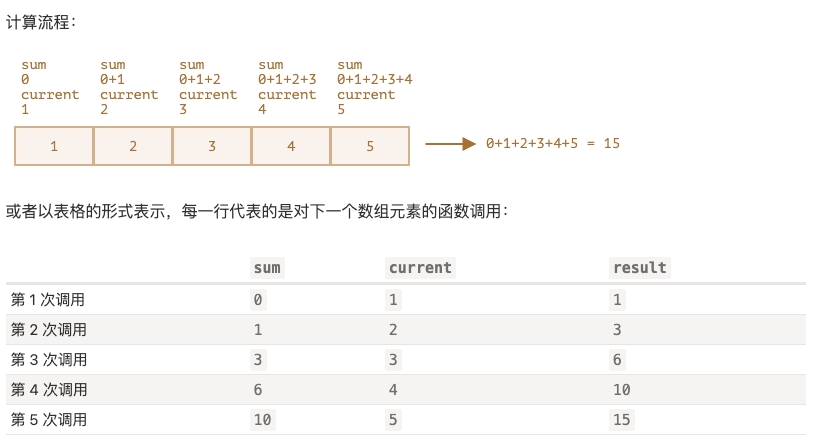

## 数组
- 数组扩展了对象，提供了特殊的方法来处理有序的数据集合以及 length 属性。但从本质上讲，它仍然是一个对象。但是数组真正特殊的是它的内部实现。JavaScript 引擎尝试把这些元素一个接一个地存储在连续的内存区域，而且还有一些其它的优化，以使数组更好地作用于连续的有序数据。如果我们不像“有序集合”那样使用数组，而是像常规对象那样使用数组，从技术上讲，这是可以的，因为数组是基于对象的，但是这些优化就都不生效了。
  ```js
  let fruits = []; // 创建一个数组

  // 以下操作不会报错，但是Javascript 引擎会发现，我们在像使用常规对象一样使用数组，那么针对数组的优化就不再适用了
  fruits[99999] = 5; // 分配索引远大于数组长度的属性

  fruits.age = 25; // 创建一个具有任意名称的属性
  ```

- 数组是存储有序数据的集合。数组元素从 0 开始编号。数组可以存储任何类型的元素。
  ```js
  // 混合值
  let arr = [ 'Apple', { name: 'John' }, true, function() { alert('hello'); } ];

  // 获取索引为 1 的对象然后显示它的 name
  alert( arr[1].name ); // John

  // 获取索引为 3 的函数并执行
  arr[3](); // hello
  ```

- `length`属性不是数组里元素的个数，而是最大的数字索引值加一。
  ```js
  let fruits = [];
  fruits[123] = "Apple";

  console.log( fruits.length ); // 124

  // 查找数组最中间的元素(要求适用于任何奇数长度的数组)
  arr[Math.floor((arr.length - 1) / 2)]
  ```

- `length`属性是可写的。如果我们减少它，数组就会被截断，该过程是不可逆的。所以，清空数组最简单的方法就是：`arr.length = 0;`。
  ```js
  let arr = [1, 2, 3, 4, 5];

  arr.length = 2; // 截断到只剩 2 个元素
  console.log( arr ); // [1, 2]

  arr.length = 5; // 又把 length 加回来
  console.log( arr[3] ); // undefined：被截断的那些数值并没有回来
  ```

- 如果使用单个参数（即数字）调用 `new Array`，那么它会创建一个 指定了长度，却没有任何项 的数组。
  ```js
  let arr = new Array("Apple", "Pear", "etc");

  let arr = new Array(2);
  alert( arr[0] ); // undefined！没有元素。
  alert( arr.length ); // length 2
  ```

- 数组里的项也可以是数组。我们可以将其用于多维数组，例如存储矩阵：
  ```js
  let matrix = [
    [1, 2, 3],
    [4, 5, 6],
    [7, 8, 9]
  ];

  alert( matrix[1][1] ); // 最中间的那个数
  ```

- 在数组上下文调用
  <CodeRun>{`
  // this的隐式绑定
  let arr = ["a", "b"];
  arr.push(function() {
    console.log( this );
  });
  arr[2](); // ["a", "b", function()]
  /*
  arr[2]() 调用从句法来看可以类比于 obj[method]()，与 obj 对应的是 arr，与 method 对应的是 2。
  所以调用 arr[2] 函数也就是调用对象函数。自然地，它接收 this 引用的对象 arr 然后输出该数组
  */
  `}</CodeRun>

### `Array.prototype.at()`
接收一个整数值并返回该索引对应的元素，允许正数和负数。负整数从数组中的最后一个元素开始倒数。
- 如果 `i >= 0`，则 `arr.at(i)` 与 `arr[i]` 完全相同。
- 如果 `i` 为负数，则从数组的尾部向前数。
```js
let fruits = ["Apple", "Orange", "Plum"];

// 与 fruits[fruits.length-1] 相同
alert( fruits.at(-1) ); // Plum
```

### `Array.prototype[@@iterator]()`
:::info
[在 ECMAScript 2015（ES6）规范中，使用 `@@iterator` 来引用 `Symbol.iterator`。实际上，`@@iterator` 并不存在，无法直接使用，它只是在规范中用来表示特定符号的标记。如果你想在代码中使用这个符号，比如访问数组的迭代器，你需要使用 `Symbol.iterator`。这是 Symbol 类的一个属性，初始值为 `@@iterator`。总的来说，`@@iterator` 和 `Symbol.iterator` 是等价的，只是在不同的规范和文档中使用了不同的表示方式。在实际编码中，你应该使用 `Symbol.iterator` 来访问迭代器，因为 `@@iterator` 并不是一个有效的标识符。](https://devv.ai/zh/search?threadId=d63rqbvp5eyo)
:::
:::warning
数组迭代器对象应该是一次性使用的对象。不要重复使用它。
:::
- Array 实例的 `[@@iterator]()` 方法实现了迭代协议，允许数组被大多数期望可迭代对象的语法所使用，例如 展开语法(spread syntax ) 和 for..of 循环。它返回一个数组迭代器对象，该对象会产生数组中每个索引的值。

- 实际使用语法：`array[Symbol.iterator]()`。请注意，你很少需要直接调用此方法。`@@iterator` 方法的存在使数组可迭代，并且像 for..of 循环这样的迭代语法会自动调用此方法以获得要遍历的迭代器。
  <CodeRun>{`
  const array1 = ['a', 'b', 'c'];
  const iterator1 = array1[Symbol.iterator]();
  for (const value of iterator1) {
    console.log(value);
  }
  `}</CodeRun>

- 如果你需要更多的控制迭代过程，你可以手动调用返回的迭代器对象的 `next()` 方法。
  <CodeRun>{`
  const arr = ["a", "b", "c", "d", "e"];
  const arrIter = arr[Symbol.iterator]();
  console.log(arrIter.next().value); // "a"
  console.log(arrIter.next().value); // "b"
  console.log(arrIter.next().value); // "c"
  console.log(arrIter.next().value); // "d"
  console.log(arrIter.next().value); // "e"
  `}</CodeRun>

### values 方法
- `values` 方法返回一个新的数组迭代器对象，该对象迭代数组中每个元素的值。

- `Array.prototype.values()` 是 `Array.prototype[@@iterator]()` 的默认实现。
  <CodeRun>{`
  Array.prototype.values === Array.prototype[Symbol.iterator]; // true
  `}</CodeRun>

- `values`方法返回的可迭代对象是不可重复使用的。

### pop/push, shift/unshift 方法
JavaScript 中的数组既可以用作队列(First-In-First-Out)，也可以用作栈(Last-In-First-Out)。它们允许你从首端/末端来添加/删除元素。[双端队列](https://wangtunan.github.io/blog/books/javascript/algorithm.html#%E5%8F%8C%E7%AB%AF%E9%98%9F%E5%88%97%E6%95%B0%E6%8D%AE%E7%BB%93%E6%9E%84)
- `pop` 取出并返回数组的最后一个元素
  ```js
  let fruits = ["Apple", "Orange", "Pear"];

  alert( fruits.pop() ); // 移除 "Pear" 然后 alert 显示出来

  alert( fruits );       // Apple, Orange
  ```

- `push` 在数组末端添加元素。调用 `fruits.push(...)` 与 `fruits[fruits.length] = ...` 是一样的。

- `shift` 取出数组的第一个元素并返回它
  ```js
  let fruits = ["Apple", "Orange", "Pear"];

  alert( fruits.shift() ); // 移除 Apple 然后 alert 显示出来

  alert( fruits ); // Orange, Pear
  ```

- `unshift` 在数组的首端添加元素。`push` 和 `unshift` 方法都可以一次添加多个元素
  ```js
  let fruits = ["Apple"];

  fruits.push("Orange", "Peach");
  fruits.unshift("Pineapple", "Lemon");

  // ["Pineapple", "Lemon", "Apple", "Orange", "Peach"]
  alert( fruits );
  ```
  
- push/pop 方法运行的比较快，而 shift/unshift 比较慢。
  
  

### splice/slice 方法
:::warning
splice 方法 修改的是数组本身。
:::

- 如何从数组中删除元素？数组是对象，所以我们可以尝试使用 `delete`，如下发现元素被删除了，但数组仍然有 3 个元素。这是因为 `delete obj.key` 是通过 `key` 来移除对应的值。对于普通对象来说是可以的。但是对于数组来说，我们通常希望剩下的元素能够移动并占据被释放的位置。
<CodeRun>{`
let arr = ["I", "go", "home"];
delete arr[1]; // remove "go"
console.log( arr[1] ); // undefined
console.log( arr.toString() ); // now arr = ["I",  , "home"];
cosole.log( arr.length ); // 3
`}</CodeRun>

- `arr.splice(start[, deleteCount, elem1, ..., elemN])` 可以添加、删除和插入元素。它从索引 `start` 开始修改 `arr`：删除 `deleteCount` 个元素并在当前位置插入 `elem1, ..., elemN`，最后返回被删除的元素所组成的数组。(当只填写了 splice 的 `start` 参数时，将删除从索引 `start` 开始的所有数组项)
  ```js
  let arr = ["I", "study", "JavaScript"];

  arr.splice(1, 1); // 从索引 1 开始删除 1 个元素

  alert( arr ); // ["I", "JavaScript"]
  ```
  ```js
  let arr = ["I", "study", "JavaScript", "right", "now"];

  // 删除数组的前三项，并使用其他内容代替它们
  arr.splice(0, 3, "Let's", "dance");

  alert( arr ) // 现在 ["Let's", "dance", "right", "now"]
  ```
  ```js
  // splice 返回被删除的元素所组成的数组
  let arr = ["I", "study", "JavaScript", "right", "now"];

  // 删除前两个元素
  let removed = arr.splice(0, 2);

  alert( removed ); // "I", "study" <-- 被从数组中删除了的元素
  ```
  ```js
  // 将 deleteCount 设置为 0，splice 方法就能够插入元素而不用删除任何元素
  let arr = ["I", "study", "JavaScript"];

  // 从索引 2 开始
  // 删除 0 个元素
  // 然后插入 "complex" 和 "language"
  arr.splice(2, 0, "complex", "language");

  alert( arr ); // "I", "study", "complex", "language", "JavaScript"
  ```
  ```js
  // 允许负向索引
  let arr = [1, 2, 5];

  // 从索引 -1（尾端前一位）
  // 删除 0 个元素，
  // 然后插入 3 和 4
  arr.splice(-1, 0, 3, 4);

  alert( arr ); // 1,2,3,4,5
  ```

  <CodeRun>{`
  // 若a ≤ arr[i] ≤ b 则保留，否则删除
  function filterRangeInPlace(arr, a, b) {
    for (let i = 0; i < arr.length; i++) {
      let val = arr[i];
      // 如果超出范围，则删除
      if (val < a || val > b) {
        arr.splice(i, 1);
        i--;
      }
    }
  }
  let arr = [5, 3, 8, 1];
  filterRangeInPlace(arr, 1, 4);
  console.log( arr ); // [3, 1]
  `}</CodeRun>

- `arr.slice([start], [end])` 创建一个新数组，将所有从索引 `start` 到 `end`（不包括 `end`）的数组项复制到一个新的数组。`start` 和 `end` 都可以是负数，在这种情况下，从末尾计算索引。我们也可以不带参数地调用它：`arr.slice()` 会创建一个 `arr` 的副本。其通常用于获取副本，以进行不影响原始数组的进一步转换。
  ```js
  let arr = ["t", "e", "s", "t"];

  alert( arr.slice(1, 3) ); // e,s（复制从位置 1 到位置 3 的元素）

  alert( arr.slice(-2) );   // s,t（复制从位置 -2 到尾端的元素）
  ```
  <CodeRun>{`
  // 对字符串数组arr进行排序，但保持 arr 不变。
  function copySorted(arr) {
    return arr.slice().sort(); // 使用 slice() 来创建一个副本并对其进行排序
  }
  let arr = ["HTML", "JavaScript", "CSS"];
  let sorted = copySorted(arr);
  console.log( sorted );
  console.log( arr );
  `}</CodeRun>

### concat 方法
- `arr.concat(arg1, arg2...)` 创建一个新数组，其中包含来自于 `arr`，然后是 `arg1`，`arg2` 的元素。它接受任意数量的参数(数组或值都可以，如果参数是一个数组，那么其中的所有元素都会被复制，否则，将复制参数本身)。
  ```js
  let arr = [1, 2];

  // 从 arr 和 [3,4] 创建一个新数组
  alert( arr.concat([3, 4]) );         // 1,2,3,4

  // 从 arr、[3,4] 和 [5,6] 创建一个新数组
  alert( arr.concat([3, 4], [5, 6]) ); // 1,2,3,4,5,6

  // 从 arr、[3,4]、5 和 6 创建一个新数组
  alert( arr.concat([3, 4], 5, 6) );   // 1,2,3,4,5,6
  ```

- concat的参数如果是个类数组对象，通常会被作为一个整体添加。但是，如果类数组对象具有 `Symbol.isConcatSpreadable` 属性，那么它就会被 concat 当作一个数组来处理：此对象中的元素将被添加。
  ```js
  let arr = [1, 2];

  let arrayLike = {
    0: "something",
    length: 1
  };

  alert( arr.concat(arrayLike) ); // 1,2,[object Object]
  ```
  <CodeRun>{`
  let arr = [1, 2];
  let arrayLike = {
    0: "something",
    1: "else",
    [Symbol.isConcatSpreadable]: true,
    length: 2
  };
  console.log( String(arr.concat(arrayLike)) ); // 1,2,something,else
  `}</CodeRun>

### indexOf/lastIndexOf 和 includes 方法
- `arr.indexOf(item, from)` 从索引 `from` 开始搜索 `item`，如果找到则返回索引，否则返回 -1。默认情况下，搜索是从头开始的。

- `arr.includes(item, from)` 从索引 `from` 开始搜索 `item`，如果找到则返回 true，否则返回 false。默认情况下，搜索是从头开始的。

- 方法 `lastIndexOf` 与 `indexOf` 相似，但从右向左查找。

```js
let arr = [1, 0, false];

alert( arr.indexOf(0) );     // 1
alert( arr.indexOf(false) ); // 2
alert( arr.indexOf(null) );  // -1

alert( arr.includes(1) );    // true

let fruits = ['Apple', 'Orange', 'Apple'];

alert( fruits.indexOf('Apple') );     // 0（第一个 Apple）
alert( fruits.lastIndexOf('Apple') ); // 2（最后一个 Apple）
```

:::tip
- `indexOf` 和 `includes` 使用严格相等 `===` 进行比较。

- 方法 `includes` 可以正确地处理 `NaN`，而 `indexOf`不能
  <CodeRun>{`
  const arr = [NaN];
  alert( arr.indexOf(NaN) );  // -1（错，应该为 0）
  alert( arr.includes(NaN) ); // true（正确）
  `}</CodeRun>
:::

### find 和 findIndex/findLastIndex
- `arr.find(function(item, index, array) {...})` 依次对数组中的每个元素调用该函数，如果该函数返回 true，则搜索停止，并返回 `item`。对于假值（falsy）的情况，则返回 `undefined`。
  ```js
  let users = [
    {id: 1, name: "John"},
    {id: 2, name: "Pete"},
    {id: 3, name: "Mary"}
  ];

  let user = users.find(item => item.id == 1);

  alert(user.name); // John
  ```

- `findIndex` 方法与 `find` 具有相同的语法，但它返回找到的元素的索引，而不是元素本身。如果没找到，则返回 -1。
- `findLastIndex` 方法类似于 `findIndex`，但从右向左搜索
  ```js
  let users = [
    {id: 1, name: "John"},
    {id: 2, name: "Pete"},
    {id: 3, name: "Mary"},
    {id: 4, name: "John"}
  ];

  // 寻找第一个 John 的索引
  alert(users.findIndex(user => user.name == 'John')); // 0

  // 寻找最后一个 John 的索引
  alert(users.findLastIndex(user => user.name == 'John')); // 3
  ```

### filter 方法
返回的是所有匹配元素组成的数组。对于假值（falsy）的情况，则返回空数组。
```js
let users = [
  {id: 1, name: "John"},
  {id: 2, name: "Pete"},
  {id: 3, name: "Mary"}
];

// 返回前两个用户的数组，回调函数使用箭头函数
let someUsers = users.filter(item => item.id < 3);

alert(someUsers.length); // 2
```
<CodeRun>{`
let users = [
  {id: 1, name: "John"},
  {id: 2, name: "Pete"},
  {id: 3, name: "Mary"}
];
// 返回前两个用户的数组
let someUsers = users.filter(callbackFn);
function callbackFn(user) {
  return user.id < 3;
}
console.log( someUsers ); // [ { id: 1, name: 'John' }, { id: 2, name: 'Pete' } ]
`}</CodeRun>

### map 方法
对数组的每个元素都调用函数，并返回结果数组。
```js
let lengths = ["Bilbo", "Gandalf", "Nazgul"].map(item => item.length);
alert(lengths); // 5,7,6
```
```js
let john = { name: "John", surname: "Smith", id: 1 };
let pete = { name: "Pete", surname: "Hunt", id: 2 };
let mary = { name: "Mary", surname: "Key", id: 3 };

let users = [ john, pete, mary ];

let usersMapped = users.map(user => ({ // 把要返回的对象直接包在括号里，这样可以省略写return
  fullName: `${user.name} ${user.surname}`,
  id: user.id
}));

/*
usersMapped = [
  { fullName: "John Smith", id: 1 },
  { fullName: "Pete Hunt", id: 2 },
  { fullName: "Mary Key", id: 3 }
]
*/

alert( usersMapped[0].id ); // 1
alert( usersMapped[0].fullName ); // John Smith
```

### sort 方法
:::warning
sort 方法 修改的是数组本身。
:::

- 对数组进行 原位（in-place，是指在此数组内，而非生成一个新数组）排序，更改元素的顺序(**默认情况下按字符串进行排序**)。
<CodeRun>{`
let arr = [ 1, 2, 15 ];
arr.sort(); // 该方法重新排列 arr 的内容，所有元素都被转换为字符串，然后进行比较，"2" > "15"
console.log( arr.toString() );  // "1,15,2"
`}</CodeRun>

- 要使用我们自己的排序顺序，我们需要提供一个函数作为 `sort()` 的参数。
  <CodeRun>{`
  function compareNumeric(a, b) {
    if (a > b) return 1;
    if (a == b) return 0;
    if (a < b) return -1;
  }
  let arr = [ 1, 15, 2 ];
  arr.sort(compareNumeric);
  console.log(arr);  // [1, 2, 15]
  `}</CodeRun>

- 比较函数只需要返回一个正数表示“大于”，一个负数表示“小于”。
  <CodeRun>{`
  let arr = [ 1, 15, 2 ];
  arr.sort(function(a, b) { return a - b; });
  console.log( arr );  // [1, 2, 15]
  `}</CodeRun>
  <CodeRun>{`
  let arr = [ 1, 15, 2 ];
  arr.sort( (a, b) => a - b );
  console.log( arr );  // [1, 2, 15]
  `}</CodeRun>
  <CodeRun>{`
  function sortByAge(arr) {
    arr.sort((a, b) => a.age - b.age);
  }
  let john = { name: "John", age: 25 };
  let pete = { name: "Pete", age: 30 };
  let mary = { name: "Mary", age: 28 };
  let arr = [ pete, john, mary ];
  sortByAge(arr);
  // 排序后的数组为：[john, mary, pete]
  console.log(arr[0].name); // "John"
  console.log(arr[1].name); // "Mary"
  console.log(arr[2].name); // "Pete"
  `}</CodeRun>

- 对于许多字母，最好使用 `localeCompare` 方法正确地对字母进行排序
  ```js
  let countries = ['Österreich', 'Andorra', 'Vietnam'];

  alert( countries.sort( (a, b) => a > b ? 1 : -1) ); // Andorra, Vietnam, Österreich（错的）

  alert( countries.sort( (a, b) => a.localeCompare(b) ) ); // Andorra,Österreich,Vietnam（对的！）
  ```

### reverse 方法
:::warning
reverse 方法 修改的是数组本身。
:::

`reverse()` 方法就地反转数组中的元素，并返回同一数组的引用。要在不改变原始数组的情况下反转数组中的元素，使用 `toReversed()`。
```js
const array1 = ['one', 'two', 'three'];
const reversed = array1.reverse();
console.log('reversed:', reversed); // "reversed:" Array ["three", "two", "one"]
console.log('array1:', array1);     // "array1:" Array ["three", "two", "one"]
```

### split 和 join
- `split(delim)` 方法通过给定的分隔符 `delim` 将字符串分割成一个数组。`split` 方法有一个可选的第二个数字参数用于对数组长度进行限制。如果提供了，那么额外的元素会被忽略。若`split`方法参数为空字符串，则会将字符串拆分为字母数组。
  ```js
  let names = 'Bilbo, Gandalf, Nazgul';

  let arr = names.split(', ');

  for (let name of arr) {
    alert( `A message to ${name}.` ); // A message to Bilbo（和其他名字）
  }

  // 限制数组长度
  let arr2 = 'Bilbo, Gandalf, Nazgul, Saruman'.split(', ', 2);
  console.log( arr2 ); // ['Bilbo', 'Gandalf']

  // 参数为空字符串，会将字符串拆分为字母数组
  let str = "test";
  alert( str.split('') ); // t,e,s,t
  ```

- join() 方法将一个数组（或一个类数组对象）的所有元素连接成一个字符串并返回这个字符串，用逗号（默认）或指定的分隔符分隔。如果数组只有一个元素，那么将返回该元素而不使用分隔符。
  ```js
  const elements = ['Fire', 'Air', 'Water'];

  console.log(elements.join());   // "Fire,Air,Water"
  console.log(elements.join('')); // "FireAirWater"
  ```

### reduce/reduceRight
- `reduce(callbackFn, [initialValue])`，`callbackFn`为数组中每个元素执行的函数。其返回值将作为下一次调用 `callbackFn` 时的 `accumulator` 参数。对于最后一次调用，返回值将作为 `reduce`方法 的返回值。
  ```js
  let value = array.reduce(function(accumulator, currentValue, currentIndex, array) {
    // ...
  }, [initialValue]);
  /*
  accumulator —— 是上一个函数调用的结果，第一次等于 initial（如果提供了 initialValue 的话）。
  currentValue —— 当前的数组元素。
  currentIndex —— 当前索引。
  array —— 调用了 reduce方法 的数组本身。
  */
  ```
  <CodeRun>{`
  let arr = [1, 2, 3, 4, 5];
  let result = arr.reduce((sum, current) => sum + current, 0);
  console.log( result ); // 15
  `}</CodeRun>

  

- 如果没有初始值，那么 `reduce` 会将数组的第一个元素作为初始值，并从第二个元素开始迭代。
  <CodeRun>{`
  let arr = [1, 2, 3, 4, 5];
  let result = arr.reduce((sum, current) => sum + current);
  console.log( result ); // 15
  `}</CodeRun>

- 如果初始值存在，空数组的reduce运算结果为该初始值；否则对空数组使用没有初始值的reduce会报错。
  <CodeRun>{`
  let arr = [];
  let result = arr.reduce((sum, current) => sum + current, 0);
  console.log( result ); // 0
  `}</CodeRun>
  <CodeRun>{`
  let arr = [];
  arr.reduce((sum, current) => sum + current); // TypeError: Reduce of empty array with no initial value
  `}</CodeRun>

- `reduceRight` 和 `reduce` 方法的功能一样，只是遍历为从右到左。
  <CodeRun>{`
  let users = [
    {id: 'john', name: "John Smith", age: 20},
    {id: 'ann', name: "Ann Smith", age: 24},
    {id: 'pete', name: "Pete Peterson", age: 31},
  ];
  let usersById = groupById(users);
  // 创建一个函数 groupById(arr) 从该数组创建对象，以 id 为键（key），数组项为值。
  function groupById(array) {
    return array.reduceRight((obj, value) => {
      obj[value.id] = value;
      return obj;
    }, {})
  }
  console.log( usersById )
  /*
  {
    pete: { id: 'pete', name: 'Pete Peterson', age: 31 },
    ann: { id: 'ann', name: 'Ann Smith', age: 24 },
    john: { id: 'john', name: 'John Smith', age: 20 }
  }
  */
  `}</CodeRun>

### some 和 every
- `some(callbackFn, [thisArg])` 是一个迭代方法。它为数组中的每个元素调用一次指定的 `callbackFn` 函数，直到 `callbackFn` 返回一个真值。如果找到这样的元素，`some` 方法将会立即返回 true 并停止遍历数组。否则，如果 `callbackFn` 对所有元素都返回假值，`some` 就会返回 false。

- `every(callbackFn, [thisArg])` 是一个迭代方法。它为数组中的每个元素调用一次指定的 `callbackFn` 函数，直到 `callbackFn` 返回一个假值。如果找到这样的元素，`every` 方法将会立即返回 false 并停止遍历数组。否则，如果 `callbackFn` 为每个元素返回一个真值，`every` 就会返回 true。
  ```js
  // 可以使用every方法比较简单数组
  function arraysEqual(arr1, arr2) {
    return arr1.length === arr2.length && arr1.every((value, index) => value === arr2[index]);
  }

  alert( arraysEqual([1, 2], [1, 2])); // true
  ```

### fill
`fill(value, [start], [end])` 用一个固定值填充一个数组中从start（默认为 0）到end（默认为 array.length）内的全部元素。返回修改后的数组。

### copyWithin
`copyWithin(target, [start], [end])` 浅复制数组的一部分到同一数组中的另一个位置，并返回它，**不会改变原数组的长度**。copyWithin 将会拷贝到该位置，但不包括 end 这个位置的元素。
<CodeRun>{`
const array1 = ['a', 'b', 'c', 'd', 'e'];
// 从索引3复制到索引4，不包含索引4(总共复制了1个元素)，然后赋值给索引0
console.log(array1.copyWithin(0, 3, 4));
console.log(array1)
// 从索引3复制到最后(总共复制了2个元素)，然后赋值给索引1开始的2个元素，不会改变原数组的长度
console.log(array1.copyWithin(1, 3));
console.log(array1)
`}</CodeRun>

### flat/flatMap
从多维数组创建一个新的扁平数组

### forEach
`Array.prototype.forEach()` 允许为数组的每个元素都运行一个函数(该函数的结果（如果它有返回）会被抛弃和忽略)。
```js
["Bilbo", "Gandalf", "Nazgul"].forEach((item, index, array) => {
  alert(`${item} is at index ${index} in ${array}`);
});
```

:::tip
[forEach别和async结合使用](https://medium.com/@steven234/%E9%81%87%E5%88%B0-async-%E5%88%A5%E7%94%A8-foreach-7cea84f4242f)
:::

### `Array.isArray`
`Array.isArray(value)` 如果 `value` 是一个数组，则返回 true；否则返回 false。
```js
alert(Array.isArray({})); // false
alert(Array.isArray([])); // true

alert(typeof {}); // object
alert(typeof []); // object（相同）
```

### `Array.of`
`Array.of(element0, element1, /* … ,*/ elementN)` 通过可变数量的参数创建一个新的 Array 实例，而不考虑参数的数量或类型。
```js
console.log( Array.of('foo', 2, 'bar', true) ); // ["foo", 2, "bar", true]

console.log( Array.of() ); // []
```

### `Array.from`
`Array.from(arrayLike, [mapFn], [thisArg])` 从可迭代或类数组对象创建一个新的浅拷贝的数组实例。
```js
console.log(Array.from('foo')); // ["f", "o", "o"]

console.log(Array.from([1, 2, 3], (x) => x + x)); // [2, 4, 6]
```
<CodeRun>{`
let arrayLike = {
  0: "Hello",
  1: "World",
  length: 2
};
let arr = Array.from(arrayLike); // 检查arrayLike是一个可迭代对象或类数组对象，然后创建一个新数组，并将该对象的所有元素复制到这个新数组。
console.log( arr.pop() ); // World（pop 方法有效）
`}</CodeRun>
<CodeRun>{`
function unique(arr) {
  return Array.from(new Set(arr));
}
let values = ["Hare", "Krishna", "Hare", "Krishna",
  "Krishna", "Krishna", "Hare", "Hare", ":-O"
];
console.log( unique(values) ); // ["Hare", "Krishna", ":-O"]
`}</CodeRun>

### 数组方法的`thisArg`参数
- 许多数组方法接受`thisArg`作为可选的最后一个参数，例如`find(callbackFn, thisArg)`，`filter(callbackFn, thisArg)`，`map(callbackFn, thisArg)`等

- `thisArg` 参数（默认为 `undefined`）将在调用 `callbackFn` 时用作 `this` 值。对于使用 箭头函数 定义的任何 `callbackFn` 来说，`thisArg` 参数都是无关紧要的，因为箭头函数没有自己的 `this` 绑定。
  <CodeRun>{`
  let army = {
    minAge: 18,
    maxAge: 27,
    canJoin(user) {
      console.log( this );
      if (this) return user.age >= this.minAge && user.age < this.maxAge;
    }
  };
  let users = [
    {age: 16},
    {age: 20},
    {age: 23},
    {age: 30}
  ];
  // 找到 army.canJoin 返回 true 的 user
  let soldiers = users.filter(army.canJoin, army);
  console.log( soldiers ) // [ {age: 20}, {age: 23} ]
  // 没传thisArg，则army.canJoin 将被作为独立函数调用，并且这时 this为globalThis(严格模式为undefined)
  let soldiers1 = users.filter(army.canJoin);
  console.log( soldiers1 ) // []
  // 使用箭头函数
  let soldiers2 = users.filter(user => army.canJoin(user));
  console.log( soldiers2 ) // [ {age: 20}, {age: 23} ]
  `}</CodeRun>

### 数组的转换
- **数组没有 `Symbol.toPrimitive`，也没有 `valueOf`，它们只能执行 `toString` 进行转换。** 数组的 `toString` 方法，会返回以逗号隔开的元素列表。
  <CodeRun>{`
  let arr = [1, 2, 3];
  console.log( String(arr) === '1,2,3' ); // true
  console.log( [] + 1 );                  // "1"
  console.log( [1] + 1 );                 // "11"
  console.log( [1,2] + 1 );               // "1,21"
  `}</CodeRun>

- 不要使用 `==` 比较数组，该运算符不会对数组进行特殊处理，它会像处理任意对象那样处理数组。所以，如果我们使用 `==` 来比较数组，除非我们比较的是两个引用同一数组的变量，否则它们永远不相等。
  ```js
  alert( [] == [] );   // false
  alert( [0] == [0] ); // false
  ```

- 数组和原始类型进行比较时，数组会被转换为原始类型以进行比较，比如`[]`会被转换为一个空字符串 ''
  ```js
  alert( 0 == [] ); // true 数组(对象)与原始类型比较先被转换为原始类型（[]会被转换为一个空字符串 ''），不同原始类型比较会被转换为Number类型以进行比较（'' 被转换成了数字 0）

  alert('0' == [] ); // false
  ```