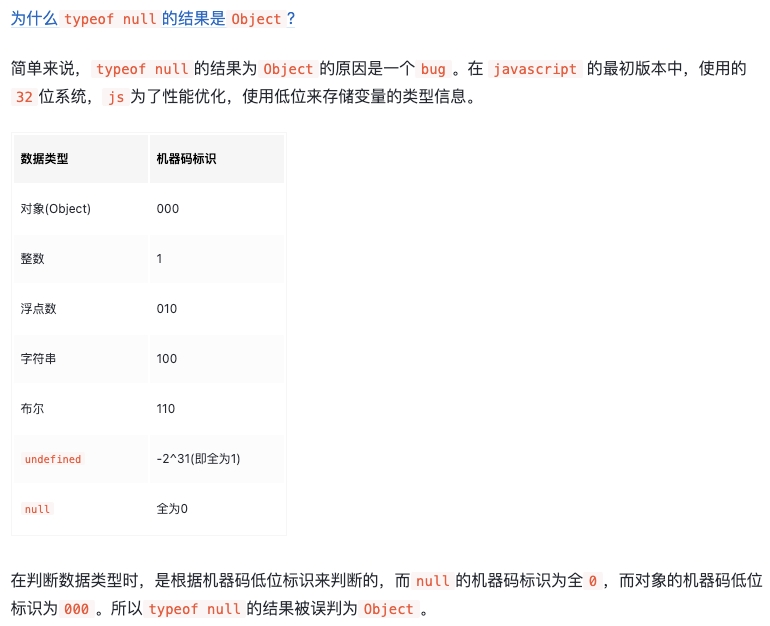

## 运算符
所有的运算符中都隐含着优先级顺序。[优先级汇总表](https://developer.mozilla.org/zh-CN/docs/Web/JavaScript/Reference/Operators/Operator_Precedence#%E6%B1%87%E6%80%BB%E8%A1%A8)
- 圆括号拥有最高优先级
- 一元运算符优先级高于二元运算符
- 如果优先级相同，则按照由左至右的顺序执行

### 赋值运算符
在 JavaScript 中，所有运算符都会返回一个值。**语句 `x = value` 将值 `value` 写入 `x` 然后返回 `value`。**
```js
// (a = b + 1) 的结果是 赋给 a 的值（也就是 3）。然后该值被用于进一步的运算。
let a = 1;
let b = 2;

let c = 3 - (a = b + 1);

alert( a ); // 3
alert( c ); // 0
```

### “修改并赋值”运算符
所有算术和位运算符都有简短的“修改并赋值”运算符：`/=` 和 `-=` 等。这类运算符的优先级与普通赋值运算符的优先级相同，所以它们在大多数其他运算之后执行:
<CodeRun>
{
  `
  let n = 2;
  n *= 3 + 5;
  console.log( n ); // 16 （右边部分先被计算，等同于 n *= 8）
  `
}
</CodeRun>

### 位运算符
- 按位与 ( `&` )
- 按位或 ( `|` )
- 按位异或 ( `^` )
- 按位非 ( `~` )
- 左移 ( `<<` )
- 右移 ( `>>` )
- 无符号右移 ( `>>>` )

### 逗号运算符
逗号运算符能让我们处理多个表达式，使用 `,` 将它们分开，每个表达式都运行了，但是只有最后一个的结果会被返回。
<CodeRun>
{
  `
  let a = (1 + 2, 3 + 4); // 逗号运算符的优先级非常低，比 = 还要低，因此此处圆括号非常重要
  console.log(a) // 7（3 + 4 的结果）
  // 一行上有三个运算符
  for (a = 1, b = 3, c = a * b; a < 10; a++) {
   // ...
  }
  `
}
</CodeRun>

### 逻辑运算符
JavaScript 中有四个逻辑运算符：`||`（或），`&&`（与），`!`（非），`??`（空值合并运算符, Nullish Coalescing）。

#### 或运算寻找第一个真值
一个或运算 `||` 的链，将返回第一个真值，如果不存在真值，就返回该链的最后一个值。
```js
result = value1 || value2 || value3;
```
- 从左到右依次计算操作数。
- 处理每一个操作数时，**都将其转化为布尔值**。如果结果是 `true`，就停止计算，返回这个操作数的初始值。
- 如果所有的操作数都被计算过（也就是，转换结果都是 `false`），则返回最后一个操作数。
<CodeRun>
{
  `
  console.log( 1 || 0 );                 // 1（1 是真值）
  console.log( null || 1 );              // 1（1 是第一个真值）
  console.log( null || 0 || 1 );         // 1（第一个真值）
  console.log( undefined || null || 0 ); // 0（都是假值，返回最后一个值）
  `
}
</CodeRun>

#### 短路求值（Short-circuit evaluation）
- 或运算符 `||` 在遇到 “真值” 时立即停止运算
<CodeRun>
{
  `
  // 或运算符 || 在遇到 true 时立即停止运算
  true || console.log("not printed");
  false || console.log("printed");
  // 先输出1然后输出2
  // 第一个或运算 || 对它的左值 console.log(1) 进行了计算。这就显示了第一条信息 1。
  // 函数console.log没有返回值，或者说返回的是 undefined。所以或运算继续检查第二个操作数以寻找真值
  console.log( console.log(1) || 2 || console.log(3) );
  `
}
</CodeRun>

- 与运算符 `&&` 在遇到 “假值” 时立即停止运算
<CodeRun>
{
  `
  // 先输出1然后输出undefined
  console.log( console.log(1) && console.log(2) );
  `
}
</CodeRun>

#### 与运算寻找第一个假值
与运算返回第一个假值，如果没有假值就返回最后一个值。
```js
result = value1 && value2 && value3;
```
- 从左到右依次计算操作数。
- 在处理每一个操作数时，都将其转化为布尔值。如果结果是 `false`，就停止计算，并返回这个操作数的初始值。
- 如果所有的操作数都被计算过（例如都是真值），则返回最后一个操作数。
<CodeRun>
{
  `
  // 与运算寻找第一个假值，找不到就返回最后一个操作数的初始值
  console.log( 1 && 0 );                // 0
  console.log( 1 && 5 );                // 5
  console.log( 1 && 2 && null && 3 );   // null
  // 如果第一个操作数是假值，
  // 与运算将直接返回它。后面的操作数会被忽略
  console.log( null && 5 );             // null
  console.log( 0 && "no matter what" ); // 0
  `
}
</CodeRun>

:::tip
与运算 `&&` 的优先级比或运算 `||` 要高。`a && b || c && d` 等同于 `(a && b) || (c && d)`
<CodeRun>
{
  `
  // 与运算 && 的优先级比 || 高，所以它第一个被执行。
  console.log( null || 2 && 3 || 4 );
  `
}
</CodeRun>
:::

#### 逻辑非运算符
逻辑非运算符接受一个参数，并按如下运作：
1. 将操作数转化为布尔类型：`true` 或 `false`。
2. 返回相反的值。

- **两个非运算 `!!` 用来将某个值转化为布尔类型**
<CodeRun>
{
  `
  // 第一个非运算将该值转化为布尔类型并取反，第二个非运算再次取反。
  console.log( !!"non-empty string" );        // true
  console.log( !!null );                      // false
  // 内建的 Boolean 函数也可以实现同样的效果
  console.log( Boolean("non-empty string") ); // true
  console.log( Boolean(null) );               // false
  `
}
</CodeRun>

- 非运算符 `!` 的优先级在所有逻辑运算符里面最高

#### 空值合并运算符`??`
如果第一个操作数不是 `null` 或 `undefined`，则 `??` 返回第一个操作数。否则，返回第二个操作数。
```js
result = a ?? b;
// 等同于
result = (a !== null && a !== undefined) ? a : b;
```

`||` 无法区分 `false`、`0`、空字符串 ""、 `null`、`undefined`。它们都一样是假值（falsy values）。如果其中任何一个是 `||` 的第一个操作数，那么我们将得到第二个操作数作为结果。
```js
let height = 0;
console.log(height || 100); // 100
console.log(height ?? 100); // 0
```

`??` 运算符的优先级与 `||` 相同

### 可选链运算符`?.`
- 可选链(Optional chaining operator) 是一种访问嵌套对象属性的安全的方式。即使中间的属性不存在，也不会出现错误。
- 不使用可选链时，可以使用`&&`运算符
  <CodeRun>{`
  let user = {};
  console.log( user.address && user.address.street && user.address.street.name ); // undefined（不报错）
  `}</CodeRun>

- 短链效应：如果可选链 `?.` 前面的值为 `undefined` 或者 `null`，它会立即停止运算并返回 `undefined`。
  ```js
  let user = null;
  console.log( user?.address ); // undefined

  let x = 0;
  user?.sayHi(x++); // 代码执行没有到达 sayHi 调用和 x++

  alert(x); // 0，值没有增加
  ```

:::warning
- 不要过度使用可选链。例如，如果根据我们的代码逻辑，`user` 对象必须存在，但 `address` 是可选的，那么我们应该这样写 `user.address?.street`，而不是这样 `user?.address?.street`。如果 `user` 恰巧为 `undefined`，我们会看到一个编程错误并修复它。否则，如果我们滥用 `?.`，会导致代码中的错误在不应该被消除的地方消除了，这会导致调试更加困难。

- `?.` 左边的变量必须已声明。可选链仅适用于已声明的变量。

- 可选链 `?.` 不能用在赋值语句的左侧。
  ```js
  let user = null;

  user?.name = "John"; // SyntaxError: Invalid left-hand side in assignment
  // 因为它在计算的是：undefined = "John"
  ```
:::

#### 可选函数调用`?.()`
`?.()` 用于调用一个可能不存在的函数。
```js
let userAdmin = {
  admin() {
    alert("I am admin");
  }
};

let userGuest = {};

// ?.() 会检查它左边的部分：如果 admin 函数存在，那么就调用运行它（对于 userAdmin）。否则（对于 userGuest）运算停止，没有报错。
userAdmin.admin?.(); // I am admin
userGuest.admin?.(); // 啥都没发生（没有这样的方法）
console.log( userGuest.admin?.() ); // undefined
```

#### 另一种语法`?.[]`
`?.[]` 用于从一个可能不存在的对象上安全地读取属性。
```js
let key = "firstName";

let user1 = {
  firstName: "John"
};

let user2 = null;

// 如果 obj 存在则返回 obj[prop]，否则返回 undefined。
alert( user1?.[key] ); // John
alert( user2?.[key] ); // undefined
```

### `typeof` 运算符
`typeof` 是一个操作符，不是一个函数。`typeof(x)` 与 `typeof x` 相同，但是这里的括号不是 `typeof` 的一部分，它是数学运算分组的括号。
```jsx live
function typeofDemo() {
  function showResult() {
    alert( typeof undefined );      // 'undefined'
    alert( typeof 0 );              // 'number'
    // console.log( typeof 10n );   // 'bigint'
    alert( typeof true );           // 'boolean'
    alert( typeof "foo" );          // 'string'
    alert( typeof Symbol("id") );   // 'symbol'
    alert( typeof Math );           // 'object'
    alert( typeof null );           // 'object'
    alert( typeof console.log );    // 'function'
  }

  return (
    <div>
      <p onClick={showResult}>查看执行结果</p>
    </div>
  );
}
```
- `Math` 是一个提供数学运算的内建 object。

- 在 JavaScript 语言中没有一个特别的 “function” 类型。函数隶属于 object 类型。但是 `typeof` 会对函数区分对待，并返回 "function"。这也是来自于 JavaScript 语言早期的问题。从技术上讲，这种行为是不正确的，但在实际编程中却非常方便。

- `typeof null` 的结果为 "object"，这是官方承认的 `typeof` 的错误，这个问题来自于 JavaScript 语言的早期阶段，并为了兼容性而保留了下来。`null` 绝对不是一个 `object`。`null` 有自己的类型，它是一个特殊值。
  