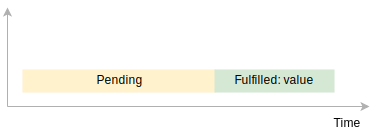
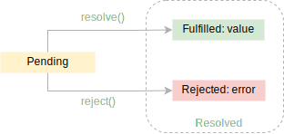
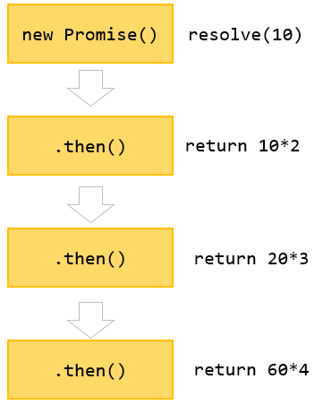

## [JavaScript Promises](https://www.javascripttutorial.net/es6/javascript-promises/)
异步操作时，使用`callbacks`也能得到预期的结果：
```js
function getUsers(callback) {
  setTimeout(() => {
    callback([
      { username: 'john', email: 'john@test.com' },
      { username: 'jane', email: 'jane@test.com' },
    ]);
  }, 1000);
}

function findUser(username, callback) {
  getUsers((users) => {
    const user = users.find((user) => user.username === username);
    callback(user);
  });
}

findUser('john', console.log); // { username: 'john', email: 'john@test.com' }
```
However, the callback makes the code more difficult to follow. Also, it adds complexity to the functions with callback arguments. If the number of functions grows, you may end up with the callback hell problem. To resolve this, JavaScript comes up with the concept of promises.

:::tip
By definition, a promise is an object that encapsulates the result of an asynchronous operation. 一个promise是一个object，用于封装一个异步操作的结果。

A promise object has a state that can be one of the following:
- Pending
- Fulfilled with a value
- Rejected for a reason

In the beginning, the state of a promise is pending, indicating that the asynchronous operation is in progress. Depending on the result of the asynchronous operation, the state changes to either fulfilled or rejected. 一开始，promise 的状态是 pending，表示异步操作正在进行中。根据异步操作的结果，状态更改为已完成或已拒绝。

The fulfilled state indicates that the asynchronous operation was completed successfully. The rejected state indicates that the asynchronous operation failed.


:::

### Creating a promise
To create a promise object, you use the `Promise()` constructor. The promise constructor accepts a callback function that typically performs an asynchronous operation. This function is often referred to as an `executor`. The executor accepts two callback functions with the name `resolve` and `reject`. promise构造函数的形参是一个回调函数，通常用于执行一个异步操作，该回调函数通常被称为执行器。执行器的形参是2个回调函数，名为 resolve 和 reject。
```js
const promise = new Promise((resolve, reject) => {
  // contain an operation
  // ...

  // return the state
  if (success) {
    resolve(value);
  } else {
    reject(error);
  }
});
```

:::info
Once a promise reaches either fulfilled or rejected state, it stays in that state and can’t go to another state. In other words, a promise cannot go from the fulfilled state to the rejected state and vice versa. Also, it cannot go back from the fulfilled or rejected state to the pending state. promise 不能从 fulfilled 状态变为 rejected 状态，反之亦然。此外，它不能从已完成或已拒绝状态返回到待处理状态。

Once a new Promise object is created, its state is pending. If a promise reaches fulfilled or rejected state, it is resolved.


:::

### Consuming a Promise: then, catch, finally
> 使用promise：then catch finally

#### then
:::tip
The callback passed to the `then()` method executes once the promise is resolved. 一旦promise的状态为resolved(fulfilled 或 rejected)，传给then()方法的回调函数就会执行。
:::
To get the value of a promise when it’s fulfilled, you call the `then()` method of the promise object. then()方法接收2个回调函数 `onFulfilled` 和 `onRejected`。The `then()` method calls the `onFulfilled()` with a value, if the promise is fulfilled or the `onRejected()` with an error if the promise is rejected. Note that both `onFulfilled` and `onRejected` arguments are optional. onFulfilled 和 onRejected 都是可选的，如果promise的状态是fulfilled，则then方法调用onFulfilled获取返回的value；如果promise的状态是rejected，则then方法调用onRejected获取返回的error reason。
```js
promise.then(onFulfilled,onRejected);
```

```js
function getUsers() {
  return new Promise((resolve, reject) => {
    setTimeout(() => {
      resolve([
        { username: 'john', email: 'john@test.com' },
        { username: 'jane', email: 'jane@test.com' },
      ]);
    }, 1000);
  });
}

function onFulfilled(users) {
  console.log(users);
}

const promise = getUsers();
promise.then(onFulfilled);

// 使用箭头函数
promise.then((users) => {
  console.log(users);
});

// 直接使用then
getUsers().then((users) => {
  console.log(users);
});
```

```js
function getUsers(successFlag) {
  return new Promise((resolve, reject) => {
    setTimeout(() => {
      if (successFlag) {
        resolve([
          { username: 'john', email: 'john@test.com' },
          { username: 'jane', email: 'jane@test.com' },
        ]);
      } else {
        reject('Failed to the user list');
      }
    }, 1000);
  });
}

function onFulfilled(users) {
  console.log(users);
}
function onRejected(error) {
  console.log(error);
}

const promise = getUsers(true);
// promise.then(onFulfilled, onRejected);
promise.then(
  (users) => console.log(users),
  (error) => console.log(error)
);

const promise1 = getUsers(false);
promise1.then(onFulfilled, onRejected);
```

#### catch
如果只想获取promise为rejected状态返回的error reason，可以使用promise的catch()方法。Internally, the `catch()` method invokes the `then(undefined, onRejected)` method. 在内部，catch() 方法调用 then(undefined, onRejected) 方法。
```js
promise.catch(onRejected);
```
```js
let success = false;

function getUsers() {
  return new Promise((resolve, reject) => {
    setTimeout(() => {
      if (success) {
        resolve([
          { username: 'john', email: 'john@test.com' },
          { username: 'jane', email: 'jane@test.com' },
        ]);
      } else {
        reject('Failed to the user list');
      }
    }, 1000);
  });
}

const promise = getUsers();

promise.catch((error) => {
  console.log(error);
});
```

#### finally
Sometimes, you want to execute the same piece of code whether the promise is fulfilled or rejected. 
```js
const render = () => {
  //...
};

getUsers()
  .then((users) => {
    console.log(users);
    render();
  })
  .catch((error) => {
    console.log(error);
    render();
  });

// 为了避免在then和catch中重复调用render，可以使用finally. To remove this duplicate and execute the render() whether the promise is fulfilled or rejected, you use the finally() method
getUsers()
  .then((users) => {
    console.log(users);
  })
  .catch((error) => {
    console.log(error);
  })
  .finally(() => {
    render();
  });
```

### [Promise Chaining](https://www.javascripttutorial.net/es6/promise-chaining/)
:::tip
promise chain executes multiple asynchronous tasks in sequence.
:::
Because the `then()` method returns `a new Promise` with a value resolved to a value, you can call the `then()` method on the return Promise like this:
```js
let p = new Promise((resolve, reject) => {
  setTimeout(() => {
    resolve(10);
  }, 3 * 100);
});

p.then((result) => {
  console.log(result); // 10
  return result * 2;
}).then((result) => {
  console.log(result); // 20
  return result * 3;
}).then((result) => {
  console.log(result); // 60
  return result * 4;
});


// Output: 10 20 60
```
The way we call the then() methods like this is often referred to as a promise chain.


:::info
When you return a value in the `then()` method, the `then()` method returns `a new Promise` that immediately resolves to the return value. 在then()方法中返回一个值，则then()方法会返回一个新的promise，该promise会立即resolve()该返回值。
:::

也可以在then()中返回一个新的promise
```js
let p = new Promise((resolve, reject) => {
  setTimeout(() => {
    resolve(10);
  }, 3 * 100);
});

p.then((result) => {
  console.log(result);
  return new Promise((resolve, reject) => {
    setTimeout(() => {
      resolve(result * 2);
    }, 3 * 1000);
  });
}).then((result) => {
  console.log(result);
  return new Promise((resolve, reject) => {
    setTimeout(() => {
      resolve(result * 3);
    }, 3 * 1000);
  });
}).then(result => console.log(result));

// Output: 10 20 60

// 针对上面例子，抽出公共函数
function generateNumber(num) {
  return new Promise((resolve, reject) => {
    setTimeout(() => {
      resolve(num);
    }, 3 * 1000);
  });
}

generateNumber(10)
  .then((result) => {
    console.log(result);
    return generateNumber(result * 2);
  })
  .then((result) => {
    console.log(result);
    return generateNumber(result * 3);
  })
  .then((result) => console.log(result));
```

例子：
```jsx live
function liveRender() {
  // begin
  function getUser(userId) {
    return new Promise((resolve, reject) => {
      alert('Get the user from the database.');
      setTimeout(() => {
        resolve({
          userId: userId,
          username: 'admin'
        });
      }, 1000);
    })
  }

  function getServices(user) {
    return new Promise((resolve, reject) => {
      alert(`Get the services of ${user.username} from the API.`);
      setTimeout(() => {
        resolve(['Email', 'VPN', 'CDN']);
      }, 3 * 1000);
    });
  }

  function getServiceCost(services) {
    return new Promise((resolve, reject) => {
      alert(`Calculate the service cost of ${services}.`);
      setTimeout(() => {
        resolve(services.length * 100);
      }, 2 * 1000);
    });
  }
  // end

  function showResult() {
    getUser(100)
      .then(getServices)
      .then(getServiceCost)
      .then(alert);
  }
  return <button onClick={showResult}>查看结果</button>
}
```

### [Promise Error Handling](https://www.javascripttutorial.net/es6/promise-error-handling/)
#### Errors outside the Promises
When you raise an exception outside the promise, you must catch it with try/catch. 当您在promise之外引发异常时，您必须使用 try/catch 捕获它。
```jsx live
function liveRender() {
  // begin
  function getUserById(id) {
    if (typeof id !== 'number' || id <= 0) {
      throw new Error('Invalid id argument');
    }

    return new Promise((resolve, reject) => {
      resolve({
        id: id,
        username: 'admin'
      });
    });
  }
  // end

  function showResult() {
    getUserById('a')
      .then(user => alert(user.username))
      .catch(err => alert(err)); // 发现并没有执行该catch，而是在控制台抛出异常了: Uncaught Error: Invalid id argument
  }
  function showResult2() {
    try {
      getUserById('a')
        .then(user => alert(user.username))
        .catch(err => alert(`Caught by .catch ${error}`));
    } catch (error) {
      alert(`Caught by try/catch ${error}`);
    }
  }
  return <div>
    <button onClick={showResult}>查看结果promise-catch</button>
    <button onClick={showResult2}>查看结果try-catch</button>
  </div>
}
```

#### Errors inside the Promises
:::tip
If you throw an error inside the promise, the `catch()` method will catch it, not the `try/catch`.
:::
```jsx live
function liveRender() {
  // begin
  let authorized = false;

  function getUserById(id) {
    return new Promise((resolve, reject) => {
      if (!authorized) {
        throw new Error('Unauthorized access to the user data');
      }

      resolve({
        id: id,
        username: 'admin'
      });
    });
  }
  // end

  function showResult() {
    getUserById(10)
      .then(user => alert(user.username))
      .catch(err => alert(`Caught by .catch ${err}`));
  }
  function showResult2() {
    try {
      getUserById(10)
        .then(user => alert(user.username))
        .catch(err => alert(`Caught by .catch ${err}`));
    } catch (error) {
      alert(`Caught by try/catch ${error}`);
    }
  }
  return <div>
    <button onClick={showResult}>查看结果promise-catch</button>
    <button onClick={showResult2}>查看结果try-catch</button>
  </div>
}
```

:::info
对于Errors inside the Promises，If you chain promises, the `catch()` method will catch errors that occurred in any promise.
```js
promise1
  .then(promise2)
  .then(promise3)
  .then(promise4)
  .catch(err => console.log(err));
```
In this example, if any error in the promise1, promise2, or promise4, the `catch()` method will handle it.

```jsx live
function liveRender() {
  // begin
  function queryInitInfo() {
    return new Promise((resolve, reject) => {
      setTimeout(() => {
        resolve({name: 'LBJ'});
      }, 500);
    });
  }
  // end

  function showResult() {
    try {
      queryInitInfo().then(res => {
        b.c = 1;
      }).catch(reason => {
        console.log('reason::', reason) // reason:: ReferenceError: b is not defined
      })
    } catch (error) {
      console.log('error::', error)
    }
  }

  return <div>
    <button onClick={showResult}>控制台查看哪个catch有效</button>
  </div>
}
```
:::

#### Calling reject() function
在下面例子中，我们没有在 promise 中抛出错误，而是显式调用了 reject()，catch() 方法也处理这种情况下的错误。
```jsx live
function liveRender() {
  // begin
  let authorized = false;

  function getUserById(id) {
    return new Promise((resolve, reject) => {
      if (!authorized) {
        reject('Unauthorized access to the user data');
      }

      resolve({
        id: id,
        username: 'admin'
      });
    });
  }
  // end

  function showResult() {
    try { // 实际不用try-catch，promise-catch就能处理
      getUserById(10)
        .then(user => alert(user.username))
        .catch(err => alert(`Caught by .catch ${err}`));
    } catch (error) {
      alert(`Caught by try/catch ${error}`);
    }
  }

  return <button onClick={showResult}>查看结果</button>
}
```

```jsx live
function liveRender() {
  // begin
  function getUserById(id) {
    return new Promise((resolve, reject) => {
      if (!authorized) {
        reject('Unauthorized access to the user data');
      }
      resolve({
        id: id,
        username: 'admin'
      });
    });
  }

  function showResult() {
    try {
      getUserById(10)
        .then(user => console.log(user.username));
      // the following code will not execute
      alert('next');
    } catch (error) {
      alert(`Caught by try/catch ${error}`);
    }
  }
  // end

  return <button onClick={showResult}>查看结果</button>
}
```