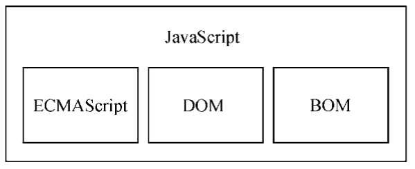

:::tip
完整的JavaScript实现包含以下几个部分：
1. 核心（ECMAScript）：由ECMA-262 定义并提供核心功能。
2. 文档对象模型（DOM）：提供与网页内容交互的方法和接口。
3. 浏览器对象模型（BOM）：提供与浏览器交互的方法和接口。

各种浏览器均以ECMAScript作为自己JavaScript实现的依据，具体实现各有不同：
- Chrome的Blink/V8
- Firefox的Gecko/SpiderMonkey
- Safari的WebKit/JavaScriptCore
- 微软的Trident/EdgeHTML/Chakra

JavaScript 实现了ECMAScript，而Adobe ActionScript 同样也实现了ECMAScript。

多数浏览器对 JavaScript 的支持，指的是实现 ECMAScript 和 DOM 的程度。

宿主为JS定义了与外界交互所需的全部API：DOM、网路请求、系统硬件、存储、事件、文件、加密等
:::

## ECMAScript
- ECMAScript，即ECMA-262 定义的语言，并不局限于Web 浏览器。事实上，这门语言没有输入和 输出之类的方法。
- Web 浏览器只是 ECMAScript 实现可能存在的一种宿主环境（host environment）。
- 宿主环境提供 ECMAScript 的基准实现和与环境自身交互必需的扩展。
- 扩展（比如DOM）使用ECMAScript 核心类型和语法，提供特定于环境的额外功能。

如果不涉及浏览器的话，ECMA-262 到底定义了什么？在基本的层面，它描述这门语言的如下部分：
- 语法
- 类型
- 语句
- 关键字
- 保留字
- 操作符
- 全局对象

ECMAScript 符合性，即 要成为ECMAScript 实现，必须满足下列条件：
- 支持ECMA-262 中描述的所有“类型、值、对象、属性、函数，以及程序语法与语义”
- 支持Unicode 字符标准

符合性实现还可以满足下列要求：
- 增加ECMA-262 中未提及的“额外的类型、值、对象、属性和函数”（ECMA-262 所说的这些额外内容主要指规范中未给出的新对象或对象的新属性）
- 支持ECMA-262 中没有定义的“程序和正则表达式语法”（意思是允许修改和扩展内置的正则表达式特性）

主要的浏览器版本对 ECMAScript 的支持情况：
<table>
<th>浏览器</th>
<th>ECMAScript符合性</th>
<tr>
  <td>IE9</td>
  <td>第5版（部分）</td>
</tr>
<tr>
  <td>IE10~11</td>
  <td>第5版</td>
</tr>
<tr>
  <td>Edge 12+</td>
  <td>第6版</td>
</tr>
<tr>
  <td>Safari 6~8</td>
  <td>第5版</td>
</tr>
<tr>
  <td>Safari 9+</td>
  <td>第6版</td>
</tr>
<tr>
  <td>iOS Safari 6~8.4</td>
  <td>第5版</td>
</tr>
<tr>
  <td>iOS Safari 9.2+</td>
  <td>第6版</td>
</tr>
<tr>
  <td>Chrome 23+</td>
  <td>第5版</td>
</tr>
<tr>
  <td>Chrome 42~48</td>
  <td>第6版（部分）</td>
</tr>
<tr>
  <td>Chrome 49+</td>
  <td>第6版</td>
</tr>
<tr>
  <td>Firefox 21~44</td>
  <td>第5版</td>
</tr>
<tr>
  <td>Firefox 45+</td>
  <td>第6版</td>
</tr>
</table>

## DOM
- 文档对象模型（DOM，Document Object Model）将整个页面抽象为一组分层节点。使用DOM API，可以轻松地删除、添加、替换、修改节点。
- DOM 并非只能通过JavaScript 访问，而且确实被其他很多语言实现了。不过对于浏览器来说，DOM 就是使用ECMAScript 实现的，如今已经成为JavaScript 语言的一大组成部分。
- DOM 标准由万维网联盟（W3C，World Wide Web Consortium）制定并维护。
- 支持DOM 是浏览器厂商的重中之重，每个版本发布都会改进支持度。

## BOM
- 使用 浏览器对象模型（BOM，Browser Object Model）API，开发者可以操控 浏览器显示页面之外的部分。
- BOM 是使用 JavaScript 开发 Web 应用程序的核心。
- 总体来说，BOM 主要针对 浏览器窗口 和 子窗口（frame），不过人们通常会把任何特定于浏览器的扩展都归在BOM的范畴内。比如，下面就是这样一些扩展：
  - 弹出新浏览器窗口的能力；
  - 移动、缩放和关闭浏览器窗口的能力；
  - navigator 对象，提供关于浏览器的详尽信息；
  - location 对象，提供浏览器加载页面的详尽信息；
  - screen 对象，提供关于用户屏幕分辨率的详尽信息；
  - performance 对象，提供浏览器内存占用、导航行为和时间统计的详尽信息；
  - 对cookie 的支持；
  - 其他自定义对象，如XMLHttpRequest 和IE 的ActiveXObject。

- HTML5 规范中有一部分涵盖了 BOM 的主要内容。
- BOM 的核心是 window 对象，表示浏览器的实例。
