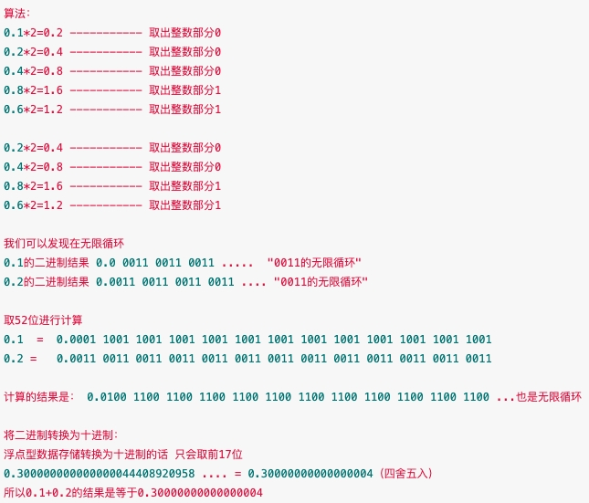
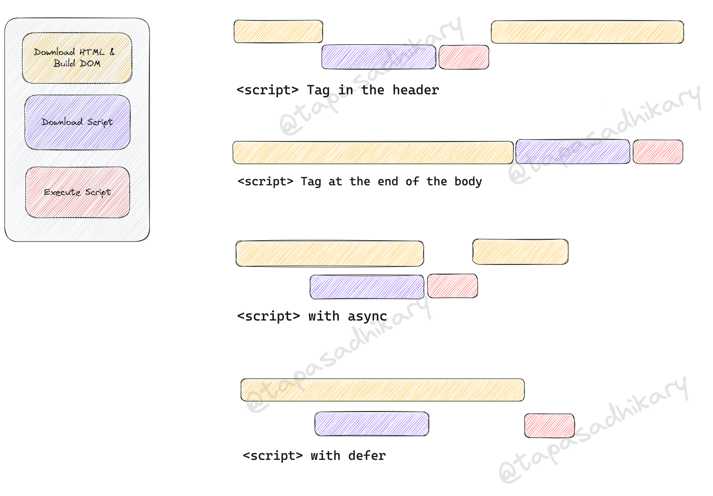

> [源码](https://github.com/msfrisbie/professional-javascript-for-web-developers)

:::tip
完整的JavaScript实现包含以下几个部分：
1. 核心（ECMAScript）：由ECMA-262 定义并提供核心功能。
2. 文档对象模型（DOM）：提供与网页内容交互的方法和接口。
3. 浏览器对象模型（BOM）：提供与浏览器交互的方法和接口。


各种浏览器均以ECMAScript作为自己JavaScript实现的依据，具体实现各有不同：
- Chrome的Blink/V8
- Firefox的Gecko/SpiderMonkey
- Safari的WebKit/JavaScriptCore
- 微软的Trident/EdgeHTML/Chakra

JavaScript 实现了ECMAScript，而Adobe ActionScript 同样也实现了ECMAScript。

多数浏览器对 JavaScript 的支持，指的是实现 ECMAScript 和 DOM 的程度。

宿主为JS定义了与外界交互所需的全部API：DOM、网路请求、系统硬件、存储、事件、文件、加密等
:::

## ECMAScript
> [ecma262](https://tc39.es/ecma262/)

- ECMAScript，即ECMA-262 定义的语言，并不局限于Web 浏览器。事实上，这门语言没有输入和 输出之类的方法。
- Web 浏览器只是 ECMAScript 实现可能存在的一种宿主环境（host environment）。
- 宿主环境提供 ECMAScript 的基准实现和与环境自身交互必需的扩展。
- 扩展（比如DOM）使用ECMAScript 核心类型和语法，提供特定于环境的额外功能。

如果不涉及浏览器的话，ECMA-262 到底定义了什么？在基本的层面，它描述这门语言的如下部分：
- 语法
- 类型
- 语句
- 关键字
- 保留字
- 操作符
- 全局对象

ECMAScript 符合性，即 要成为ECMAScript 实现，必须满足下列条件：
- 支持ECMA-262 中描述的所有“类型、值、对象、属性、函数，以及程序语法与语义”
- 支持Unicode 字符标准

符合性实现还可以满足下列要求：
- 增加ECMA-262 中未提及的“额外的类型、值、对象、属性和函数”（ECMA-262 所说的这些额外内容主要指规范中未给出的新对象或对象的新属性）
- 支持ECMA-262 中没有定义的“程序和正则表达式语法”（意思是允许修改和扩展内置的正则表达式特性）

主要的浏览器版本对 ECMAScript 的支持情况：
<table>
<th>浏览器</th>
<th>ECMAScript符合性</th>
<tr>
  <td>IE9</td>
  <td>第5版（部分）</td>
</tr>
<tr>
  <td>IE10~11</td>
  <td>第5版</td>
</tr>
<tr>
  <td>Edge 12+</td>
  <td>第6版</td>
</tr>
<tr>
  <td>Safari 6~8</td>
  <td>第5版</td>
</tr>
<tr>
  <td>Safari 9+</td>
  <td>第6版</td>
</tr>
<tr>
  <td>iOS Safari 6~8.4</td>
  <td>第5版</td>
</tr>
<tr>
  <td>iOS Safari 9.2+</td>
  <td>第6版</td>
</tr>
<tr>
  <td>Chrome 23+</td>
  <td>第5版</td>
</tr>
<tr>
  <td>Chrome 42~48</td>
  <td>第6版（部分）</td>
</tr>
<tr>
  <td>Chrome 49+</td>
  <td>第6版</td>
</tr>
<tr>
  <td>Firefox 21~44</td>
  <td>第5版</td>
</tr>
<tr>
  <td>Firefox 45+</td>
  <td>第6版</td>
</tr>
</table>

### 1. 严格模式
- ECMAScript 5 增加了严格模式（strict  mode）的概念。严格模式是一种不同的 JavaScript 解析和执行模型，ECMAScript 3 的一些不规范写法在这种模式下会被处理，对于不安全的活动将抛出错误。
- 要对整个脚本启用严格模式，在脚本开头加上这一行，它其实是一个预处理指令。任何支持的JavaScript引擎看到它都会切换到严格模式。选择这种语法形式的目的是不破坏ECMAScript 3 语法。
```js
"use strict";
```
- 也可以单独指定一个函数在严格模式下执行
```js
function doSomething() { 
  "use strict"; 
  // 函数体  
}
```
- 所有现代浏览器都支持严格模式

### 2. 变量
- ECMAScript 中一切都区分大小写。无论是变量、函数名还是操作符，都区分大小写。
- 在函数内定义变量时省略 `var` 操作符，可以创建一个全局变量
```js
function test() { 
  message = "hi";     // 全局变量 
} 
test(); 
console.log(message); // "hi"
```
- 在严格模式下，如果像上面这样给未声明的变量赋值，则会导致抛出ReferenceError。
- 在严格模式下，不能定义名为 `eval` 和 `arguments` 的变量，否则会导致语法错误。

#### 2.1 var 声明提升
- 所谓的“提升”（hoist），也就是把所有变量声明都拉到函数作用域的顶部。
- 使用 `var` 时，下面的代码不会报错。这是因为使用这个关键字声明的变量会自动提升到函数作用域顶部
```js
function foo() {
  console.log(age);
  var age = 26;
}
foo();  // undefined

// ECMAScript 运行时把它看成等价于如下代码
function foo() { 
  var age; 
  console.log(age); 
  age = 26; 
} 
foo();  // undefined
```

#### 2.2 let声明
- `let` 声明的范围是块作用域，而 `var` 声明的范围是函数作用域。块作用域是函数作用域的子集，因此适用于 `var` 的作用域限制同样也适用于`let`。
- `let` 声明的变量不会在作用域中被提升。在 `let` 声明之前的执行瞬间被称为“暂时性死区”（temporal dead zone），在此阶段引用任何后面才声明的变量都会抛出ReferenceError。
```js
// age 不会被提升 
console.log(age); // ReferenceError：age 没有定义 
let age = 26;

// name 会被提升 
console.log(name); // undefined 
var name = 'Matt';
```
- `let` 在全局作用域中声明的变量不会成为window 对象的属性（`var` 声明的变量则会）
```js
var name = 'Matt'; 
console.log(window.name); // 'Matt' 
 
let age = 26; 
console.log(window.age);  // undefined
```
- `for` 循环中使用`var`定义的迭代变量会渗透到循环体外部，使用 `var` 声明的变量不是该循环的局部变量，而是**与 `for` 循环处在同样的作用域中**。改成使用 `let` 之后，这个问题就消失了，因为`let`迭代变量的作用域仅限于`for` 循环块内部。**在使用 `let` 声明迭代变量时，JavaScript 引擎在后台会为每个迭代循环声明一个新的迭代变量。**
```js
for (var i = 0; i < 5; ++i) { 
  // 循环逻辑  
} 
console.log(i); // 5

for (let i = 0; i < 5; ++i) { 
  // 循环逻辑 
} 
console.log(i); // ReferenceError: i 没有定义
```
```js
for (var i = 0; i < 5; ++i) { 
  setTimeout(() => console.log(i), 0) 
}
// 实际上会输出5、5、5、5、5，因为在退出循环时，迭代变量保存的是导致循环退出的值：5。在之后执行超时逻辑时，所有的i 都是同一个变量，因而输出的都是同一个最终值。

for (let i = 0; i < 5; ++i) { 
  setTimeout(() => console.log(i), 0) 
} 
// 会输出0、1、2、3、4，在使用 let 声明迭代变量时，JavaScript 引擎在后台会为每个迭代循环声明一个新的迭代变量。每个setTimeout 引用的都是不同的变量实例，所以console.log 输出的是我们期望的值，也就是循环执行过程中每个迭代变量的值。
```
- 这种每次迭代声明一个独立变量实例的行为适用于所有风格的for 循环，包括`for-in` 和`for-of`循环。

#### 2.3 const声明
- `const`声明变量时必须同时初始化变量
- 修改 `const` 声明的变量会导致运行时错误，`const` 声明的限制只适用于它指向的变量的引用。换句话说，如果`const` 变量引用的是一个对象，那么修改这个对象内部的属性并不违反`const` 的限制。
```js
const age = 26; 
age = 36; // TypeError: 给常量赋值

const person = {}; 
person.name = 'Matt';  // 不会报错

for (const i = 0; i < 10; ++i) {} // TypeError：给常量赋值

for (const key in {a: 1, b: 2}) { 
  console.log(key); 
} 
// a, b 
 
for (const value of [1,2,3,4,5]) { 
  console.log(value); 
} 
// 1, 2, 3, 4, 5
```

### 3. 数据类型
The ECMAScript language types are `Undefined`, `Null`, `Boolean`, `String`, `Symbol`, `Number`, `BigInt`, and `Object`.

#### 3.1 Undefined
- `Undefined` 类型只有一个值，就是特殊值`undefined`。增加这个特殊值的目的就是为了正式明确空对象指针（`null`）和未初始化变量的区别。
- 在对未初始化的变量调用`typeof`时，返回的结果是`undefined`，但对未声明的变量调用它时，返回的结果还是`undefined`
```js
let a;

console.log(typeof a); // 未初始化的变量，结果为"undefined" 
console.log(typeof b); // 未声明的变量，结果为"undefined"
```

#### 3.2 Null
- `Null` 类型同样只有一个值，即特殊值 `null`。逻辑上讲，`null` 值表示一个空对象指针。
- 在定义将来要保存对象值的变量时，建议使用 `null` 来初始化，不要使用其他值。这样，只要检查这个变量的值是不是 `null` 就可以知道这个变量是否在后来被重新赋予了一个对象的引用。
- `undefined` 值是由 `null` 值派生而来的，因此 ECMA-262 将它们定义为表面上相等，用等于操作符（`==`）比较 `null` 和`undefined` 始终返回true。但要注意，这个操作符会为了比较而转换它的操作数
```js
console.log(null == undefined);  // true
```

#### 3.3 Boolean
- Boolean（布尔值）类型有两个字面值：true 和false。
- `if`等流控制语句会自动执行其他类型值到布尔值的转换，不同类型与布尔值之间的转换规则：
<table>
<th>数据类型</th>
<th>转换为true的值</th>
<th>转换为false的值</th>
<tr>
  <td>Boolean</td>
  <td>true</td>
  <td>false</td>
</tr>
<tr>
  <td>String</td>
  <td>非空字符串</td>
  <td>""（空字符串）</td>
</tr>
<tr>
  <td>Number</td>
  <td>非零数值（包括无穷值）</td>
  <td>0、NaN</td>
</tr>
<tr>
  <td>Object</td>
  <td>任意对象</td>
  <td>false</td>
</tr>
<tr>
  <td>Undefined</td>
  <td>N/A（不存在）</td>
  <td>undefined</td>
</tr>
</table>

#### 3.4 Number
- 存储浮点值使用的内存空间是存储整数值的两倍，ECMAScript 会把以下情况的值转换为整数：在小数点后面没有数字的情况下，数值就会变成整数；如果数值本身就是整数，只是小数点后面跟着0（如1.0），那它也会被转换为整数。
```js
let floatNum1 = 1.;   // 小数点后面没有数字，当成整数1 处理 
let floatNum2 = 10.0; // 小数点后面是零，当成整数10 处理 
```
- 浮点值的精确度最高可达 17 位小数，但在算术计算中远不如整数精确。

> [Why 0.1 + 0.2 ≠ 0.3 in JavaScript](https://javascript.plainenglish.io/why-0-1-0-2-0-3-in-javascript-d7e218224a72)
> - 因为浮点数运算的精度问题。在计算机运行过程中，需要将数据转化成二进制，然后再进行计算。
> - js中的Number类型遵循IEEE754标准，在IEEE754标准的64位浮点数相加，因为浮点数自身小数位数的限制而截断的二进制在转化为十进制，就变成`0.30000000000000004`，所以在计算时会产生误差。


- ECMAScript 可以表示的最小数值保存在 `Number.MIN_VALUE` 中；可以表示的最大数值保存在 `Number.MAX_VALUE` 中。如果某个计算得到的数值结果超出了 JavaScript 可以表示的范围，那么这个数值会被自动转换为一个特殊的 `Infinity`（无穷）值。任何无法表示的负数以`-Infinity`（负无穷大）表示，任何无法表示的正数以`Infinity`（正无穷大）表示。如果计算返回正 Infinity 或负 Infinity，则该值将不能再进一步用于任何计算。这是因为Infinity 没有可用于计算的数值表示形式。
- `Number.NEGATIVE_INFINITY`的值是`-Infinity`，`Number.POSITIVE_INFINITY`的值是`Infinity`
- 要确定一个值是不是有限大（即介于 JavaScript 能表示的最小值和最大值之间），可以使用`isFinite()`函数
```js
let result = Number.MAX_VALUE + Number.MAX_VALUE;
console.log(isFinite(result));  // false
```
- `NaN`意思是“不是数值”（Not a Number），用于表示本来要返回数值的操作失败了（而不是抛出错误）。
- 在ECMAScript 中，0、+0 或-0 相除会返回`NaN`
```js
console.log(0/0);    // NaN 
console.log(-0/+0);  // NaN
```
- 如果分子是非0 值，分母是有符号0 或无符号0，则会返回`Infinity` 或`-Infinity`
```js
console.log(5/0);   // Infinity 
console.log(5/-0);  // -Infinity
```
- 任何涉及 `NaN` 的操作始终返回 `NaN`（如 `NaN/10`），在连续多步计算时可能产生这个问题。
- 把一个值传给 `isNaN()` 后，该函数会尝试把它转换为数值，任何不能转换为数值的值都会导致这个函数返回true
```js
console.log(isNaN(NaN));     // true 
console.log(isNaN(10));      // false，10 是数值 
console.log(isNaN("10"));    // false，可以转换为数值10 
console.log(isNaN("blue"));  // true，不可以转换为数值 
console.log(isNaN(true));    // false，可以转换为数值1 
```
- 虽然不常见，但`isNaN()`可以用于测试对象。此时，首先会调用对象的`valueOf()`方法，然后再确定返回的值是否可以转换为数值。如果不能，再调用`toString()`方法，并测试其返回值。

##### 3.4.1 数值转换
有3个函数可以将非数值转换为数值：`Number()`、`parseInt()`和`parseFloat()`。`Number()`是转型函数，可用于任何数据类型。后两个函数主要用于将字符串转换为数值。
1. `Number()`
Number()函数基于如下规则执行转换:
- 布尔值，true 转换为1，false 转换为0。`Number(true); // 1`
- 数值，直接返回。
- null，返回0。
- undefined，返回NaN。
- 字符串，应用以下规则:
  - 如果字符串包含数值字符，包括数值字符前面带加、减号的情况，则转换为一个十进制数值。
  - 如果字符串包含有效的浮点值格式如"1.1"，则会转换为相应的浮点值（同样，忽略前面的零）。
  - 如果字符串包含有效的十六进制格式如"0xf"，则会转换为与该十六进制值对应的十进制整数值。
  - 如果是空字符串（不包含字符），则返回0。
  - 如果字符串包含除上述情况之外的其他字符，则返回`NaN`。
  ```js
  Number("1") // 1
  Number("123") // 123
  Number("011") // 11，忽略前面的零
  Number("Hello world!");  // NaN
  Number(""); // 0d
  ```

- 对象，调用 `valueOf()` 方法，并按照上述规则转换返回的值。如果转换结果是 `NaN`，则调用 `toString()` 方法，再按照转换字符串的规则转换。

- 一元加操作符与Number()函数遵循相同的转换规则。

2. `parseInt()`
- 考虑到用`Number()`函数转换字符串时相对复杂且有点反常规，通常在需要得到整数时可以优先使用`parseInt()`函数。
- 字符串最前面的空格会被忽略，从第一个非空格字符开始转换。如果第一个字符不是数值字符、加号或减号，parseInt()立即返回`NaN`。这意味着空字符串也会返回`NaN`。
```js
parseInt("");          // NaN
parseInt("1234blue");  // 1234 "blue"会被完全忽略
parseInt(22.5);        // 22 因为小数点不是有效的整数字符
parseInt("70");        // 70 解释为十进制值
parseInt("0xA");       // 10 解释为十六进制整数
parseInt("0xf");       // 15 解释为十六进制整数
```
- parseInt()也接收第二个参数，用于指定底数（进制数）
```js
parseInt("0xAF", 16); // 175
parseInt("AF", 16);  // 175 传入了进制数作为参数，告诉parseInt()要解析的是一个十六进制字符串
parseInt("AF");      // NaN 没传进制数，检测到第一个字符就是非数值字符，随即自动停止并返回NaN

// 因为不传底数参数相当于让parseInt()自己决定如何解析，所以为避免解析出错，建议始终传给它第二个参数
parseInt("10", 2);   // 2，按二进制解析
parseInt("10", 8);   // 8，按八进制解析
parseInt("10", 10);  // 10，按十进制解析
parseInt("10", 16);  // 16，按十六进制解析
```

3. `parseFloat()`
- 从位置0 开始检测每个字符，解析到字符串末尾或者解析到一个无效的浮点数值字符为止。这意味着第一次出现的小数点是有效的，但第二次出现的小数点就无效了，此时字符串的剩余字符都会被忽略。
- `parseFloat()`只解析十进制值，因此不能指定底数，十六进制数值始终会返回 0
- `parseFloat()`始终忽略字符串开头的零
- 如果字符串表示整数（没有小数点或者小数点后面只有一个零），则`parseFloat()`返回整数
```js
parseFloat("22.34.5");   // 22.34
parseFloat("1234blue");  // 1234，按整数解析
parseFloat("0908.5");    // 908.5
parseFloat("22.5");      // 22.5
parseFloat("0xA");       // 0
parseFloat("3.125e7");   // 31250000
```

#### 3.5 String
- ECMAScript 中的字符串是不可变的（immutable），意思是一旦创建，它们的值就不能变了。要修改某个变量中的字符串值，必须先销毁原始的字符串，然后将包含新值的另一个字符串保存到该变量
```js
let lang = "Java";
lang = lang + "Script";

// 整个过程首先会分配一个足够容纳 10 个字符的空间，然后填充上"Java"和"Script"。最后销毁原始的字符串"Java"和字符串"Script"，因为这两个字符串都没有用了。
```

##### 3.5.1 `toString()`
- `toString()`方法可见于数值、布尔值、对象和字符串值。（没错，字符串值也有`toString()`方法，该方法只是简单地返回自身的一个副本。）`null` 和 `undefined` 值没有`toString()`方法。
- 在对数值调用这个方法时，`toString()`可以接收一个底数参数。默认情况下，`toString()`返回数值的十进制字符串表示。而通过传入底数参数，可以得到数值的二进制、八进制、十六进制，或者其他任何有效基数的字符串表示。
```js
let num = 10; 
console.log(num.toString());     // "10" 
console.log(num.toString(2));    // "1010" 
console.log(num.toString(8));    // "12" 
console.log(num.toString(10));   // "10" 
console.log(num.toString(16));   // "a"
```

##### 3.5.2 `String()`
`String()`函数遵循如下规则:
- 如果值有`toString()`方法，则调用该方法（不传参数）并返回结果。
- 如果值是`null`，返回"null"。
- 如果值是`undefined`，返回"undefined"。
```js
let value1 = 10; 
let value2 = true; 
let value3 = null; 
let value4; 
 
console.log(String(value1));  // "10" 
console.log(String(value2));  // "true" 
console.log(String(value3));  // "null" 
console.log(String(value4));  // "undefined"
```

##### 3.5.3 模板字面量
- 技术上讲，模板字面量不是字符串，而是一种特殊的 JavaScript 句法表达式，只不过求值后得到的是字符串。
- 模板字面量在定义时立即求值并转换为字符串实例，任何插入的变量也会从它们最接近的作用域中取值。
- 字符串插值通过在 `${}` 中使用一个JavaScript 表达式实现。所有插入的值都会使用 `toString()` 强制转型为字符串，而且任何 JavaScript 表达式都可以用于插值。
- 在插值表达式中可以调用函数
- 模板字面量也支持定义`标签函数（tag  function）`，标签函数本身是一个常规函数，使用方式：函数名``
```js
let a = 6; 
let b = 9;  
 
function simpleTag(strings, aValExpression, bValExpression, sumExpression) { 
  console.log(strings); 
  console.log(aValExpression); 
  console.log(bValExpression); 
  console.log(sumExpression); 
 
  return 'foobar'; 
}

let taggedResult = simpleTag`${ a } + ${ b } = ${ a + b }`;
// ["", " + ", " = ", ""] 
// 6 
// 9 
// 15

console.log(taggedResult);     // "foobar"
```

##### 3.5.4 原始字符串
> `String.raw`

```js
console.log(String.raw`\u00A9`);  // \u00A9

console.log(`first line\nsecond line`); 
// first line
// second line


console.log(`\u00A9`);            // ' 
console.log(String.raw`\u00A9`);  // \u00A9 
 
// 换行符示例 
console.log(`first line\nsecond line`); 
// first line 
// second line 
 
console.log(String.raw`first line\nsecond line`); // "first line\nsecond line"
```

#### 3.6 Symbol
- Symbol（符号）是原始值，且符号实例是唯一、不可变的。符号的用途是确保对象属性使用唯一标识符，不会发生属性冲突的危险。
- 因为符号本身是原始类型，所以typeof 操作符对符号返回 `symbol`。
- `Symbol()` 函数不能与 `new` 关键字一起作为构造函数使用，这样做是为了避免创建符号包装对象
```js
let sym = Symbol();
console.log(typeof sym); // symbol

let genericSymbol = Symbol();
console.log(genericSymbol);  // Symbol()
let otherGenericSymbol = Symbol();
console.log(genericSymbol == otherGenericSymbol);  // false

let fooSymbol = Symbol('foo');
console.log(fooSymbol);      // Symbol(foo);
let otherFooSymbol = Symbol('foo');
console.log(fooSymbol == otherFooSymbol);          // false
```
```js
let myBoolean = new Boolean(); 
console.log(typeof myBoolean); // "object" 
 
let myString = new String(); 
console.log(typeof myString);  // "object" 
 
let myNumber = new Number(); 
console.log(typeof myNumber);  // "object" 
 
let mySymbol = new Symbol(); // TypeError: Symbol is not a constructor
```

- 凡是可以使用字符串或数值作为属性的地方，都可以使用符号。
```js
let s1 = Symbol('foo'), 
    s2 = Symbol('bar'), 
    s3 = Symbol('baz'), 
    s4 = Symbol('qux'); 
 
let o = { 
  [s1]: 'foo val' 
}; 
// 这样也可以：o[s1] = 'foo val';
console.log(o); // {Symbol(foo): 'foo val'}

Object.defineProperty(o, s2, {value: 'bar val'});
console.log(o); // {Symbol(foo): 'foo val', Symbol(bar): 'bar val'}

Object.defineProperties(o, { 
  [s3]: {value: 'baz val'}, 
  [s4]: {value: 'qux val'} 
});
console.log(o); // {Symbol(foo): 'foo val', Symbol(bar): 'bar val', Symbol(baz): 'baz val', Symbol(qux): 'qux val'}
```

- 因为符号属性是对内存中符号的一个引用，所以直接创建并用作属性的符号不会丢失。但是，如果没有显式地保存对这些属性的引用，那么必须遍历对象的所有符号属性才能找到相应的属性键。
```js
let o = {  
  [Symbol('foo')]: 'foo val', 
  [Symbol('bar')]: 'bar val' 
};
console.log(o); // {Symbol(foo): 'foo val', Symbol(bar): 'bar val'}

console.log(o[[Symbol('foo')]]) // TypeError: Cannot convert a Symbol value to a string
console.log(o[Symbol('foo')]) // undefined

let barSymbol = Object.getOwnPropertySymbols(o).find((symbol) => symbol.toString().match(/bar/));
console.log(barSymbol); // Symbol(bar)
```

##### 3.6.1 `Symbol.for()`
- `Symbol.for()`可以用一个字符串作为键来重用符号实例
```js
let fooGlobalSymbol = Symbol.for('foo');
console.log(fooGlobalSymbol);      // Symbol(foo);
console.log(typeof fooGlobalSymbol); // symbol

let fooGlobalSymbol = Symbol.for('foo');       // 创建新符号 
let otherFooGlobalSymbol = Symbol.for('foo');  // 重用已有符号 
console.log(fooGlobalSymbol === otherFooGlobalSymbol);  // true

let localSymbol = Symbol('foo');
let globalSymbol = Symbol.for('foo');
console.log(localSymbol === globalSymbol); // false

let emptyGlobalSymbol = Symbol.for(); 
console.log(emptyGlobalSymbol);    // Symbol(undefined)
```

##### 3.6.2 `Symbol.keyFor()`
- `Symbol.keyFor()`接收符号，返回该全局符号对应的字符串键。如果查询的不是全局符号，则返回`undefined`。如果传给 `Symbol.keyFor()` 的不是符号，则该方法抛出TypeError
```js
// 创建全局符号 
let s = Symbol.for('foo');
console.log(Symbol.keyFor(s));   // foo

// 创建普通符号 
let s2 = Symbol('bar');
console.log(Symbol.keyFor(s2));  // undefined

Symbol.keyFor(123); // TypeError: 123 is not a symbol
```

##### 3.6.3 `Object.getOwnPropertySymbols()`
- `Object.getOwnPropertyNames()` 返回对象实例的常规属性数组
- `Object.getOwnPropertySymbols()` 返回对象实例的符号属性数组
- `Object.getOwnPropertyNames()` 和 `Object.getOwnPropertySymbols()` 的返回值彼此互斥
- `Object.getOwnPropertyDescriptors()` 会返回同时包含常规和符号属性描述符的对象
- `Reflect.ownKeys()` 会返回两种类型的键
```js
let s1 = Symbol('foo'), 
    s2 = Symbol('bar');  
 
let o = { 
  [s1]: 'foo val', 
  [s2]: 'bar val', 
  baz: 'baz val', 
  qux: 'qux val' 
};

console.log(Object.getOwnPropertySymbols(o)); // [Symbol(foo), Symbol(bar)]
console.log(Object.getOwnPropertyNames(o)); // ['baz', 'qux']
console.log(Object.getOwnPropertyDescriptors(o));
/*
baz: {value: 'baz val', writable: true, enumerable: true, configurable: true}
qux: {value: 'qux val', writable: true, enumerable: true, configurable: true}
Symbol(bar): {value: 'bar val', writable: true, enumerable: true, configurable: true}
Symbol(foo): {value: 'foo val', writable: true, enumerable: true, configurable: true}
*/
console.log(Reflect.ownKeys(o)); // ['baz', 'qux', Symbol(foo), Symbol(bar)]
```

##### 3.6.4 `Symbol.iterator`


## DOM
- 文档对象模型（DOM，Document Object Model）将整个页面抽象为一组分层节点。使用DOM API，可以轻松地删除、添加、替换、修改节点。
- DOM 并非只能通过JavaScript 访问，而且确实被其他很多语言实现了。不过对于浏览器来说，DOM 就是使用ECMAScript 实现的，如今已经成为JavaScript 语言的一大组成部分。
- DOM 标准由万维网联盟（W3C，World Wide Web Consortium）制定并维护。
- 支持DOM 是浏览器厂商的重中之重，每个版本发布都会改进支持度。

## BOM
- 使用 浏览器对象模型（BOM，Browser Object Model）API，开发者可以操控 浏览器显示页面之外的部分。
- BOM 是使用 JavaScript 开发 Web 应用程序的核心。
- 总体来说，BOM 主要针对 浏览器窗口 和 子窗口（frame），不过人们通常会把任何特定于浏览器的扩展都归在BOM的范畴内。比如，下面就是这样一些扩展：
  - 弹出新浏览器窗口的能力；
  - 移动、缩放和关闭浏览器窗口的能力；
  - navigator 对象，提供关于浏览器的详尽信息；
  - location 对象，提供浏览器加载页面的详尽信息；
  - screen 对象，提供关于用户屏幕分辨率的详尽信息；
  - performance 对象，提供浏览器内存占用、导航行为和时间统计的详尽信息；
  - 对cookie 的支持；
  - 其他自定义对象，如XMLHttpRequest 和IE 的ActiveXObject。

- HTML5 规范中有一部分涵盖了 BOM 的主要内容。
- BOM 的核心是 window 对象，表示浏览器的实例。

## HTML5
> [HTML Living Standard](https://html.spec.whatwg.org/)

### 1. [Scripting](https://html.spec.whatwg.org/#scripting-3)
#### 1.1 The script element
1）`<script>`元素的属性：
- src — Address of the resource
- type — Type of script
- nomodule — Prevents execution in user agents that support module scripts
- async — Execute script when available, without blocking while fetching
- defer — Defer script execution
- crossorigin — How the element handles crossorigin requests
- integrity — Integrity metadata used in Subresource Integrity checks
- referrerpolicy — Referrer policy for fetches initiated by the element
- blocking — Whether the element is potentially render-blocking
- fetchpriority — Sets the priority for fetches initiated by the element

2）使用`<script>`的方式有两种:
```html
<script>  
  function sayHi() { 
    console.log("Hi!"); 
  } 
</script>

<script src="example.js"></script> // 本地js文件
<script src="http://www.somewhere.com/afile.js"></script> // 外部js文件
```
- 包含在`<script>`内的代码会被从上到下解释，解释期间，页面会阻塞，即页面的其余内容不会被加载，也不会被显示。同样，在解释外部JavaScript文件时，页面也会阻塞（该阻塞时间也包含下载文件的时间）。
- 按照惯例，外部 JavaScript 文件的扩展名是`.js`，但这不是必需的，因为浏览器不会检查所包含 JavaScript 文件的扩展名。
- 使用了 src 属性的`<script>`元素不应该再在`<script></script>`中间包含其他JavaScript代码。如果两者都提供的话，则浏览器只会下载并执行 src 指定的脚本文件，从而忽略行内代码。

3）`<script>`元素的位置
- 如果把所有 JavaScript 文件都放在`<head>`里，则意味着必须把所有 JavaScript 代码都下载、解析和解释完成后，才能开始渲染页面（页面在浏览器解析到`<body>`的起始标签时开始渲染）。对于需要很多 JavaScript 的页面，这会导致页面渲染的明显延迟，在此期间浏览器窗口完全空白。
- 为解决这个问题，现代 Web 应用程序通常将所有 JavaScript 引用放在`<body>`元素中的页面内容后面。这样一来，页面会在处理 JavaScript 代码之前完全渲染页面，用户会感觉页面加载更快了，因为浏览器显示空白页面的时间短了。
```html
<!DOCTYPE html>
<html>
  <head>
  <title>Example HTML Page</title>
  </head>
  <body>
  <!-- 这里是页面内容 -->
  <script src="example1.js"></script>
  <script src="example2.js"></script>
  </body>
</html>
```
以上两种情况都是按顺序执行。HTML 提供了 async 和 defer 属性来更快地加载页面，并通过在后台下载它们来最大程度地减少较大的脚本加载延迟。

> [JavaScript Performance – How to Improve Page Speed with async and defer](https://www.freecodecamp.org/news/javascript-performance-async-defer/)
- `<script>` 标签的`async`属性确保其他脚本下载不会等待 async script 下载，反之亦然。浏览器在遇到异步脚本(async script)时也不会阻止 DOM 内容创建。异步脚本(async script)在后台下载并在完成后执行。
- 异步脚本以加载优先的顺序执行。即使较小的异步脚本在 HTML 文件中指定的顺序较低，它也可能在所有其他脚本之前执行。
```html
<!DOCTYPE html>
<html>
  <head>
  <title>Example HTML Page</title>s
  <script async src="./js/script-1.js"></script>
  <script async src="./js/script-2.js"></script>
  <script async src="./js/script-3.js"></script>
  </head>
</html>
```

- **异步脚本(async script)在下载后立即开始执行**。无法保证在执行异步脚本时相关的 DOM 已加载到浏览器中。所以，不要将 `async` 属性与操作 DOM 的脚本一起使用。
- **The most effective way of loading a script is by using the `defer` attribute.**
- `defer` 在后台下载脚本，但它在执行时永远不会中断页面​​渲染。可以对执行 DOM 操作的所有脚本使用 `defer`。具有 `defer` 属性的脚本在页面加载结束时按顺序执行。
- 具有 `defer` 属性的脚本与页面文档并行下载。不过，**defer script仅在文档加载后执行**。如果有多个具有 `defer` 属性的脚本，它们都在 `DOMContentLoaded` 事件之前 按顺序执行。
