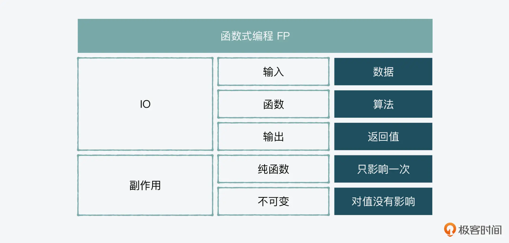
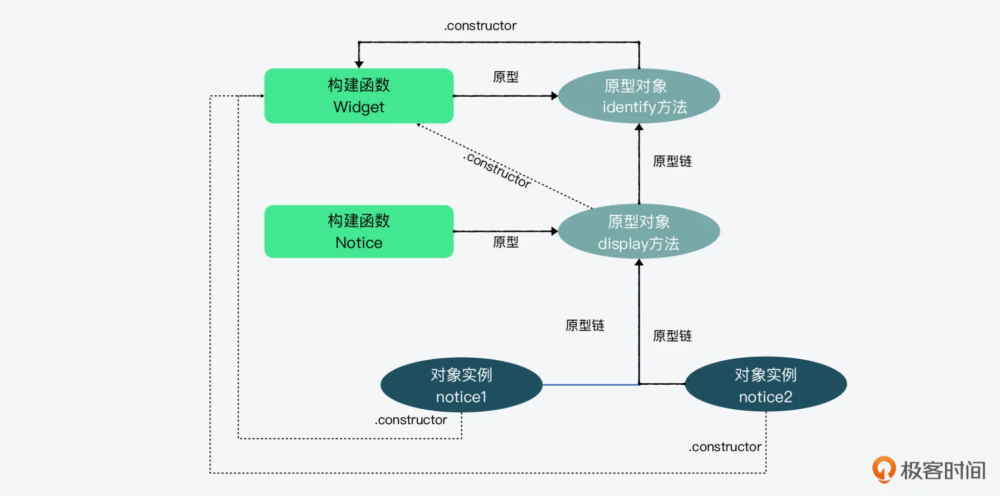

# 深入JS_1
> JavaScript进阶实战课 笔记

## 一、编程模式
:::tip
从编程模式的角度看，JS是结构化的、事件驱动的动态语言，且支持声明式（函数式）和指令式（面向对象）两种模式。
:::
### 1. 函数式编程(FP functional programming)
:::tip
- 在函数式编程中，通常会把各种干扰(不确定性)叫做**副作用（Side effect）**。
- 函数式编程最核心的就是输入、输出、中间的算法，要解决的核心问题就是副作用。
- 可以使用“纯函数”和“不可变”的概念解决副作用。
- “纯函数”强调的是自身的稳定性，对结果只影响一次；“不可变”强调的是和外界的交互中。尽量减少相互间负面的影响。
:::
- 形参：parameter
- 实参：argument
- 返回值：returned value
- 高阶函数：higher order functions，输入和输出都是函数的函数
- 幂等：idempotence，在数学中幂等的意思是不管我们把一个函数嵌套多少次来执行，它的结果都应该是一样的；在计算机中幂等的意思是，一个程序执行多次结果是一样的。

### 1.1 函数的副作用
常见的副作用有：
1. 全局变量（global variable）
2. IO影响（IO effects），IO有浏览器中的用户行为如鼠标和键盘的输入；也有服务器端(Node)的文件系统、网络连接以及stream的stdin(标准输入)和stdout(标准输出)
3. 网络请求

如何减少副作用？
1. 纯函数（pure function）。纯函数更多解决的是“内循环”。纯函数可以通过减少对外界不确定因素的依赖，来减少副作用。
:::info
纯函数，即一个函数的返回结果的变化只依赖其参数，并且执行过程中没有副作用。
:::
```js
// 下面为一个纯函数：无论有什么干扰，它都不会返回一个不是 5 的数字，除非你换一个参数
function calculateGST( productPrice ) {
  return productPrice * 0.05;
}
calculateGST(100); // return 5

var rate = 0.05;
// 下面就不是一个纯函数了，因为随着这个变量的变化，计算结果会有所不同
function calculateGST( productPrice ) {
  return productPrice * rate;
}
calculateGST(100); // return 5
```


:::note
- 如果一个函数只要输入值一样，返回的结果就一样，那这个函数就是纯函数。
- 同理，如果React组件通过相同的state和props得出相同的输出，则称它是纯组件。
:::

2. 不可变（immutability）。不可变更多考虑的是“外循环”。
:::info
不可变就是在减少程序被外界影响的同时，也减少对外界的影响。
:::
```js
// 在开发中，如果要保证不可变，就要使用slice，而不能使用splice
const beforeList = [1,2,3,4]
console.log(beforeList.splice(0,2))
console.log(beforeList.splice(0,2))
//[ 1, 2 ]
//[ 3, 4 ]

const beforeList = [1,2,3,4]
console.log(beforeList.slice(0,2))
console.log(beforeList.slice(0,2))
//[ 1, 2 ]
//[ 1, 2 ]
```

:::tip
从值的角度来看，“纯函数”对值只影响一次，而"不可变"完全不影响。
- splice 更像是一块**橡皮泥**，一开始它可能是个方块儿，你可以捏出腿和脑袋，它就成了一个小人儿，也就是说它本身发生了变化。而 slice 在处理完后是形成了一个新的数组，但原始的数组完好无损，它是把值当成**乐高积木**，而不是橡皮泥。
- 把这种思想用到状态管理里，你就会记录状态的变化，而不会篡改状态。
:::

:::note
JavaScript 中的常量（const，constant）算不算不可变呢？
- 对于“原始类型值”，如数字、字符串是不可变的；对于像数组这样的“对象类型值”，仍然是可变的。
- 所以常量只是做到“赋值动作”的不可变，而不是做到“值”本身的不可变。

这里的不可变我们要搞清楚是值不可变，还是变量的不可变。

```js
// 比如我们给num赋值数组，值还是可变
const num = [3];
num[0] = 5; // 返回：5

// 反之，我们没法拷贝原数组，slice后再赋值给原来的变量
const sliceNums = [1,2,3,4,5];
sliceNums = sliceNums.slice(0,2); // 返回错误 TypeError: Assignment to constant variable.
```

所以const还是蛮多坑的，在Java中用的就是final，而不是const。

也是因为这些坑，在JS中，通常const更多用于原始类型的值，比如数理常量、字节顺序或版本号：
```js
const H0 = 74; // 哈勃常数 (km/s/Mpc)
const PI = 3.141592; // 圆周率
const C = 299792.458; // 光速 (km/s)
```
:::



### 1.2 Monad
:::tip
参考：
- [图解 Monad](https://www.ruanyifeng.com/blog/2015/07/monad.html)
:::

- 函数可以返回值，也可以返回数据类型。数据类型就是对值的一种封装，不仅包括值本身，还包括相关的属性和方法。
- 因为数据类型是带有运算方法的，如果函数的输入和输出都是数据类型，每一步返回的都是数据类型的实例，就可以把它们连接起来，称为Monad。
- Monad是一种设计模式，表示将一个运算过程，通过函数拆解成互相连接的多个步骤。你只要提供下一步运算所需的函数，整个运算就会自动进行下去。

### 2. 面向对象编程(OOP object oriented programming)
:::tip
**JavaScript使用的是基于原型的面向对象！！**
- **工具和方法通常是服务于对象的**。比如，站在岸边的“你”，这个“你”就是对象，如果没有对象，就算是有一个工具（function），比如有快艇在岸边，它也只能停靠在那儿；或者你有游泳这个方法（method），但它也只有在你身上才能发挥作用。
- 如果说函数➕对象组成了生产力，则封装、重用、继承组成了生产关系。
:::

- 封装，通常用在组件化设计的时候，封装组件或模块。
- 重用，就是把可以重复使用的功能抽象到一个类里，每次只是创建一个它的实例对象来使用。
- 继承，可以把通用功能放到抽象类，将一些特定的行为或属性通过继承放到实现类中。
- 组合（composition），一个子类不是继承的某个父类，而是通过组合多个类，来形成一个类。
:::tip
通常，“组合”优于“继承”，因为如果父类有了问题，就会牵一发动全身，而且抽象的层级过多也会让代码难以理解。不过在实际情况下，继承也不是完全不可取的，在开发中，我们使用哪种思想还是要根据情况具体分析。
:::

### 2.1 基于原型的继承
:::info
JS里的对象和“类”，不存在拷贝从属关系，而是**原型链接关系**。
- 在传统的面向对象语言，比如 Java 里，当我们用到继承时，一个类的属性和功能是可以被基于这个类创建的对象“拷贝”过去的。
- 在 JavaScript 里，实例并没有将类的属性和功能拷贝过来，而是默认通过原型链来寻找原型中的功能，然后利用“链接”而不是“拷贝”来。
:::

```js
function Widget(widgetName) {
  this.widgetName = widgetName;
}
Widget.prototype.identify = function() {
  return "这是" + this.widgetName;
}

// 通过函数自带的 call() 方法和对象自带的 Object.create() 方法，让 Notice 作为子类继承 Widget 父类的属性和方法
function Notice(widgetName) {
  Widget.call(this, widgetName);
}
Notice.prototype = Object.create(Widget.prototype);

Notice.prototype.display = function() {
  console.log("你好，" + this.identify());
}

var notice1 = new Notice("应用A");
var notice2 = new Notice("应用B");

console.log('结果1::', Object.getPrototypeOf(notice1) === Notice.prototype);
console.log('结果2::', Object.getPrototypeOf(notice2) === Notice.prototype);

// 调用的是原型链里 Notice 的原型中的方法
notice1.display();
notice2.display();
/*
虽然我们用 Notice 创建了 notice1 和 notice2，但是它俩并没有将其属性和功能拷贝过来，而是默认通过原型链来寻找原型中的功能，然后利用“链接”而不是“拷贝”来
*/

// 除了 Notice 自己的原型对象和自己的 display 功能之外，它也链接了 Widget 里的 identify 功能
for (var method in Notice.prototype) {
  console.log("found: " + method);
}

console.log('结果3::', Notice.prototype.constructor);
console.log('结果4::', notice1.constructor);
console.log('结果5::', notice1.constructor);

console.log('结果6::', notice1.identify());
console.log('结果7::', notice2.identify());
```
[运行](https://code.juejin.cn/pen/7147272771171516449)



### 2.2 基于类的继承

:::tip
在JavaScript中，面向对象的特殊性是基于原型的继承，这种继承更像是“授权”，而不是传统意义的“父子”继承。
:::

## 二、闭包和对象
- 在 React.js 里，props 和 state 都是用对象来储存状态的。
- 一个应用肯定需要和用户交互，而一旦有交互，我们就需要管理值的状态（state） 和围绕值设计一系列行为（behavior）。在这个过程中，我们需要考虑的就是一个值的**结构性不可变的问题**。
- 闭包（closure）和对象（object），这二者都可以对一个状态值进行封装和创建行为。

### 1. 闭包
:::tip
闭包最大的特点是**可以突破生命周期和作用域的限制**。
:::
