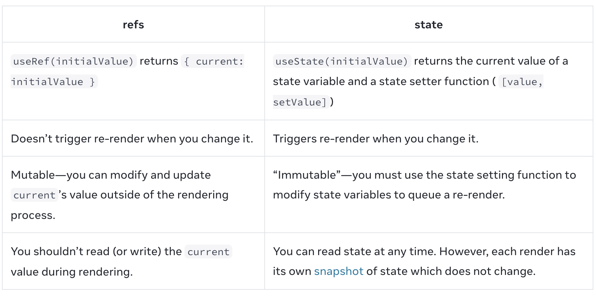

## Built-in React Hooks
### State Hooks
#### `useState`
[How to store and update arrays in React useState hook](https://www.codingdeft.com/posts/react-usestate-array/)

#### `useReducer`

### Context Hooks
#### `useContext`

### Ref Hooks
:::tip
- Refs 让组件保存一些不用于渲染的信息，例如 DOM节点或超时ID。与state不同，更新ref不会重新渲染您的组件。当您希望组件“记住”某些信息，但不希望该信息触发新的渲染时，可以使用 ref。
- ref 可以和 state 一起使用，需要重新渲染的信息使用state存储，不需要重新渲染的使用ref
- **Don’t read or write ref.current during rendering.** 在 React 中，每次更新都分为两个阶段(render、commit)：在渲染期间，React 调用您的组件来确定屏幕上应该显示什么；在提交期间，React 将差异应用于 DOM。一般来说，您不想在渲染期间访问refs。在第一次渲染期间，DOM 节点尚未创建，因此 `ref.current` 将为 `null`，并且在渲染更新的过程中，DOM节点还没有被更新。React 在提交期间设置 `ref.current`，在更新 DOM 之前，React 将受影响的 `ref.current` 值设置为 `null`，更新 DOM 后，React 立即将它们设置为相应的 DOM 节点。[示例: 不同状态时查看ref.current](https://code.juejin.cn/pen/7293051768584273920)
:::
#### `useRef`
1. 使用ref存储不需要重新渲染的信息
```tsx
import { useRef } from 'react';

export default function Counter() {
  let ref = useRef(0);

  function handleClick() {
    ref.current = ref.current + 1;
    alert('You clicked ' + ref.current + ' times!');
  }

  return (
    <button onClick={handleClick}>
      Click me!
    </button>
  );
}
```
`useRef` 返回一个对象，类似：
```js
{ 
  current: 0 // The value you passed to useRef
}
```
```tsx
import { useState, useRef } from 'react';

export default function Stopwatch() {
  const [startTime, setStartTime] = useState(null);
  const [now, setNow] = useState(null);
  const intervalRef = useRef(null);

  function handleStart() {
    setStartTime(Date.now());
    setNow(Date.now());

    clearInterval(intervalRef.current);
    intervalRef.current = setInterval(() => {
      setNow(Date.now());
    }, 10);
  }

  function handleStop() {
    clearInterval(intervalRef.current);
  }

  let secondsPassed = 0;
  if (startTime != null && now != null) {
    secondsPassed = (now - startTime) / 1000;
  }

  return (
    <>
      <h1>Time passed: {secondsPassed.toFixed(3)}</h1>
      <button onClick={handleStart}>
        Start
      </button>
      <button onClick={handleStop}>
        Stop
      </button>
    </>
  );
}
```



2. 使用ref控制DOM
- `<input ref={inputRef}>` tells React to put this `<input>’s` DOM node into `inputRef.current`.
```jsx
import { useRef } from 'react';

export default function Form() {
  const inputRef = useRef(null);

  function handleClick() {
    inputRef.current.focus();
  }

  return (
    <>
      <input ref={inputRef} />
      <button onClick={handleClick}>
        Focus the input
      </button>
    </>
  );
}
```

- ref callback function
  ```jsx
  <div ref={(node) => console.log(node)} />
  ```
  :::tip
    - Do not return anything from the ref callback.
    
    - When the `<div>` DOM node is added to the screen, React will call your ref callback with the DOM node as the argument. When that `<div>` DOM node is removed, React will call your ref callback with `null`.(当 `<div>` DOM 节点添加到屏幕上时，React 将以 DOM 节点作为参数调用您的 ref 回调。当该 `<div>` DOM 节点被删除时，React 将使用 `null` 调用您的 ref 回调。)
    
    - React will also call your ref callback whenever you pass a different ref callback. In the above example, `(node) => { ... }` is a different function on every render. When your component re-renders, the previous function will be called with `null` as the argument, and the next function will be called with the DOM node.(每当您传递不同的 ref 回调时，React 也会调用您的 ref 回调。在上面的示例中， `(node) => { ... }` 在每次渲染上都是不同的函数。当您的组件重新渲染时，将使用 `null` 作为参数调用前一个函数，并使用 DOM 节点调用下一个函数。)

    - 参数`node`: A DOM node or `null`. React will pass you the DOM node when the ref gets attached, and `null` when the ref gets detached. Unless you pass the same function reference for the ref callback on every render, the callback will get temporarily detached and re-attached during every re-render of the component.(当引用被附加时，React 会向你传递 DOM 节点，当引用被分离时，React 会传递给你 null。除非您在每次渲染时为 ref 回调传递相同的函数引用，否则回调将在组件的每次重新渲染期间暂时分离并重新附加。)
  :::

  [示例: ref callback function](https://code.juejin.cn/pen/7290371092995440700)

#### `React.forwardRef()`
:::tip
当你在浏览器元素上放置一个 ref 时(如，`<input ref={inputRef}>`)，React 会将该 ref 的 current 属性设置为相应的 DOM 节点。但是，如果您尝试在自定义的组件上放置ref，例如 `<MyInput ref={inputRef} />`，默认情况下您将得到 `null`。这是因为默认情况下 React 不允许组件访问其他组件(连自己的孩子组件都不行)的 DOM 节点，手动操作另一个组件的 DOM 节点会使您的代码更加脆弱。可以使用`React.forwardRef()`来传递自定义组件的ref。
:::

```jsx
import { forwardRef, useRef } from 'react';

// MyInput将收到的ref传递给其中的 <input>
const MyInput = forwardRef((props, ref) => {
  return <input {...props} ref={ref} />;
});

export default function Form() {
  const inputRef = useRef(null);

  function handleClick() {
    inputRef.current.focus();
  }

  return (
    <>
      <MyInput ref={inputRef} />
      <button onClick={handleClick}>
        Focus the input
      </button>
    </>
  );
}
```

#### `useImperativeHandle`
用于限制自定义组件使用ref公开暴露的内容

```jsx
import { forwardRef, useRef, useImperativeHandle } from 'react';

const MyInput = forwardRef((props, ref) => {
  const realInputRef = useRef(null); // 保存实际的 input DOM 节点
  useImperativeHandle(ref, () => ({
    // 只暴露focus()方法
    focus() {
      realInputRef.current.focus();
    },
  }));
  return <input {...props} ref={realInputRef} />;
});

export default function Form() {
  const inputRef = useRef(null);

  function handleClick() {
    inputRef.current.focus(); // 此时 inputRef.current 引用的不是 DOM node，而是 useImperativeHandle调用中创建的自定义对象
  }

  return (
    <>
      <MyInput ref={inputRef} />
      <button onClick={handleClick}>
        Focus the input
      </button>
    </>
  );
}
```

### Effect Hooks
#### `useEffect`

#### `useLayoutEffect`
useLayoutEffect 会损害性能。尽可能首选 useEffect。

#### `useInsertionEffect`
useInsertionEffect 适用于 CSS-in-JS 库作者。除非您正在开发 CSS-in-JS 库并且需要一个地方来注入样式，否则您可能需要 useEffect 或 useLayoutEffect。

### Performance Hooks
#### `useMemo`
:::tip
`useMemo` won’t make the first render faster. It only helps you skip unnecessary work on updates.
:::

#### `useCallback`

#### `useTransition`
在不阻塞 UI 的情况下更新状态

#### `useDeferredValue`
推迟更新部分UI

### Resource Hooks
#### `use`
读取 Promise 或上下文等资源的值。

### Other Hooks
以下hooks对库作者比较有用，日常开发中并不常用：
#### `useDebugValue`
#### `useId`
#### `useSyncExternalStore`
```jsx
function subscribe(callback) {
  window.addEventListener('online', callback);
  window.addEventListener('offline', callback);
  return () => {
    window.removeEventListener('online', callback);
    window.removeEventListener('offline', callback);
  };
}

function useOnlineStatus() {
  // ✅ Good: Subscribing to an external store with a built-in Hook
  return useSyncExternalStore(
    subscribe, // React won't resubscribe for as long as you pass the same function
    () => navigator.onLine, // How to get the value on the client
    () => true // How to get the value on the server
  );
}

function ChatIndicator() {
  const isOnline = useOnlineStatus();
  // ...
}
```