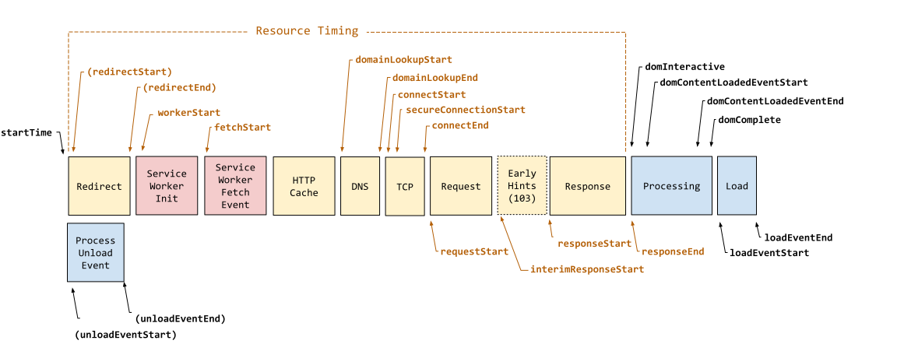

无论您使用 React 还是其他库，[Create React App](https://create-react-app.dev/) 都可以让您专注于代码，而不是构建工具。

## 创建应用
- 创建一个TypeScript应用：`yarn create react-app fl-home.onrender.com --template typescript`
  :::tip
  Expected node version "^10.13.0 || ^12.13.0 || ^14.15.0 || >=15.0.0"
  :::

### 生成的目录文件的用途
#### `public/manifest.json`
```json
{
  "short_name": "React App",
  "name": "Create React App Sample",
  "icons": [
    {
      "src": "favicon.ico",
      "sizes": "64x64 32x32 24x24 16x16",
      "type": "image/x-icon"
    },
    {
      "src": "logo192.png",
      "type": "image/png",
      "sizes": "192x192"
    },
    {
      "src": "logo512.png",
      "type": "image/png",
      "sizes": "512x512"
    }
  ],
  "start_url": ".",
  "display": "standalone",
  "theme_color": "#000000",
  "background_color": "#ffffff"
}
```
:::info
当用户在移动设备上添加网站到主屏幕时，`manifest.json` 中的元数据将确定显示该网站时要使用的图标、名称和品牌颜色等。 [Web应用程序清单指南](https://developers.google.com/web/fundamentals/engage-and-retain/web-app-manifest/)提供了有关每个字段含义以及您的自定义将如何影响用户体验的更多上下文。

ios添加网站到主屏幕：
1. 
2. 
:::

#### `public/robots.txt`
```markdown
# https://www.robotstxt.org/robotstxt.html
User-agent: *
Disallow:
```
:::tip
[robots.txt 简介](https://developers.google.com/search/docs/crawling-indexing/robots/intro?hl=zh-cn)。robots.txt 文件应位于网站的根目录下。因此，对于网站 `www.example.com`，robots.txt 文件的路径应为 `www.example.com/robots.txt`。robots.txt 是一种遵循漫游器排除标准的纯文本文件，由一条或多条规则组成。每条规则可禁止或允许所有或特定抓取工具抓取托管 robots.txt 文件的网域或子网域上的指定文件路径。除非您在 robots.txt 文件中另行指定，否则所有文件均隐式允许抓取。该 robots.txt 文件的含义是所有用户代理均可抓取整个网站。
:::

#### `src/reportWebVitals.ts`
```ts
import { ReportHandler } from 'web-vitals';

const reportWebVitals = (onPerfEntry?: ReportHandler) => {
 if (onPerfEntry && onPerfEntry instanceof Function) {
   import('web-vitals').then(({ getCLS, getFID, getFCP, getLCP, getTTFB }) => {
     getCLS(onPerfEntry);
     getFID(onPerfEntry);
     getFCP(onPerfEntry);
     getLCP(onPerfEntry);
     getTTFB(onPerfEntry);
   });
 }
};

export default reportWebVitals;
```
:::tip
在`src/index.tsx`调用了`reportWebVitals`：
```tsx
import React from 'react';
import ReactDOM from 'react-dom/client';
import './index.css';
import App from './App';
import reportWebVitals from './reportWebVitals';

const root = ReactDOM.createRoot(
 document.getElementById('root') as HTMLElement
);
root.render(
 <React.StrictMode>
   <App />
 </React.StrictMode>
);

// If you want to start measuring performance in your app, pass a function
// to log results (for example: reportWebVitals(console.log))
// or send to an analytics endpoint. Learn more: https://bit.ly/CRA-vitals
reportWebVitals();
```
当页面上任何指标的最终值完成计算时，将触发此函数。您可以使用它将任何结果记录到控制台（`reportWebVitals(console.log))`）或发送到特定端点：
```js
function sendToAnalytics(metric) {
 const body = JSON.stringify(metric);
 const url = 'https://example.com/analytics'; // 某个分析站点

 // Use `navigator.sendBeacon()` if available, falling back to `fetch()`
 if (navigator.sendBeacon) {
   navigator.sendBeacon(url, body);
 } else {
   fetch(url, { body, method: 'POST', keepalive: true });
 }
}

// 将网页指标结果发送到分析站点，以测量和跟踪网站上的真实用户性能
reportWebVitals(sendToAnalytics);
```
:::
:::info
[Web Vitals](https://web.dev/vitals/) 是一组有用的[指标](https://web.dev/explore/metrics?hl=zh-cn)，旨在捕获网页的用户体验。在 Create React App 中，使用第三方库（[web-vitals](https://github.com/GoogleChrome/web-vitals)）来衡量这些指标。
- [Cumulative Layout Shift (CLS)](https://web.dev/articles/cls?hl=zh-cn)：衡量的是视觉稳定性。CLS 用于衡量在网页的整个生命周期内发生的每次意外布局偏移的最大突发布局偏移分数。为了提供良好的用户体验，页面应将 CLS 保持在 0.1 或更低。

- [First Input Delay (FID)](https://web.dev/articles/fid?hl=zh-cn)：衡量互动。FID 衡量的是从用户首次与网页互动（即，点击链接、点按按钮或使用由 JavaScript 提供支持的自定义控件）到浏览器能够实际开始处理事件处理脚本以响应该互动的时间。为了提供良好的用户体验，网页的 FID 不应超过 100 毫秒。

- [First Contentful Paint (FCP)](https://web.dev/articles/fcp?hl=zh-cn)：衡量感知的加载速度。首次内容绘制 (FCP) 指标用于测量从用户首次导航到页面至页面内容的任何部分呈现在屏幕上的时间。要点：请务必注意，FCP 包含上一个页面的所有卸载时间、连接设置时间、重定向时间以及首字节时间 (TTFB)。在实际测量时，这些结果会非常重要，并且可能会导致现场测量结果和实验室测量结果之间存在差异。

- [Largest Contentful Paint (LCP)](https://web.dev/articles/lcp?hl=zh-cn)：衡量加载性能。为了提供良好的用户体验，LCP 应在网页首次开始加载后的 2.5 秒内发生。Largest Contentful Paint (LCP) 指标会报告视口内可见的最大图片或文本块的呈现时间（相对于用户首次导航到页面的时间）。

- [Time To First Byte (TTFB)](https://web.dev/articles/ttfb?hl=zh-cn)：有助于确定 Web 服务器何时响应速度过慢。TTFB 用于测量资源请求与响应的第一个字节开始到达之间的时间。
  
:::

#### `src/setupTests.ts`
```ts
// jest-dom adds custom jest matchers for asserting on DOM nodes.
// allows you to do things like:
// expect(element).toHaveTextContent(/react/i)
// learn more: https://github.com/testing-library/jest-dom
import '@testing-library/jest-dom';
```
:::tip
该文件会在运行测试之前自动执行。

执行 `yarn test` 报错：Error: Failed to initialize watch plugin "node_modules/jest-watch-typeahead/filename.js"。原因是node版本较低，切换到16以上版本就可以了。（参考：[关于React npm run test错误jest-watcher](https://juejin.cn/post/7141592907512807432)）
:::
:::info
[@testing-library/jest-dom](https://testing-library.com/docs/ecosystem-jest-dom/) 是测试库的配套库，为 Jest 提供自定义 DOM 元素匹配器。
:::

#### `src/react-app-env.d.ts`
```ts
/// <reference types="react-scripts" />
```
项目的`tsconfig.json`配置了`"include": [ "src" ]`，所以默认会编译`src`目录下的`.ts`、`.tsx`和`.d.ts`文件。如果打开了`allowJs`，那么还会编译`.js`和`.jsx`。编译`src/react-app-env.d.ts`会添加 `react-scripts` 的类型库，没有单独的类型声明模块`@types/react-scripts`，则编译时实际添加的脚本是`react-scripts`模块指定的类型声明文件的路径`node_modules/react-scripts/lib/react-app.d.ts`。该文件内容如下：
```ts title="node_modules/react-scripts/lib/react-app.d.ts"
/// <reference types="node" />
/// <reference types="react" />
/// <reference types="react-dom" />

declare namespace NodeJS {
  interface ProcessEnv {
    readonly NODE_ENV: 'development' | 'production' | 'test';
    readonly PUBLIC_URL: string;
  }
}

declare module '*.avif' {
  const src: string;
  export default src;
}

declare module '*.bmp' {
  const src: string;
  export default src;
}

declare module '*.gif' {
  const src: string;
  export default src;
}

declare module '*.jpg' {
  const src: string;
  export default src;
}

declare module '*.jpeg' {
  const src: string;
  export default src;
}

declare module '*.png' {
  const src: string;
  export default src;
}

declare module '*.webp' {
    const src: string;
    export default src;
}

declare module '*.svg' {
  import * as React from 'react';

  export const ReactComponent: React.FunctionComponent<React.SVGProps<
    SVGSVGElement
  > & { title?: string }>;

  const src: string;
  export default src;
}

declare module '*.module.css' {
  const classes: { readonly [key: string]: string };
  export default classes;
}

declare module '*.module.scss' {
  const classes: { readonly [key: string]: string };
  export default classes;
}

declare module '*.module.sass' {
  const classes: { readonly [key: string]: string };
  export default classes;
}

```
可以看到，该文件声明了avif bmp gif jpg png webp格式的图片、svg、css、scss、sass的类型，这样在项目文件中引入这些类型的文件时不会ts报错（参考：[react-app-env.d.ts的作用以及如何生成的？](https://segmentfault.com/a/1190000038874526)）
```ts
import contentBg from "@assets/image/content-bg.png"
import styles from './index.module.scss';
```

### `PUBLIC_URL`
如果将文件放入 `public` 文件夹中，webpack 不会处理该文件。相反，它将原封不动地复制到构建文件夹中。要引用公共文件夹中的资源，您需要使用名为 `PUBLIC_URL` 的环境变量。

在`index.html`中可以如下使用，当您运行 `npm run build` 时，Create React App 会将 `%PUBLIC_URL%` 替换为正确的绝对路径，这样即使您使用客户端路由或将其托管在非根 URL 上，您的项目也能正常运行。
```html
<link rel="icon" href="%PUBLIC_URL%/favicon.ico" />
```

在 JavaScript 代码中，您可以使用 `process.env.PUBLIC_URL` 实现类似目的：
```js
render() {
  // Note: this is an escape hatch and should be used sparingly!
  // Normally we recommend using `import` for getting asset URLs
  // as described in “Adding Images and Fonts” above this section.
  return ;
}
```

### webpack配置
查看`react-scripts`依赖包中`config/webpack.config.js`：
1. 设置了别名`src`对应为根目录下的src目录，所以导入Home组件时可以使用`src/pages/home/Home`

## [eject的替代方案](https://auth0.com/blog/how-to-configure-create-react-app/)
1. fork create-react-app 仓库
2. 在`packages/react-scripts/scripts/init.js`中的增加log来验证后续使用的是自定义的react-scripts
   ```js title="packages/react-scripts/scripts/init.js"
   console.log(`Success! Created ${appName} at ${appPath}`);
   console.log('scripts version is @rawlinsfeng/react-scripts.')
   ```
3. 查看`packages/react-scripts/scripts/build.js`发现webpack的配置文件目录为`packages/react-scripts/config/webpack.config.js`
4. cd 到 `packages/react-scripts` 执行 `yarn add postcss-px-to-viewport`
5. 在`packages/react-scripts/config/webpack.config.js`中的`postcss-loader`配置项中配置`postcss-px-to-viewport`
   ```js title="packages/react-scripts/config/webpack.config.js"
    const loaders = [
      isEnvDevelopment && require.resolve('style-loader'),
      isEnvProduction && {
        loader: MiniCssExtractPlugin.loader,
        // css is located in `static/css`, use '../../' to locate index.html folder
        // in production `paths.publicUrlOrPath` can be a relative path
        options: paths.publicUrlOrPath.startsWith('.')
          ? { publicPath: '../../' }
          : {},
      },
      {
        loader: require.resolve('css-loader'),
        options: cssOptions,
      },
      {
        // Options for PostCSS as we reference these options twice
        // Adds vendor prefixing based on your specified browser support in
        // package.json
        loader: require.resolve('postcss-loader'),
        options: {
          postcssOptions: {
            // Necessary for external CSS imports to work
            // https://github.com/facebook/create-react-app/issues/2677
            ident: 'postcss',
            config: false,
            plugins: !useTailwind
              ? [
                  'postcss-flexbugs-fixes',
                  [
                    'postcss-preset-env',
                    {
                      autoprefixer: {
                        flexbox: 'no-2009',
                      },
                      stage: 3,
                    },
                  ],
                  // Adds PostCSS Normalize as the reset css with default options,
                  // so that it honors browserslist config in package.json
                  // which in turn let's users customize the target behavior as per their needs.
                  'postcss-normalize',
                  // Adds postcss-px-to-viewport
                  [
                    'postcss-px-to-viewport',
                    {
                      viewportWidth: 750,
                      exclude: [/node_modules/],
                    },
                  ]
                ]
              : [
                  'tailwindcss',
                  'postcss-flexbugs-fixes',
                  [
                    'postcss-preset-env',
                    {
                      autoprefixer: {
                        flexbox: 'no-2009',
                      },
                      stage: 3,
                    },
                  ],
                ],
          },
          sourceMap: isEnvProduction ? shouldUseSourceMap : isEnvDevelopment,
        },
      },
    ].filter(Boolean);
   ```

6. 更改`packages/react-scripts/package.json`的name、description、repository url为自己的
7. cd到`packages/react-scripts`目录，登录npm，发布npm包
8. 使用：
   ```bash
   # npx
   npx create-react-app my-app --scripts-version @rawlinsfeng/react-scripts
   # yarn
   yarn create react-app my-app --scripts-version @rawlinsfeng/react-scripts
   # pnpm
   pnpm create react-app my-app --scripts-version @rawlinsfeng/react-scripts

   # Creating a TypeScript app
   # npx
   npx create-react-app my-app --scripts-version @rawlinsfeng/react-scripts --template typescript
   # yarn
   yarn create react-app my-app --scripts-version @rawlinsfeng/react-scripts --template typescript
   # pnpm
   pnpm create react-app my-app --scripts-version @rawlinsfeng/react-scripts --template typescript
   ```