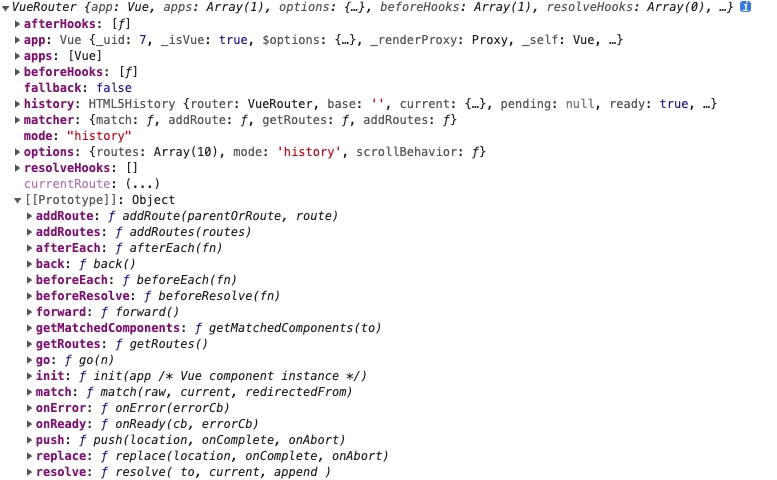

## 1. 渲染函数 & JSX
### 1.1 记录一次webpack5搭建的vue工程使用elementui的Tree组件遇到的问题
- Tree组件可以通过两种方法进行树节点内容的自定义：`render-content`和 `scoped slot`
- 使用`render-content`需要指定渲染函数，该函数返回需要的节点区内容
```jsx
<div class="block">
  <p>使用 render-content</p>
  <el-tree
    :data="data"
    show-checkbox
    node-key="id"
    default-expand-all
    :expand-on-click-node="false"
    :render-content="renderContent">
  </el-tree>
</div>
renderContent(h, { node, data, store }) {
  return (
    <span class="custom-tree-node">
      <span>{node.label}</span>
      <span>
        <el-button size="mini" type="text" on-click={ () => this.append(data) }>Append</el-button>
        <el-button size="mini" type="text" on-click={ () => this.remove(node, data) }>Delete</el-button>
      </span>
    </span>);
}
```
- `render-content`的渲染函数中使用了jsx，编译时报错（原有的配置是`webpack 5`+`@babel/core 7`+`babel-loader 8`+`vue 2`+`vue-loader 15`+`vue-template-compiler 2`）
- 解决步骤如下：
  - 新增2个依赖`@vue/babel-preset-jsx`和`@vue/babel-helper-vue-jsx-merge-props`
  - 使用`@vue/babel-preset-jsx`（在`webpack.config.js`的babel-loader的options中配置或者在babel的配置文件(`babel.config.js`或`.babelrc`)中配置）
```markdown
npm install -D @vue/babel-preset-jsx @vue/babel-helper-vue-jsx-merge-props
```
```js title="webpack.config.js"
{
  test: /\.js/,
  loader: 'babel-loader',
  options: {
    presets: ["@vue/babel-preset-jsx"]
  },
  exclude: /node_modules/
},
```
> 参考：
> - [vue项目启动报错：Support for the experimental syntax ‘jsx‘ isn‘t currently enabled](https://blog.csdn.net/q1ngqingsky/article/details/118421074)
> - [来聊聊Vue中使用Render函数和JSX](https://blog.csdn.net/liuyan19891230/article/details/118533479)

:::note
这个踩坑还有一个点是，这个webpack5搭建的vue工程，其中配置相关(webpack配置、babel配置、postcss配置等)是单独抽出来的一个底层包(目的是与vue相关的配置分离开)，会merge使用这个包的工程的相关配置文件，形成最终的配置。在vue工程中的babel.config.js配置使用`@vue/babel-preset-jsx`时不起作用，最后，在vue工程中又安装了`babel-loader`的依赖（原本是不需要在vue工程中使用babel-loader的，因为底层包配置了babel-loader），将其配置到vue工程中的`webpack.config.js`，在`babel-loader`的options中使用`@vue/babel-preset-jsx`生效了。
:::

### 1.2 由一次监听`el-switch`的click事件(想在switch切换状态前处理一些逻辑)引发的思考
- element ui官方`el-switch`只有`change`事件（以及focus方法）
- 监听其click事件首先想到两种方法：
  - 外面包一层dom，给该dom添加click监听器并阻止事件向下传递，click事件逻辑处理后更改`el-switch`的`v-model`来改其状态，视觉上达到监听`el-switch`的click事件
  ```jsx
  // vue中阻止事件向下传递：
  <div @click.stop.capture="handleClickSelf">
    <el-switch :value="switchOpenFlag" @change="handleClick"></el-switch>
  </div>
  ```
  - 弃用`v-model`，使用 `:value` 和 `@change`
  ```jsx
  <el-switch :value="switchOpenFlag" @change="handleClick" active-inner-text="开" inactive-inner-text="关"></el-switch>
  ```

- 这就引出3个值得深究的点：1）`v-model`是如何实现的？ 2）事件的向上/向下传递过程 3）vue的事件修饰符及如何实现的
> [Vue事件修饰符](https://vuetechworld.com/blog/detail/9570e28eab4b3dcf074a8f2bacdc29c9)

## 2. filters
- filters里面this为undefined，为啥这样设计？
- 解决办法：使用computed或method或filter传this
```jsx
<template>
<div>
{{state | theFilter(this)}}
</div>
</template>
<script>
filters: {
  theFilter: function(value,that) {
    // that.xxx
  },
},
</script>
```

## 3. v-if对computed无效；key对computed无效
如果想通过v-if或key控制一个dom内部的数据清空，那么该dom内部由computed控制的数据是不会被清空的。
- 为啥会这样？
- computed缓存是怎么实现的？怎么让它不缓存？
- 用inject reload?

## 4. Array触发视图更新的API
- concat不能更新视图
```js
// 使用中间变量解决concat不能更新视图的问题
let temArr = this.sourceData.concat(targetData);
this.sourceData = temArr;
```
- Array.prototype.push.apply(this.sourceData, targetData); // 这种方式可以更新视图但watch不到

## 5. 搭建vite+vue2.7+pnpm工程
- `brew install pnpm`
- `pnpm create vite`
- 把工程中的`"vue": "^3.2.25"`换为`"vue": "2.7.8"`
- 把工程中的`"@vitejs/plugin-vue": "^2.3.3"`换为`"@vitejs/plugin-vue2": "^1.1.2"`
- 把工程中的`vite.config.js`的`@vitejs/plugin-vue`换为`@vitejs/plugin-vue2`
- 注意vue3改为vue2后的template--->Component template should contain exactly one root element
- 更改`man.js`
```js title="main.js"
// vue3
import { createApp } from 'vue'
import App from './App.vue'

createApp(App).mount('#app')

// vue2
import Vue from 'vue'
import App from './App.vue'

new Vue({
  render: h => h(App)
}).$mount('#app')
```
- `pnpm add -D sass`（`Vite提供了对 .scss, .sass, .less, .styl 和 .stylus 文件的内置支持。`）
> 如果使用的是单文件组件，可以通过 `<style lang="scss">`（或其他预处理器）自动开启。

## 6. [keep-alive](https://v2.cn.vuejs.org/v2/api/#keep-alive)
> 主要用于保留组件状态或避免重新渲染。`<keep-alive>` 包裹动态组件时，会缓存不活动的组件实例，而不是销毁它们。
> - `<keep-alive>` 是一个抽象组件：它自身不会渲染一个 DOM 元素，也不会出现在组件的父组件链中。
> - 当组件在 `<keep-alive>` 内被切换，它的 activated 和 deactivated 这两个生命周期钩子函数将会被对应执行。

- include 字符串或正则表达式或数组。只有名称匹配的组件会被缓存。
- exclude 字符串或正则表达式或数组。任何名称匹配的组件都不会被缓存。
- max 数字。最多可以缓存多少组件实例。


## 7. router.addRoute
### 7.1 注意查看使用的vue-router版本中是否有addRoute方法
- vue-router 3.1.6 使用addRoute时报错：router.addRoute is not a function；升级到3.5.4，问题解决
- 可以把vue-router的实例log出来看`[[Prototype]]`中是否有addRoute方法


### 7.2 Navigation cancelled
> Error: Navigation cancelled from "/" to "/xxx" with a new navigation.
    at createRouterError (vue-router.esm.js?8c4f:2065:1)

- 通过addRoute等API动态改变router后，重新实例化vue-router即可解决上述问题
```js
router = new Router({
  mode: 'history',
  routes: routeList,
})
```

### 7.3 Redirected
> Error: Redirected when going from "/xxx" to "/yy/zzz" via a navigation guard.
  at createRouterError (vue-router.esm.js?8c4f:2065:1)

- 应该怎么捕获next()的异常？router.onError()也不生效

## 8. vue.config.js
### 8.1 pages

### 8.2 configureWebpack
- copy-webpack-plugin不需要install就能在vue.config.js中用，查看node_modules中有，说明copy-webpack-plugin不知道是哪个包的依赖，被附带安装了

## 9. router.beforeEach
### 9.1 next()
- 注意：next函数在有参和无参的时候是不一样的，当传参时，会中断当前导航然后进行一个新的导航，此时beforeEach函数会被再次调用,而不传参时next()不会重新触发beforeEach函数。

## 10. [路由组件传参](https://v3.router.vuejs.org/zh/guide/essentials/passing-props.html)
:::tip
参考：[Vue 路由组件传参的 8 种方式](https://segmentfault.com/a/1190000039398462)
:::

### 10.1 RouteConfig
```js
interface RouteConfig = {
  path: string,
  component?: Component,
  name?: string, // 命名路由
  components?: { [name: string]: Component }, // 命名视图组件
  redirect?: string | Location | Function,
  props?: boolean | Object | Function,
  alias?: string | Array<string>,
  children?: Array<RouteConfig>, // 嵌套路由
  beforeEnter?: (to: Route, from: Route, next: Function) => void,
  meta?: any,

  // 2.6.0+
  caseSensitive?: boolean, // 匹配规则是否大小写敏感？(默认值：false)
  pathToRegexpOptions?: Object // 编译正则的选项
}
```

### 10.2 使用 `props` 将组件和路由解耦 (props: boolean | Object | Function)
- boolean。当 props 设置为 true 时，route.params 将被设置为组件的 props。
```js
// 下面的代码是通过 $route.params 的方式获取动态字段 id
const User = {
  template: '<div>User {{ $route.params.id }}</div>'
}
const routes = [{ path: '/user/:id', component: User }]

// 将上面的代码替换成 props 的形式，如下：
const User = {
  props: ['id'], // 组件中通过 props 获取 id
  template: '<div>User {{ id }}</div>'
}
// 路由配置中，增加 props 字段，并将值 设置为 true
const routes = [{ path: '/user/:id', component: User, props: true }]

// 注意：对于有命名视图的路由，你必须为每个命名视图定义 props 配置
const routes = [
  {
    path: '/user/:id',
    components: { default: User, sidebar: Sidebar },
    // 为 User 提供 props
    props: { default: true, sidebar: false }
  }
]
```

- Object。当 props 是一个对象时，它将原样设置为组件 props。当 props 是静态的时候很有用。
```js
// 路由配置
const routes = [
  {
    path: '/hello',
    component: Hello,
    props: { name: 'World' }
  }
]

// 组件中获取数据
const Hello = {
  props: {
    name: {
      type: String,
      default: 'Vue'
    }
  },
  template: '<div> Hello {{ name }}</div>'
}

// <Hello /> 组件默认显示 Hello Vue，但路由配置了 props 对象，当路由跳转到 /hello 时，会显示传递过来的 name， 页面会显示为 Hello World。
```

- Function。请尽可能保持 props 函数为无状态的，因为它只会在路由发生变化时起作用。如果你需要状态来定义 props，请使用包装组件，这样 Vue 才可以对状态变化做出反应。使用函数模式时，返回 props 的函数接受的参数为路由记录 route。
```js
// 路由配置
// 创建一个返回 props 的函数
const dynamicPropsFn = (route) => {
  return { name: route.query.say + "!" }
}
const routes = [
  {
    path: '/hello',
    component: Hello,
    props: dynamicPropsFn
  }
]

// 组件获取数据
// 当 URL 为 /hello?say=World 时， 将传递 {name: 'World!'} 作为 props 传给 Hello 组件
const Hello = {
  props: {
    name: {
      type: String,
      default: 'Vue'
    }
  },
  template: '<div> Hello {{ name }}</div>'
}
```